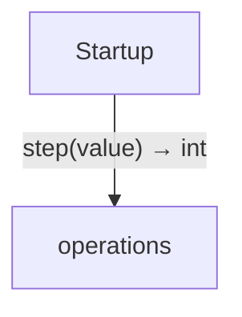

<!-- Generated by aug spec. Edit the August source, then regenerate. -->

# Project diagrams

Start here to see what moves between the application’s folders. Each arrow names an operation’s inputs and the result it returns to its caller. Open a folder for the next level of detail. Expand the contract list for complete types and dependency links.

## Data flow

Data crossing these boundaries (1 contracts)

| From | To | Operation and inputs | Result |
| --- | --- | --- | --- |
| Startup | operations | [step](../../operations.aug.md#symbol-step) · value: int | int |

## Open a module

| Module | Read |
| --- | --- |
| main.aug | [Flow and sequences](../../main.aug.diagrams.md) · [Explanation](../../main.aug.md) |
| operations.aug | [Flow and sequences](../../operations.aug.diagrams.md) · [Explanation](../../operations.aug.md) |

These are static call boundaries, not a request trace. Interface implementations and foreign internals stop at their checked contracts. Dotted arrows defer a callback or browser action. Imports alone do not imply a call.
