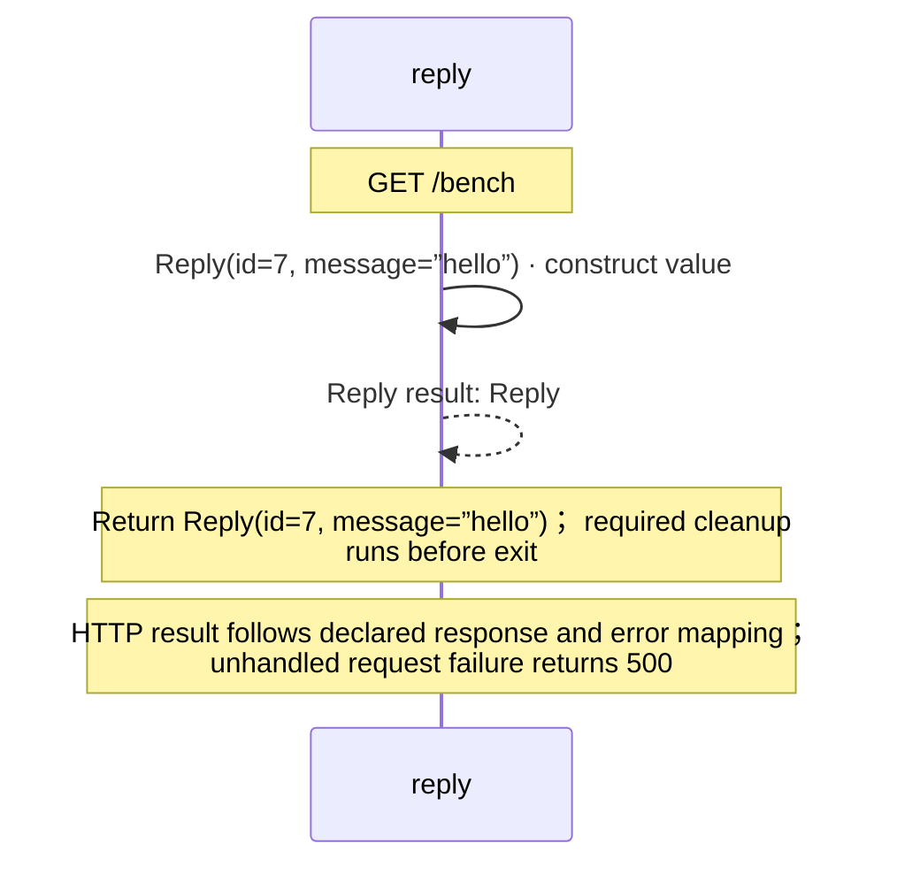

<!-- Generated by aug spec. Edit the August source, then regenerate. -->

# routes.aug diagrams

[Project overview](.aug-spec/diagrams/index.md) · [Compiled explanation](routes.aug.md)

## Sequences

Call arrows identify checked targets; loop and branch frames determine when they run. Open that target’s module to follow its implementation. Branches describe alternatives; loops describe repeated work. Native calls and interface dispatch stop at their declared contracts. Exit notes end that path; enclosing recovery and cleanup remain visible.

### Reply constructor

[Source](routes.aug#L2)

It takes `id` as an integer, kept read-only and `message` as a string, kept read-only.

Receive fields: id, message. [Explanation](routes.aug.md).

### reply

[Source](routes.aug#L3)

`reply` handles `GET /bench`.

## Called contracts

- [Reply](routes.aug.diagrams.md#sequence-Reply-20-constructor) — routes.aug
