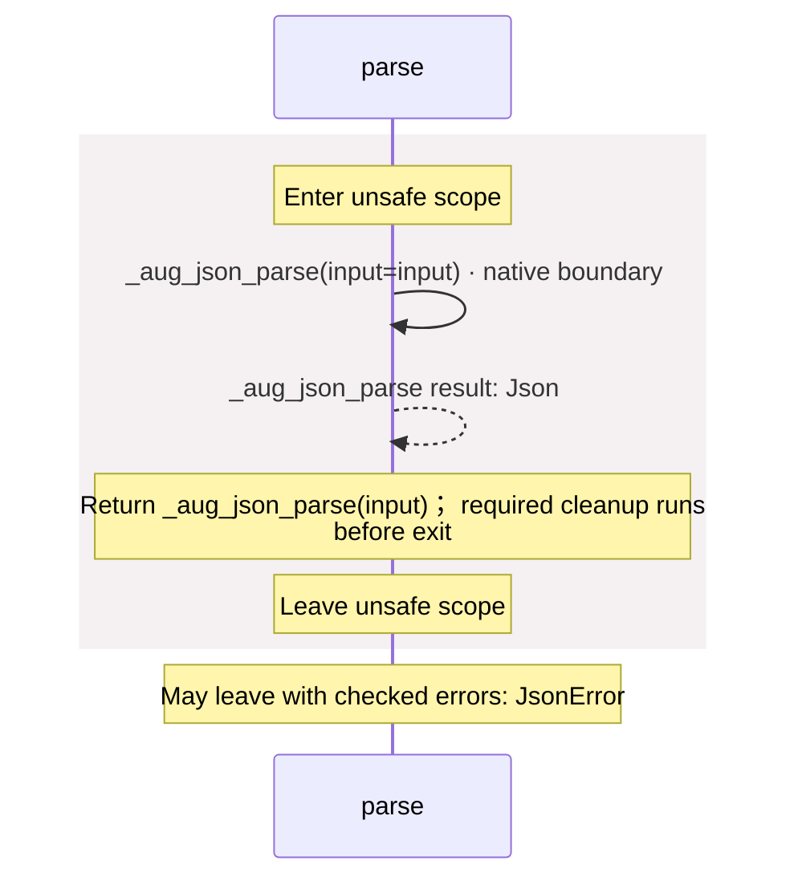

<!-- Generated by aug spec. Edit the August source, then regenerate. -->

# package/@git/url\_2d3c37c690c0fa115be1@0.0.0-git.a39fc582565d4fca40be4f75fa304d71adc69301/contracts.aug diagrams

[Project overview](../../../../diagrams/index.md) · [Compiled explanation](contracts.aug.md)

## Sequences

Call arrows identify checked targets; loop and branch frames determine when they run. Open that target’s module to follow its implementation. Branches describe alternatives; loops describe repeated work. Native calls and interface dispatch stop at their declared contracts. Exit notes end that path; enclosing recovery and cleanup remain visible.

### \_aug\_json\_parse

[Source](contracts.aug#L2)

It is private to its defining scope.

It takes `input` as a string.

It returns `Json`. Failures can raise `JsonError`.

Native C implementation; only its declared contract is visible here.

May leave with checked errors: JsonError. Native implementation; only the declared contract is known. [Explanation](contracts.aug.md).

### parse

[Source](contracts.aug#L4)

Parse strict UTF-8 JSON. Duplicate keys, invalid Unicode, oversized integers, and nesting beyond 64 levels raise JsonError.

It takes `input` as a string.

Failures can raise `JsonError`.

## Called contracts

- [\_aug\_json\_parse](contracts.aug.diagrams.md#sequence-_aug_json_parse) — package/@git/url\_2d3c37c690c0fa115be1@0.0.0-git.a39fc582565d4fca40be4f75fa304d71adc69301/contracts.aug
