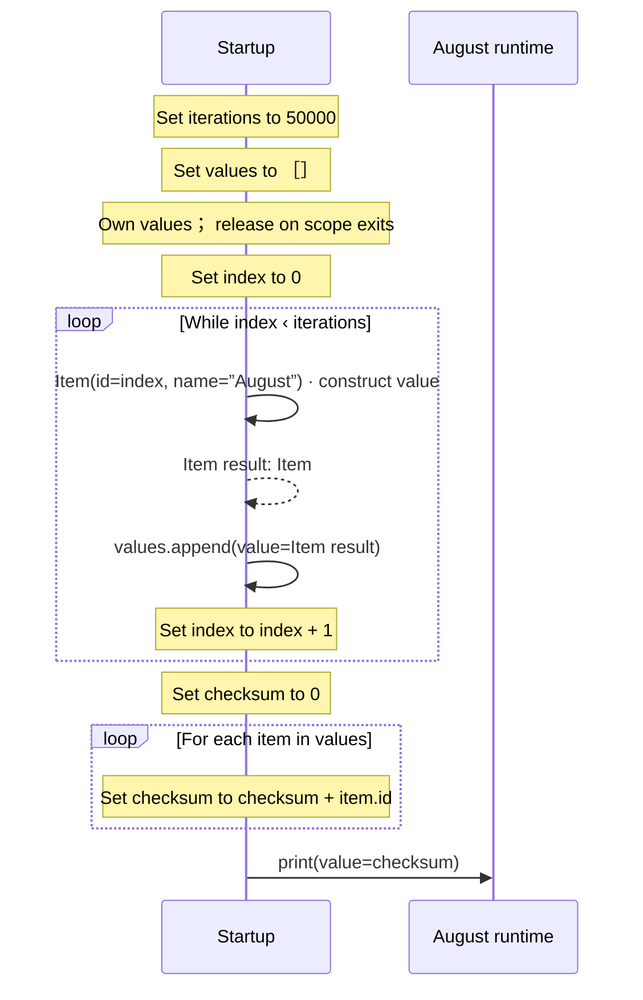

<!-- Generated by aug spec. Edit the August source, then regenerate. -->

# main.aug diagrams

[Project overview](.aug-spec/diagrams/index.md) · [Compiled explanation](main.aug.md)

## Sequences

Call arrows identify checked targets; loop and branch frames determine when they run. Open that target’s module to follow its implementation. Branches describe alternatives; loops describe repeated work. Native calls and interface dispatch stop at their declared contracts. Exit notes end that path; enclosing recovery and cleanup remain visible.

### Startup

[Source](main.aug#L3)

## Called contracts

- [Item](data.aug.diagrams.md#sequence-Item-20-constructor) — data.aug
