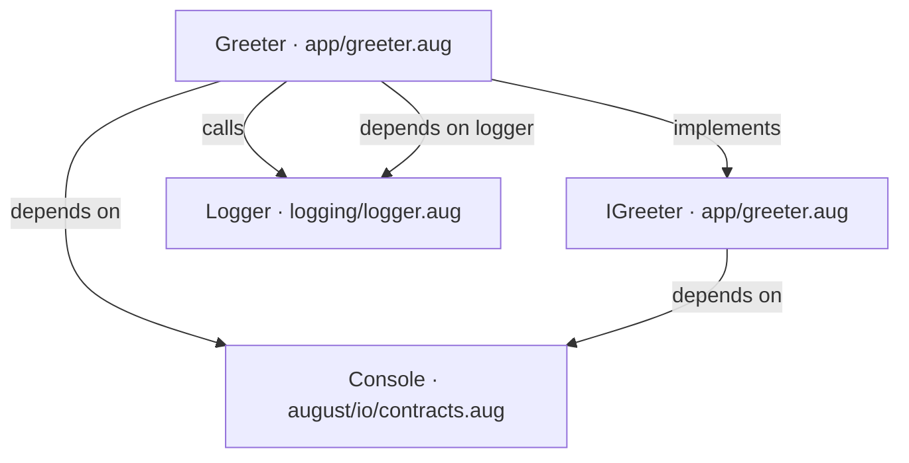

## Follow the program’s interactions

This class view is generated from the greeting project. Start at its [project overview](examples/hello/diagrams/index.md), then follow the calls to their [sequence and explanation](examples/hello/app/greeter-diagrams.md). Generated diagrams are unreleased.
