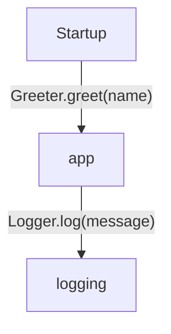
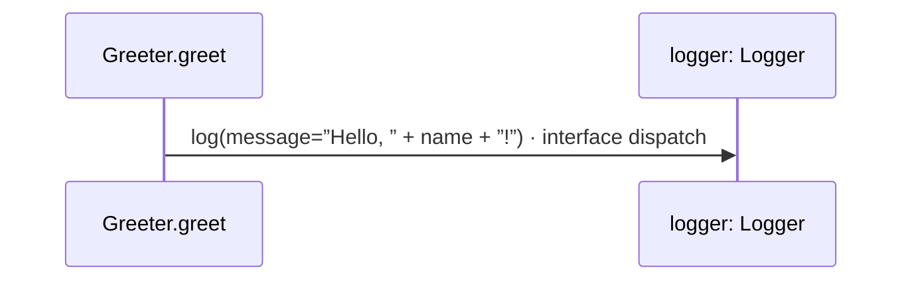

## The same program, at two resolutions

### Where the greeting goes

This is the greeting project’s folder view. Startup calls the application; the application calls the logger. Each connection opens its exact inputs and call sites in the [project overview](examples/hello/diagrams/index.md).

### What one operation does

This is the generated sequence for `Greeter.greet`. It passes the greeting to the `Logger` contract. The application chooses `ConsoleLogger` in its [startup specification](examples/hello/main.md#specification). Interface dispatch remains visible; the diagram does not guess which instance a caller will use.

[Open this operation](examples/hello/app/greeter-diagrams.md#sequence-Greeter.greet) · [Follow its logger](examples/hello/logging/console-diagrams.md#sequence-ConsoleLogger.log) · [Learn to navigate the views](guides/understand-a-project.md)
