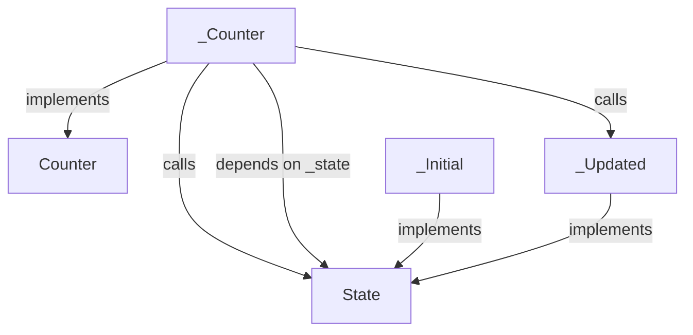
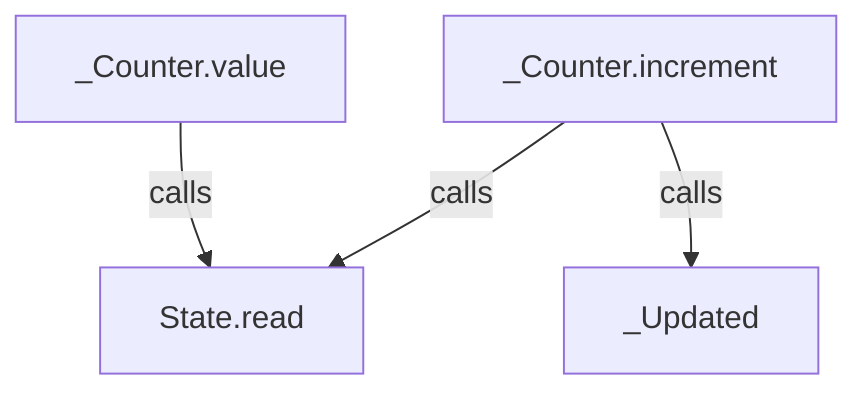
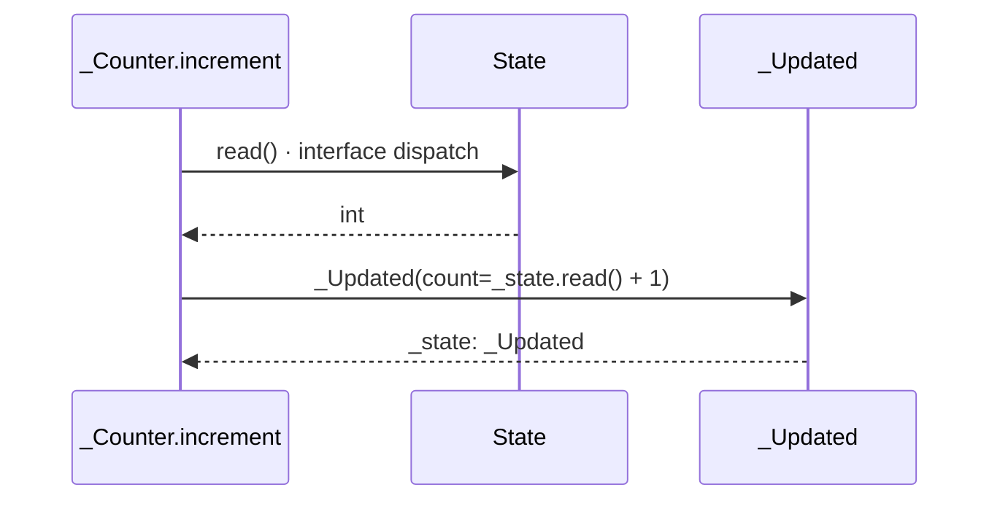
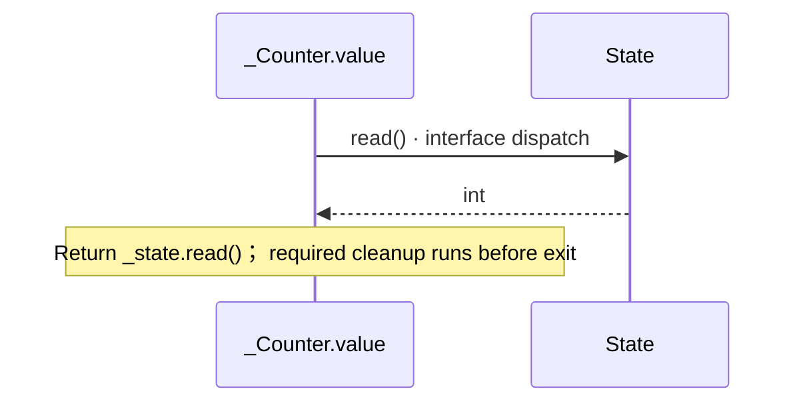

# counters.aug diagrams

[Modules and composition](index.md)

[Project overview](diagrams/index.md) · [Compiled explanation](counters.md)

## Class interactions

::: details Call relationships

:::

## Sequences

Call arrows identify checked targets; loop and branch frames determine when they run. Open that target’s module to follow its implementation. Branches describe alternatives; loops describe repeated work. Native calls and interface dispatch stop at their declared contracts. Exit notes end that path; enclosing recovery and cleanup remain visible.

### State.read {#sequence-State.read}

::: spec-paragraph specification-paragraph-1
[Source](counters.md#source-L4)
:::

Interface contract; implementation selected at runtime. [Explanation](counters.md).

### \_Initial constructor {#sequence-_Initial-20-constructor}

::: spec-paragraph specification-paragraph-2
[Source](counters.md#source-L5)
:::

[Explanation](counters.md).

### \_Initial.read {#sequence-_Initial.read}

::: spec-paragraph specification-paragraph-3
[Source](counters.md#source-L6)
:::

Return 0; required cleanup runs before exit. [Explanation](counters.md).

### \_Updated constructor {#sequence-_Updated-20-constructor}

::: spec-paragraph specification-paragraph-4
[Source](counters.md#source-L8)
:::

Receive fields: count. [Explanation](counters.md).

### \_Updated.read {#sequence-_Updated.read}

::: spec-paragraph specification-paragraph-5
[Source](counters.md#source-L9)
:::

Return count; required cleanup runs before exit. [Explanation](counters.md).

### Counter.increment {#sequence-Counter.increment}

::: spec-paragraph specification-paragraph-6
[Source](counters.md#source-L13)
:::

Interface contract; implementation selected at runtime. [Explanation](counters.md).

### Counter.value {#sequence-Counter.value}

::: spec-paragraph specification-paragraph-7
[Source](counters.md#source-L14)
:::

Interface contract; implementation selected at runtime. [Explanation](counters.md).

### \_Counter constructor {#sequence-_Counter-20-constructor}

::: spec-paragraph specification-paragraph-8
[Source](counters.md#source-L15)
:::

Receive fields: injected \_state. [Explanation](counters.md).

### \_Counter.increment {#sequence-_Counter.increment}

::: spec-paragraph specification-paragraph-9
[Source](counters.md#source-L16)
:::

### \_Counter.value {#sequence-_Counter.value}

::: spec-paragraph specification-paragraph-10
[Source](counters.md#source-L18)
:::

## Called contracts

- [Counter](counters-diagrams.md) — counters.aug
- [State](counters-diagrams.md) — counters.aug
- [State.read](counters-diagrams.md#sequence-State.read) — counters.aug
- [\_Updated](counters-diagrams.md#sequence-_Updated-20-constructor) — counters.aug
