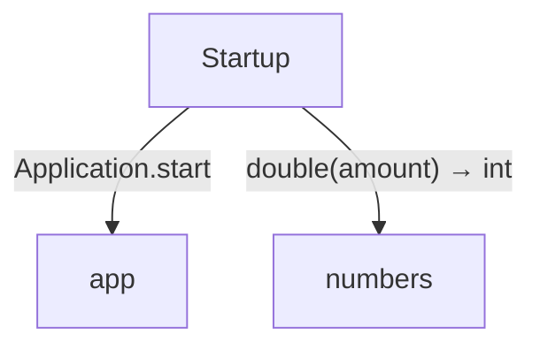
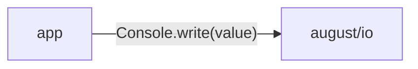

# domain data flow

[Modules and composition](../../../index.md)

[Project overview](../../index.md)

This view opens the domain folder one level deeper. Each arrow shows the called operation and the data it returns to its caller. Calls inside a file stay in that file’s sequence view.

### Package boundaries

::: details app package calls

:::

### Follow the data

Each row opens the complete operations and call sites behind one pair of logical units. A grouped arrow records calls between those units; connected arrows need not belong to the same execution path.

| From | To | Operations | Read |
| --- | --- | --- | --- |
| app | august/io | 1 | [Inputs, results and call sites](index.md#boundary-0bee19dd35ce) |
| app | models | 1 | [Inputs, results and call sites](index.md#boundary-1018226eaac9) |
| Startup | app | 1 | [Inputs, results and call sites](index.md#boundary-924906bb7307) |
| Startup | models | 1 | [Inputs, results and call sites](index.md#boundary-2175d99c2ab4) |
| Startup | numbers | 1 | [Inputs, results and call sites](index.md#boundary-115db4a8485f) |

#### Data crossing these boundaries (5 contracts)

#### app → august/io {#boundary-0bee19dd35ce}

::: details 1 operation, 1 site

**[Console.write](../../../dependencies/august/1.0.0/io/contracts.md#symbol-Console.write)** · interface dispatch

Inputs: value: string. Result: void.

| Caller or entry | Evidence |
| --- | --- |
| ApplicationImpl.start | [Call site](../../../domain/app.md#source-L13) · [Caller explanation](../../../domain/app.md#symbol-ApplicationImpl.start) |

:::

#### app → models {#boundary-1018226eaac9}

::: details 1 operation, 2 sites

**[Fruit](../../../domain/models.md#symbol-Fruit)** · value construction

Inputs: code: int, name: string. Result: Fruit.

| Caller or entry | Evidence |
| --- | --- |
| ApplicationImpl.start | [Call site](../../../domain/app.md#source-L11) · [Caller explanation](../../../domain/app.md#symbol-ApplicationImpl.start) |
| ApplicationImpl.start | [Call site](../../../domain/app.md#source-L11) · [Caller explanation](../../../domain/app.md#symbol-ApplicationImpl.start) |

:::

#### Startup → app {#boundary-924906bb7307}

::: details 1 operation, 1 site

**[Application.start](../../../domain/app.md#symbol-Application.start)** · interface dispatch

No caller-supplied inputs. Result: void.

| Caller or entry | Evidence |
| --- | --- |
| Startup | [Call site](../../../main.md#source-L9) · [Caller explanation](../../../main.md#startup) |

:::

#### Startup → models {#boundary-2175d99c2ab4}

::: details 1 operation, 2 sites

**[Fruit](../../../domain/models.md#symbol-Fruit)** · value construction

Inputs: code: int, name: string. Result: Fruit.

| Caller or entry | Evidence |
| --- | --- |
| Startup | [Call site](../../../main.md#source-L17) · [Caller explanation](../../../main.md#startup) |
| Startup | [Call site](../../../main.md#source-L17) · [Caller explanation](../../../main.md#startup) |

:::

#### Startup → numbers {#boundary-115db4a8485f}

::: details 1 operation, 2 sites

**[double](../../../domain/numbers.md#symbol-double)**

Inputs: amount: int. Result: int.

| Caller or entry | Evidence |
| --- | --- |
| Startup | [Call site](../../../main.md#source-L24) · [Caller explanation](../../../main.md#startup) |
| Startup | [Call site](../../../main.md#source-L25) · [Caller explanation](../../../main.md#startup) |

:::

## What this folder exposes

### Exports

Export the declaration `Application` from [`app.aug`](../../../domain/app.md#symbol-Application). Export the declaration `ApplicationImpl` from [`app.aug`](../../../domain/app.md#symbol-ApplicationImpl). Export the declaration `Fruit` from [`models.aug`](../../../domain/models.md#symbol-Fruit). Export the declaration `double` from [`numbers.aug`](../../../domain/numbers.md#symbol-double).

Export the declaration `RangeError` from [`numbers.aug`](../../../domain/numbers.md#symbol-RangeError).

## Files in this folder

| Module | Read |
| --- | --- |
| domain/app.aug | [Flow and sequences](../../../domain/app-diagrams.md) · [Explanation](../../../domain/app.md) |
| domain/export.aug | [Flow and sequences](../../../domain/export-diagrams.md) · [Explanation](../../../domain/export.md) |
| domain/models.aug | [Flow and sequences](../../../domain/models-diagrams.md) · [Explanation](../../../domain/models.md) |
| domain/numbers.aug | [Flow and sequences](../../../domain/numbers-diagrams.md) · [Explanation](../../../domain/numbers.md) |
