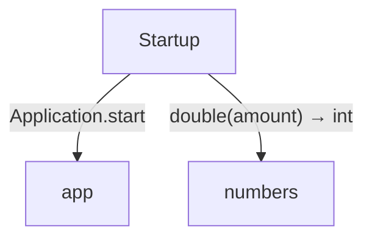
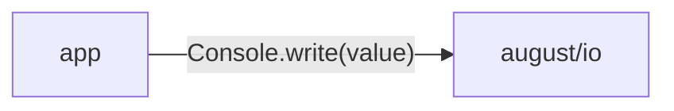

# domain data flow

[Modules and composition](../../../index.md)

[Project overview](../../index.md)

This view opens the domain folder one level deeper. Each arrow shows the called operation and the data it returns to its caller. Calls inside a file stay in that file’s sequence view.

### Package boundaries

::: details app package calls

:::

::: details Data crossing these boundaries (5 contracts)

| From | To | Operation and inputs | Result |
| --- | --- | --- | --- |
| app | august/io | [Console.write](../../../dependencies/august/0.23.0/io/contracts.md#symbol-Console.write) · value: string · interface dispatch | void |
| app | models | [Fruit](../../../domain/models.md#symbol-Fruit) · code: int, name: string · value construction | Fruit |
| Startup | app | [Application.start](../../../domain/app.md#symbol-Application.start) · interface dispatch | void |
| Startup | models | [Fruit](../../../domain/models.md#symbol-Fruit) · code: int, name: string · value construction | Fruit |
| Startup | numbers | [double](../../../domain/numbers.md#symbol-double) · amount: int | int |

:::

## Files in this folder

| Module | Read |
| --- | --- |
| domain/app.aug | [Flow and sequences](../../../domain/app-diagrams.md) · [Explanation](../../../domain/app.md) |
| domain/export.aug | [Flow and sequences](../../../domain/export-diagrams.md) · [Explanation](../../../domain/export.md) |
| domain/models.aug | [Flow and sequences](../../../domain/models-diagrams.md) · [Explanation](../../../domain/models.md) |
| domain/numbers.aug | [Flow and sequences](../../../domain/numbers-diagrams.md) · [Explanation](../../../domain/numbers.md) |
