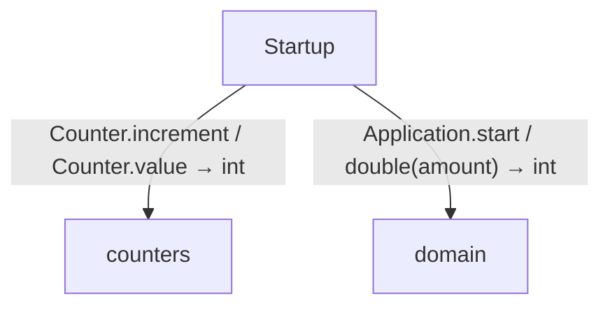
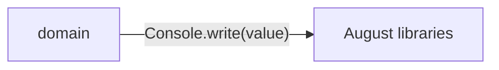

# Modules and composition diagrams

[Modules and composition](../index.md)

Start here to see what moves between the application’s folders. Each arrow names an operation’s inputs and the result it returns to its caller. Open a folder for the next level of detail. Expand the contract list for complete types and dependency links.

## Data flow

### Package boundaries

::: details domain package calls

:::

::: details Data crossing these boundaries (6 contracts)

| From | To | Operation and inputs | Result |
| --- | --- | --- | --- |
| domain | August libraries | [Console.write](../dependencies/august/0.23.0/io/contracts.md) · value: string · interface dispatch | void |
| Startup | counters | [Counter.increment](../counters.md) · interface dispatch | void |
| Startup | counters | [Counter.value](../counters.md) · interface dispatch | int |
| Startup | domain | [Application.start](../domain/app.md) · interface dispatch | void |
| Startup | domain | [Fruit](../domain/models.md) · code: int, name: string · value construction | Fruit |
| Startup | domain | [double](../domain/numbers.md) · amount: int | int |

:::

## Open a folder

| Folder | Read |
| --- | --- |
| domain | [Folder data flow](folders/domain/index.md) |

## Open a module

| Module | Read |
| --- | --- |
| counters.aug | [Flow and sequences](../counters-diagrams.md) · [Explanation](../counters.md) |
| domain/app.aug | [Flow and sequences](../domain/app-diagrams.md) · [Explanation](../domain/app.md) |
| domain/export.aug | [Flow and sequences](../domain/export-diagrams.md) · [Explanation](../domain/export.md) |
| domain/models.aug | [Flow and sequences](../domain/models-diagrams.md) · [Explanation](../domain/models.md) |
| domain/numbers.aug | [Flow and sequences](../domain/numbers-diagrams.md) · [Explanation](../domain/numbers.md) |
| main.aug | [Flow and sequences](../main-diagrams.md) · [Explanation](../main.md) |

These are static call boundaries, not a request trace. Interface implementations and foreign internals stop at their checked contracts. Dotted arrows defer a callback or browser action. Imports alone do not imply a call.
