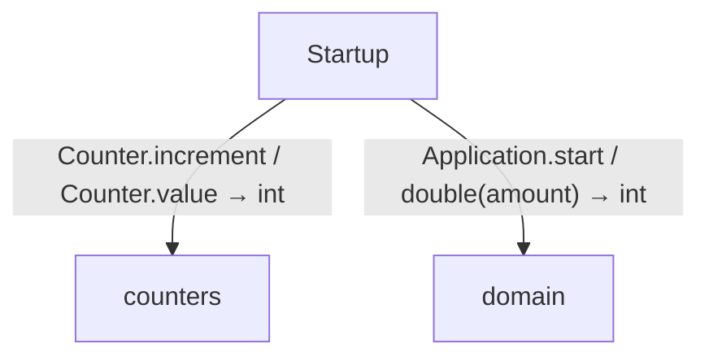
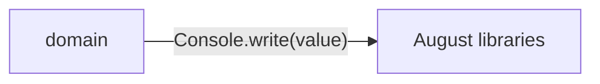

# Modules and composition diagrams

[Modules and composition](../index.md)

Start with how the application begins, then follow data between its folders. Open an operation to see its decisions, calls, failures and cleanup. Its explanation supplies the exact contract and linked dependencies.

This view includes 6 application source files. Package and interface boundaries show checked contracts; their runtime implementations are not expanded. The views describe the checked program, not desired requirements or a recorded execution.

## Where execution begins

### Providers {#providers}

`Console` is provided by [`SystemConsole`](../dependencies/august/1.0.0/io/contracts.md#symbol-SystemConsole). The same instance is shared.

`Application` is provided by [`ApplicationImpl`](../domain/app.md#symbol-ApplicationImpl). The same instance is shared. It requires bindings for `Console`. Include providers from [`Counters`](../counters.md#symbol-Counters).

### Startup {#startup}

::: spec-paragraph specification-paragraph-1
It sets `app` to the instance provided for `Application`. It calls [`app.start`](../domain/app.md#symbol-Application.start). It sets `names` to a map with `1` mapped to `"apple"`; `2` mapped to `"pear"`. If the value under `2` in `names` is null, it prints `"missing fruit"`. [source](../main.md#source-L8-L15)
:::

::: spec-paragraph specification-paragraph-2
If the value under `2` in `names` is not null, using `name` for it prints `name`. It reads a tuple containing `3`, `"plum"` once and binds `[0]` as `code` and `[1]` as `label`. It prints the number of elements in a set containing a [`Fruit`](../domain/models.md#symbol-Fruit) with `code` and `name` from `label`, a [`Fruit`](../domain/models.md#symbol-Fruit) with `name` from `label` and `code`. Within a task and ownership scope, it sets `counter` to the instance provided for `Counter`. [source](../main.md#source-L15-L22)
:::

::: spec-paragraph specification-paragraph-3
With temporary permission to change `counter`, it calls [`counter.increment`](../counters.md#symbol-Counter.increment). It prints [`counter.value`](../counters.md#symbol-Counter.value). On leaving this scope, join its child tasks and release its local values. It prints [`double`](../domain/numbers.md#symbol-double) with `amount` `7`. [source](../main.md#source-L18-L27)
:::

::: spec-paragraph specification-paragraph-4
It calls [`double`](../domain/numbers.md#symbol-double) with `amount` `-1`. If this work raises [`RangeError`](../domain/numbers.md#symbol-RangeError), it prints `"negative amount rejected"`. [source](../main.md#source-L25-L27)
:::

## Data flow

### Package boundaries

::: details domain package calls

:::

### Follow the data

Each row opens the complete operations and call sites behind one pair of logical units. A grouped arrow records calls between those units; connected arrows need not belong to the same execution path.

| From | To | Operations | Read |
| --- | --- | --- | --- |
| domain | August libraries | 1 | [Inputs, results and call sites](index.md#boundary-0619972829a9) |
| Startup | counters | 2 | [Inputs, results and call sites](index.md#boundary-b7bfe3a049b4) |
| Startup | domain | 3 | [Inputs, results and call sites](index.md#boundary-81d4afd188f5) |

#### Data crossing these boundaries (6 contracts)

#### domain → August libraries {#boundary-0619972829a9}

::: details 1 operation, 1 site

**[Console.write](../dependencies/august/1.0.0/io/contracts.md#symbol-Console.write)** · interface dispatch

Inputs: value: string. Result: void.

| Caller or entry | Evidence |
| --- | --- |
| ApplicationImpl.start | [Call site](../domain/app.md#source-L13) · [Caller explanation](../domain/app.md#symbol-ApplicationImpl.start) |

:::

#### Startup → counters {#boundary-b7bfe3a049b4}

::: details 2 operations, 2 sites

**[Counter.increment](../counters.md#symbol-Counter.increment)** · interface dispatch

No caller-supplied inputs. Result: void.

| Caller or entry | Evidence |
| --- | --- |
| Startup | [Call site](../main.md#source-L21) · [Caller explanation](../main.md#startup) |

**[Counter.value](../counters.md#symbol-Counter.value)** · interface dispatch

No caller-supplied inputs. Result: int.

| Caller or entry | Evidence |
| --- | --- |
| Startup | [Call site](../main.md#source-L22) · [Caller explanation](../main.md#startup) |

:::

#### Startup → domain {#boundary-81d4afd188f5}

::: details 3 operations, 5 sites

**[Application.start](../domain/app.md#symbol-Application.start)** · interface dispatch

No caller-supplied inputs. Result: void.

| Caller or entry | Evidence |
| --- | --- |
| Startup | [Call site](../main.md#source-L9) · [Caller explanation](../main.md#startup) |

**[Fruit](../domain/models.md#symbol-Fruit)** · value construction

Inputs: code: int, name: string. Result: Fruit.

| Caller or entry | Evidence |
| --- | --- |
| Startup | [Call site](../main.md#source-L17) · [Caller explanation](../main.md#startup) |
| Startup | [Call site](../main.md#source-L17) · [Caller explanation](../main.md#startup) |

**[double](../domain/numbers.md#symbol-double)**

Inputs: amount: int. Result: int.

| Caller or entry | Evidence |
| --- | --- |
| Startup | [Call site](../main.md#source-L24) · [Caller explanation](../main.md#startup) |
| Startup | [Call site](../main.md#source-L25) · [Caller explanation](../main.md#startup) |

:::

## Open a folder

| Folder | Read |
| --- | --- |
| domain | [Folder data flow](folders/domain/index.md) |

## Open a module

| Module | Read |
| --- | --- |
| counters.aug | [Flow and sequences](../counters-diagrams.md) · [Explanation](../counters.md) |
| domain/app.aug | [Flow and sequences](../domain/app-diagrams.md) · [Explanation](../domain/app.md) |
| domain/export.aug | [Flow and sequences](../domain/export-diagrams.md) · [Explanation](../domain/export.md) |
| domain/models.aug | [Flow and sequences](../domain/models-diagrams.md) · [Explanation](../domain/models.md) |
| domain/numbers.aug | [Flow and sequences](../domain/numbers-diagrams.md) · [Explanation](../domain/numbers.md) |
| main.aug | [Flow and sequences](../main-diagrams.md) · [Explanation](../main.md) |

These are static call boundaries, not a request trace. Interface implementations and foreign internals stop at their checked contracts. Dotted arrows defer a callback or browser action. Imports alone do not imply a call.
