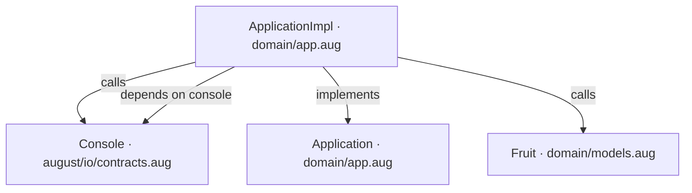
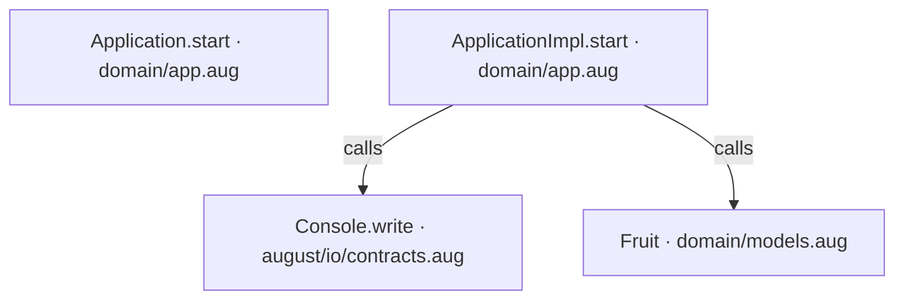
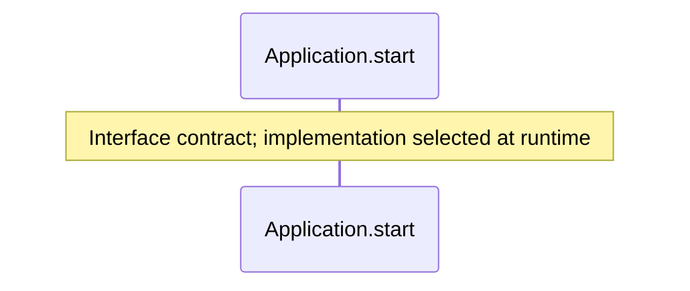
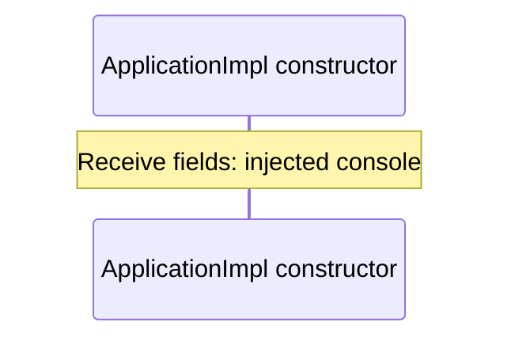
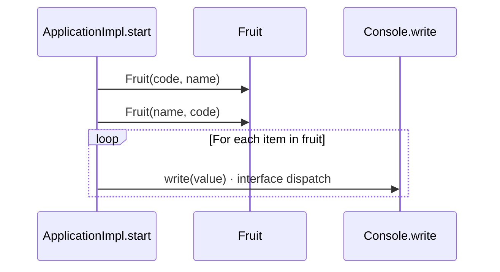

# domain/app.aug diagrams

[Modules and composition](../index.md)

[Project overview](../diagrams/index.md) · [Compiled explanation](app.md)

## Class interactions

## API calls

## Sequences

Call arrows identify checked targets; loop and branch frames determine when they run. Open that target’s module to follow its implementation. Branches describe alternatives; loops describe repeated work. Native calls and interface dispatch stop at their declared contracts. Exit notes end that path; enclosing recovery and cleanup remain visible.

### Application.start {#sequence-Application.start}

::: spec-paragraph specification-paragraph-1
[Source](app.md#source-L7)
:::

### ApplicationImpl constructor {#sequence-ApplicationImpl-20-constructor}

::: spec-paragraph specification-paragraph-2
[Source](app.md#source-L9)
:::

### ApplicationImpl.start {#sequence-ApplicationImpl.start}

::: spec-paragraph specification-paragraph-3
[Source](app.md#source-L10)
:::

## Called contracts

- [Console.write](../dependencies/august/0.23.0/io/contracts-diagrams.md#sequence-Console.write) — august/io/contracts.aug
- [Application](app-diagrams.md) — domain/app.aug
- [Fruit](models-diagrams.md#sequence-Fruit-20-constructor) — domain/models.aug
