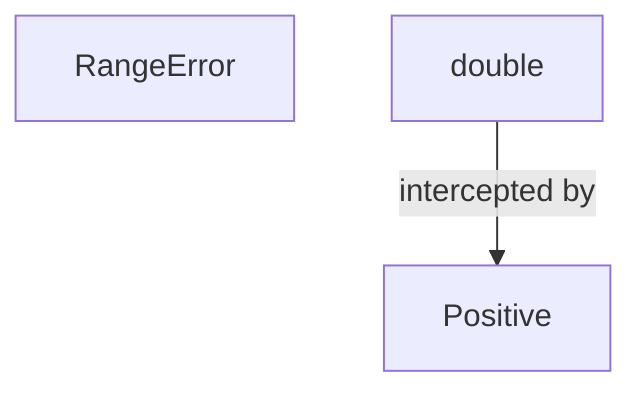
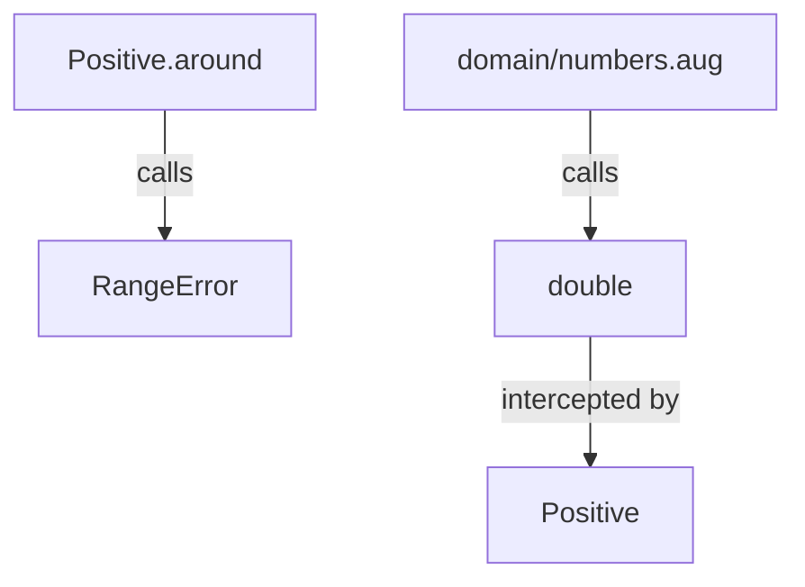
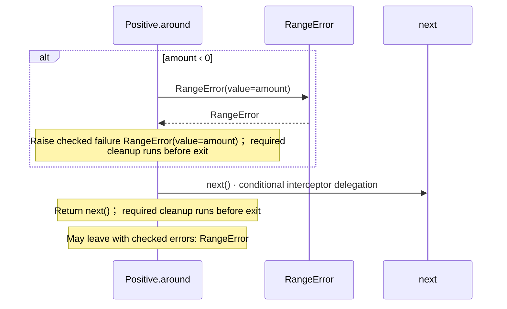

# domain/numbers.aug diagrams

[Modules and composition](../index.md)

[Project overview](../diagrams/index.md) · [Compiled explanation](numbers.md)

## Class interactions

::: details Call relationships

:::

## Sequences

Call arrows identify checked targets; loop and branch frames determine when they run. Open that target’s module to follow its implementation. Branches describe alternatives; loops describe repeated work. Native calls and interface dispatch stop at their declared contracts. Exit notes end that path; enclosing recovery and cleanup remain visible.

### RangeError constructor {#sequence-RangeError-20-constructor}

::: spec-paragraph specification-paragraph-1
[Source](numbers.md#source-L3)
:::

Receive fields: value. [Explanation](numbers.md).

### Positive.around {#sequence-Positive.around}

::: spec-paragraph specification-paragraph-2
[Source](numbers.md#source-L7)
:::

### double {#sequence-double}

::: spec-paragraph specification-paragraph-3
[Source](numbers.md#source-L18)
:::

Applied layers: Positive; may stop or change delegation; see specification. Return amount \* 2; required cleanup runs before exit. May leave with checked errors: RangeError. [Explanation](numbers.md).

## Called contracts

- [Positive](numbers-diagrams.md) — domain/numbers.aug
- [RangeError](numbers-diagrams.md#sequence-RangeError-20-constructor) — domain/numbers.aug
- [double](numbers-diagrams.md#sequence-double) — domain/numbers.aug
