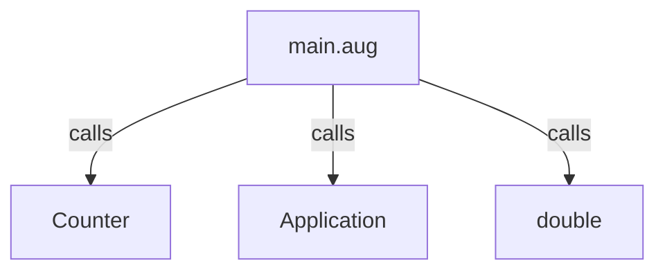
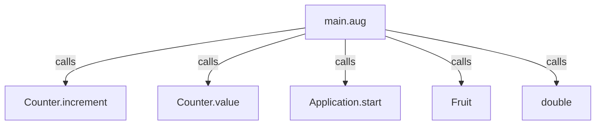
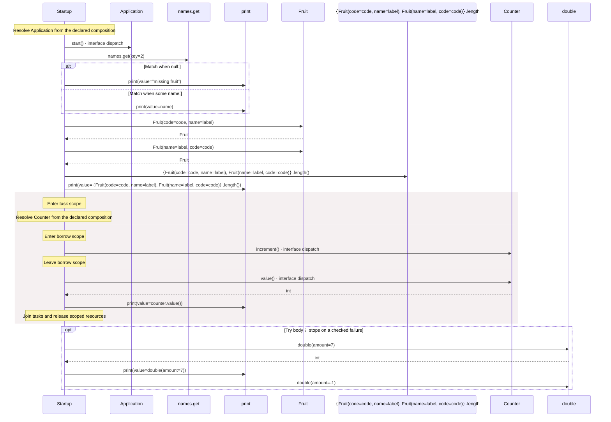
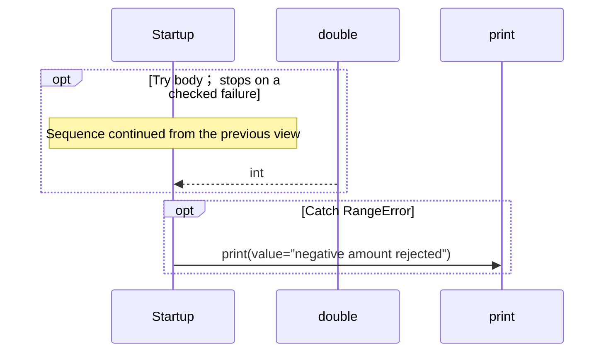

# main.aug diagrams

[Modules and composition](index.md)

[Project overview](diagrams/index.md) · [Compiled explanation](main.md)

## Class interactions

::: details Call relationships

:::

## Sequences

Call arrows identify checked targets; loop and branch frames determine when they run. Open that target’s module to follow its implementation. Branches describe alternatives; loops describe repeated work. Native calls and interface dispatch stop at their declared contracts. Exit notes end that path; enclosing recovery and cleanup remain visible.

### Startup {#sequence-Startup}

::: spec-paragraph specification-paragraph-1
[Source](main.md#source-L8)
:::

#### Sequence 1 of 2 (continued)

#### Sequence 2 of 2 (continued)

## Called contracts

- [Counter.increment](counters-diagrams.md#sequence-Counter.increment) — counters.aug
- [Counter.value](counters-diagrams.md#sequence-Counter.value) — counters.aug
- [Application.start](domain/app-diagrams.md#sequence-Application.start) — domain/app.aug
- [Fruit](domain/models-diagrams.md#sequence-Fruit-20-constructor) — domain/models.aug
- [double](domain/numbers-diagrams.md#sequence-double) — domain/numbers.aug
