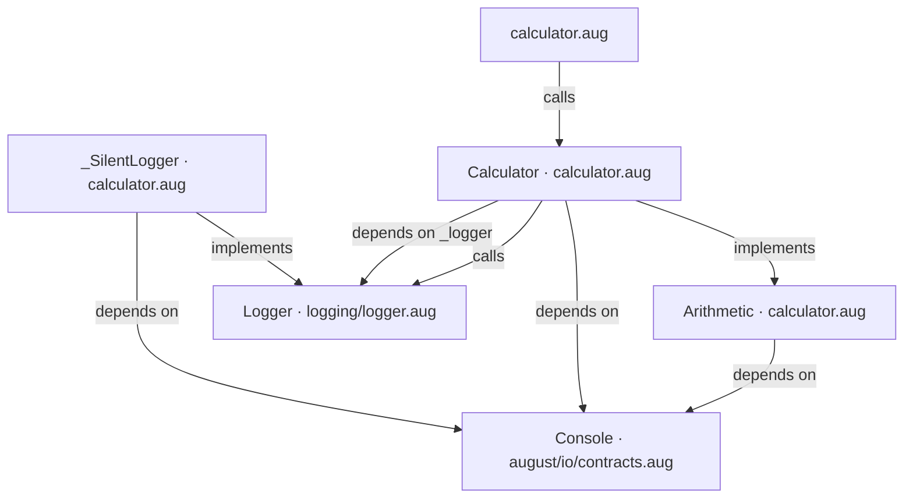
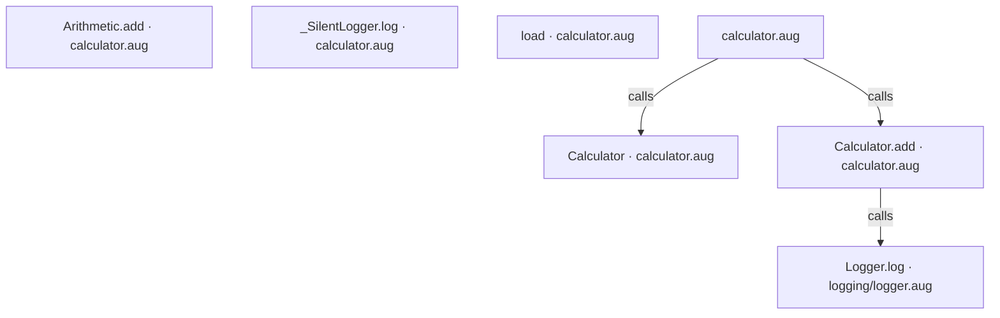
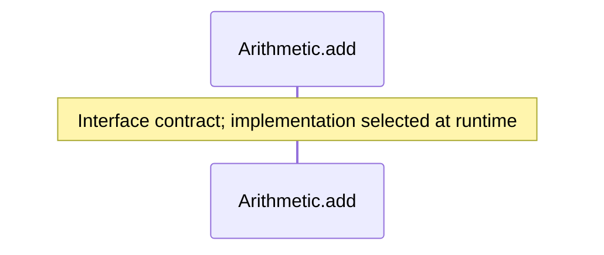
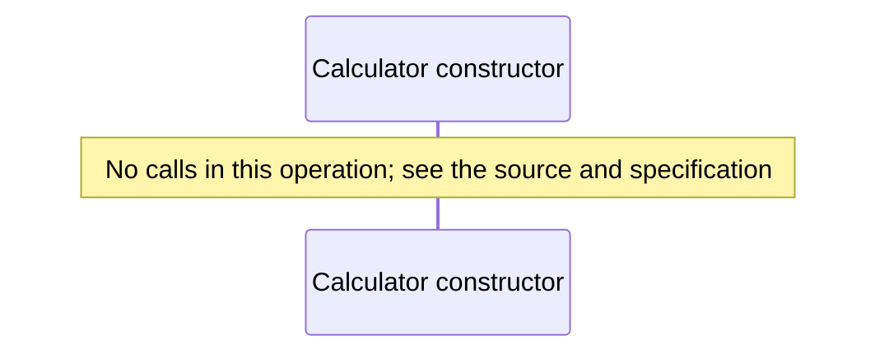
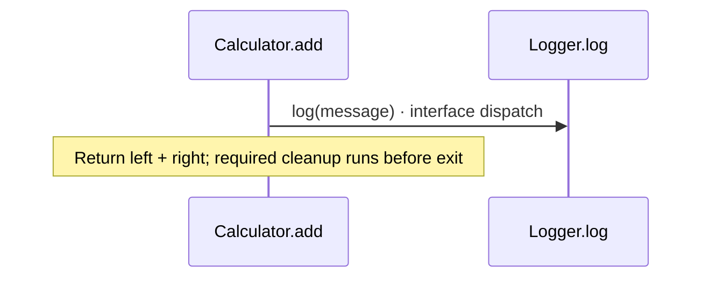
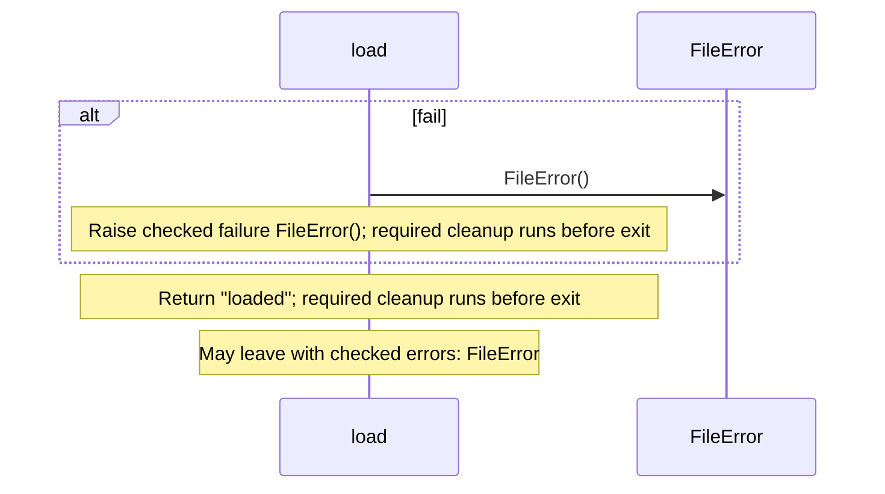
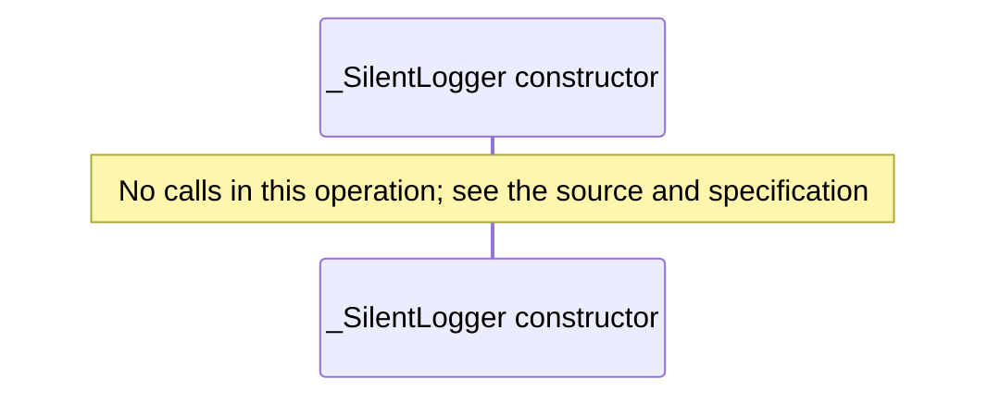
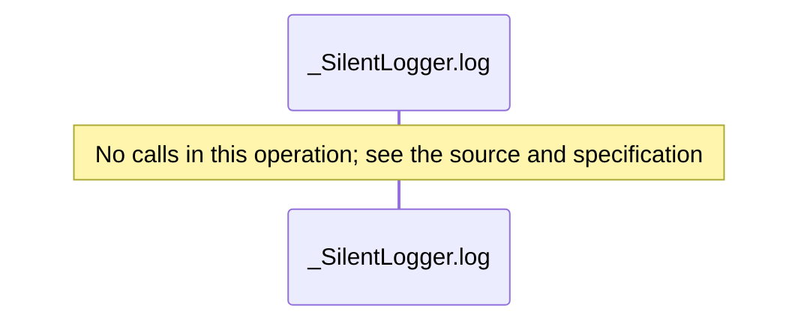

# A small tested application diagrams

[A small tested application](index.md)

[Project overview](diagrams/index.md) · [Compiled explanation](calculator.md)

### Class interactions

### API calls

### Sequences

Call arrows identify checked targets; loop and branch frames determine when they run. Open that target’s module to follow its implementation. Branches describe alternatives; loops describe repeated work. Native calls and interface dispatch stop at their declared contracts. Exit notes end that path; enclosing recovery and cleanup remain visible.

#### Arithmetic.add {#sequence-Arithmetic.add}

::: spec-paragraph specification-paragraph-1
[Source](calculator.md#source-L6)
:::

#### Calculator constructor {#sequence-Calculator-20-constructor}

::: spec-paragraph specification-paragraph-2
[Source](calculator.md#source-L9)
:::

#### Calculator.add {#sequence-Calculator.add}

::: spec-paragraph specification-paragraph-3
[Source](calculator.md#source-L16)
:::

#### load {#sequence-load}

::: spec-paragraph specification-paragraph-4
[Source](calculator.md#source-L26)
:::

#### \_SilentLogger constructor {#sequence-_SilentLogger-20-constructor}

::: spec-paragraph specification-paragraph-5
[Source](calculator.md#source-L33)
:::

#### \_SilentLogger.log {#sequence-_SilentLogger.log}

::: spec-paragraph specification-paragraph-6
[Source](calculator.md#source-L34)
:::

### Called contracts

- [Console](dependencies/august/0.23.0/io/contracts-diagrams.md) — august/io/contracts.aug
- [Arithmetic](calculator-diagrams.md) — calculator.aug
- [Calculator](calculator-diagrams.md#sequence-Calculator-20-constructor) — calculator.aug
- [Calculator.add](calculator-diagrams.md#sequence-Calculator.add) — calculator.aug
- [Logger](logging/logger-diagrams.md) — logging/logger.aug
- [Logger.log](logging/logger-diagrams.md#sequence-Logger.log) — logging/logger.aug
