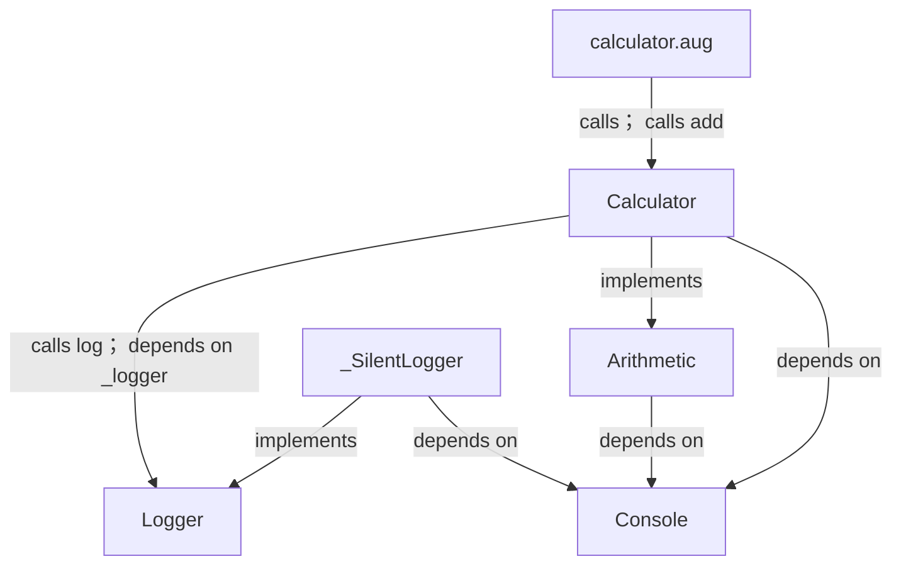
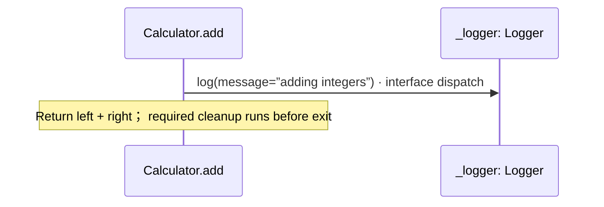
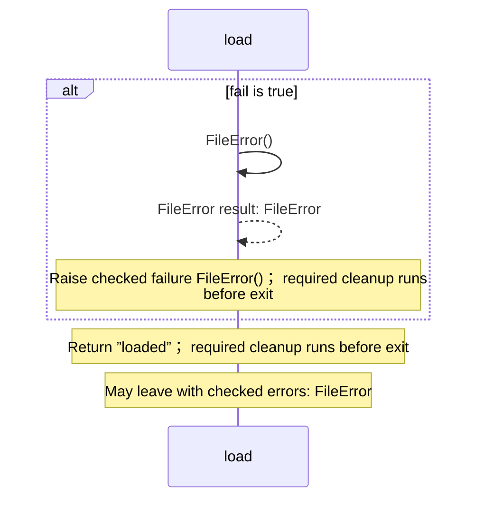

# calculator.aug diagrams

[A small tested application](index.md)

[Project overview](diagrams/index.md) · [Compiled explanation](calculator.md)

## Class interactions

## Sequences

Call arrows identify checked targets; loop and branch frames determine when they run. Open that target’s module to follow its implementation. Branches describe alternatives; loops describe repeated work. Native calls and interface dispatch stop at their declared contracts. Exit notes end that path; enclosing recovery and cleanup remain visible.

### Arithmetic.add {#sequence-Arithmetic.add}

::: spec-paragraph specification-paragraph-1
[Source](calculator.md#source-L6)
:::

It takes `left` and `right` as integers. It gets `console` ([`Console`](dependencies/august/1.0.0/io/contracts.md#symbol-Console)) from dependency injection.

It returns `int`. It can call [`Console.write`](dependencies/august/1.0.0/io/contracts.md#symbol-Console.write).

Interface contract; implementation selected at runtime. [Explanation](calculator.md).

### Calculator constructor {#sequence-Calculator-20-constructor}

::: spec-paragraph specification-paragraph-2
[Source](calculator.md#source-L9)
:::

Uses the selected logger to describe each addition. It implements [`Arithmetic`](calculator.md#symbol-Arithmetic).

The `_logger` dependency is injected as [`Logger`](logging/logger.md#symbol-Logger) and stored read-only and privately.

Receive fields: injected \_logger. [Explanation](calculator.md).

### Calculator.add {#sequence-Calculator.add}

::: spec-paragraph specification-paragraph-3
[Source](calculator.md#source-L16)
:::

Adds left and right, logging the operation.

It takes `left` and `right` as integers. It gets `console` ([`Console`](dependencies/august/1.0.0/io/contracts.md#symbol-Console)) from dependency injection.

It returns `int` — Sum of the two integers. It can call [`Console.write`](dependencies/august/1.0.0/io/contracts.md#symbol-Console.write).

### load {#sequence-load}

::: spec-paragraph specification-paragraph-4
[Source](calculator.md#source-L26)
:::

Demonstrates a checked failure instead of a successful result.

It takes `fail` as a boolean.

Failures can raise `FileError` (when fail is true).

### \_SilentLogger constructor {#sequence-_SilentLogger-20-constructor}

::: spec-paragraph specification-paragraph-5
[Source](calculator.md#source-L33)
:::

Test adapter: keeps calculator tests independent of console output. It implements [`Logger`](logging/logger.md#symbol-Logger). It is private to this file.

[Explanation](calculator.md).

### \_SilentLogger.log {#sequence-_SilentLogger.log}

::: spec-paragraph specification-paragraph-6
[Source](calculator.md#source-L34)
:::

It takes `message` as a string. It gets `console` ([`Console`](dependencies/august/1.0.0/io/contracts.md#symbol-Console)) from dependency injection.

It can call [`Console.write`](dependencies/august/1.0.0/io/contracts.md#symbol-Console.write).

[Explanation](calculator.md).

## Called contracts

- [Console](dependencies/august/1.0.0/io/contracts-diagrams.md) — august/io/contracts.aug
- [Arithmetic](calculator-diagrams.md) — calculator.aug
- [Calculator](calculator-diagrams.md#sequence-Calculator-20-constructor) — calculator.aug
- [Calculator.add](calculator-diagrams.md#sequence-Calculator.add) — calculator.aug
- [Logger](logging/logger-diagrams.md) — logging/logger.aug
- [Logger.log](logging/logger-diagrams.md#sequence-Logger.log) — logging/logger.aug
