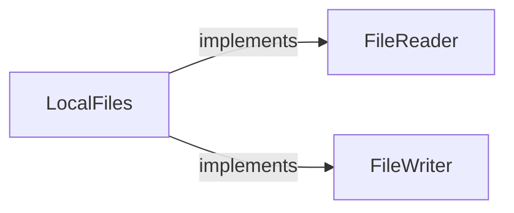
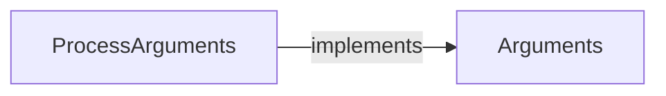
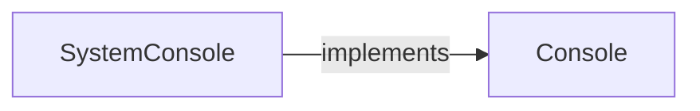
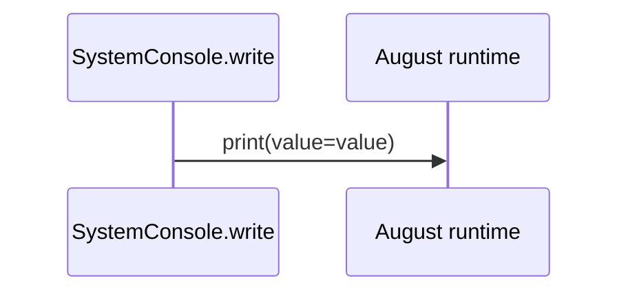
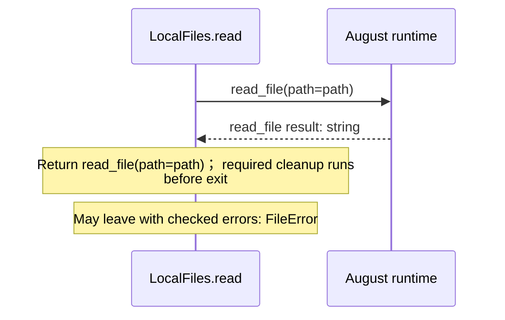
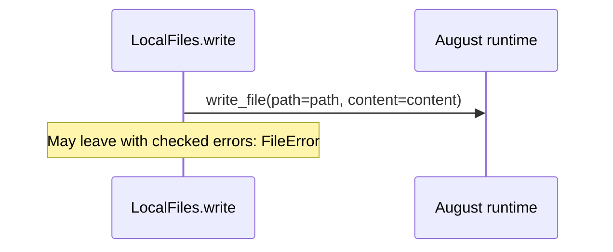
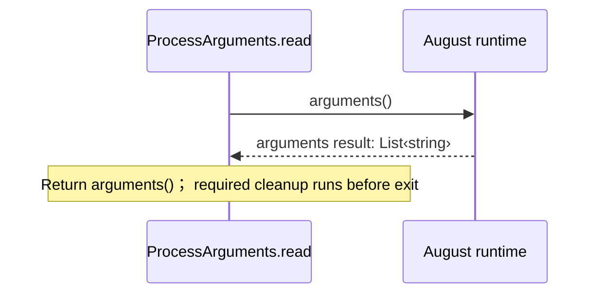

# august/io/contracts.aug diagrams

[A small tested application](../../../../index.md)

[Project overview](../../../../diagrams/index.md) · [Compiled explanation](contracts.md)

## Class interactions

### LocalFiles

### ProcessArguments

### SystemConsole

## Sequences

Call arrows identify checked targets; loop and branch frames determine when they run. Open that target’s module to follow its implementation. Branches describe alternatives; loops describe repeated work. Native calls and interface dispatch stop at their declared contracts. Exit notes end that path; enclosing recovery and cleanup remain visible.

### Console.write {#sequence-Console.write}

::: spec-paragraph specification-paragraph-1
[Source](contracts.md#source-L6)
:::

Interface contract; implementation selected at runtime. [Explanation](contracts.md).

### SystemConsole constructor {#sequence-SystemConsole-20-constructor}

::: spec-paragraph specification-paragraph-2
[Source](contracts.md#source-L9)
:::

[Explanation](contracts.md).

### SystemConsole.write {#sequence-SystemConsole.write}

::: spec-paragraph specification-paragraph-3
[Source](contracts.md#source-L10)
:::

### FileReader.read {#sequence-FileReader.read}

::: spec-paragraph specification-paragraph-4
[Source](contracts.md#source-L16)
:::

May leave with checked errors: FileError. Interface contract; implementation selected at runtime. [Explanation](contracts.md).

### FileWriter.write {#sequence-FileWriter.write}

::: spec-paragraph specification-paragraph-5
[Source](contracts.md#source-L21)
:::

May leave with checked errors: FileError. Interface contract; implementation selected at runtime. [Explanation](contracts.md).

### LocalFiles constructor {#sequence-LocalFiles-20-constructor}

::: spec-paragraph specification-paragraph-6
[Source](contracts.md#source-L24)
:::

[Explanation](contracts.md).

### LocalFiles.read {#sequence-LocalFiles.read}

::: spec-paragraph specification-paragraph-7
[Source](contracts.md#source-L25)
:::

### LocalFiles.write {#sequence-LocalFiles.write}

::: spec-paragraph specification-paragraph-8
[Source](contracts.md#source-L27)
:::

### Arguments.read {#sequence-Arguments.read}

::: spec-paragraph specification-paragraph-9
[Source](contracts.md#source-L32)
:::

Interface contract; implementation selected at runtime. [Explanation](contracts.md).

### ProcessArguments constructor {#sequence-ProcessArguments-20-constructor}

::: spec-paragraph specification-paragraph-10
[Source](contracts.md#source-L35)
:::

[Explanation](contracts.md).

### ProcessArguments.read {#sequence-ProcessArguments.read}

::: spec-paragraph specification-paragraph-11
[Source](contracts.md#source-L36)
:::

## Called contracts

- [Arguments](contracts-diagrams.md) — august/io/contracts.aug
- [Console](contracts-diagrams.md) — august/io/contracts.aug
- [FileReader](contracts-diagrams.md) — august/io/contracts.aug
- [FileWriter](contracts-diagrams.md) — august/io/contracts.aug
