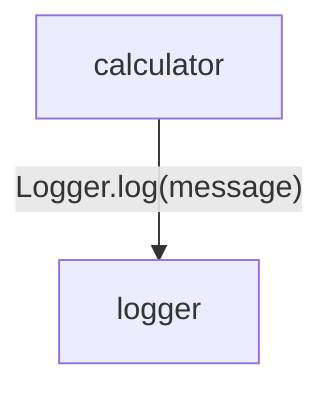
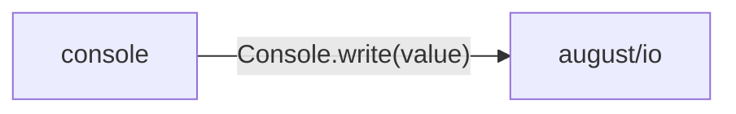

# logging data flow

[A small tested application](../../../index.md)

[Project overview](../../index.md)

This view opens the logging folder one level deeper. Each arrow shows the called operation and the data it returns to its caller. Calls inside a file stay in that file’s sequence view.

### Package boundaries

::: details console package calls

:::

### Follow the data

Each row opens the complete operations and call sites behind one pair of logical units. A grouped arrow records calls between those units; connected arrows need not belong to the same execution path.

| From | To | Operations | Read |
| --- | --- | --- | --- |
| calculator | logger | 1 | [Inputs, results and call sites](index.md#boundary-621b6794f8c9) |
| console | august/io | 1 | [Inputs, results and call sites](index.md#boundary-211d6d32ce6e) |

#### Data crossing these boundaries (2 contracts)

#### calculator → logger {#boundary-621b6794f8c9}

::: details 1 operation, 1 site

**[Logger.log](../../../logging/logger.md#symbol-Logger.log)** · interface dispatch

Inputs: message: string. Result: void.

| Caller or entry | Evidence |
| --- | --- |
| Calculator.add | [Call site](../../../calculator.md#source-L17) · [Caller explanation](../../../calculator.md#symbol-Calculator.add) |

:::

#### console → august/io {#boundary-211d6d32ce6e}

::: details 1 operation, 1 site

**[Console.write](../../../dependencies/august/1.0.0/io/contracts.md#symbol-Console.write)** · interface dispatch

Inputs: value: string. Result: void.

| Caller or entry | Evidence |
| --- | --- |
| ConsoleLogger.log | [Call site](../../../logging/console.md#source-L7) · [Caller explanation](../../../logging/console.md#symbol-ConsoleLogger.log) |

:::

## What this folder exposes

### Exports

Export the declaration `Logger` from [`logger.aug`](../../../logging/logger.md#symbol-Logger). Export the declaration `ConsoleLogger` from [`console.aug`](../../../logging/console.md#symbol-ConsoleLogger).

## Files in this folder

| Module | Read |
| --- | --- |
| logging/console.aug | [Flow and sequences](../../../logging/console-diagrams.md) · [Explanation](../../../logging/console.md) |
| logging/export.aug | [Flow and sequences](../../../logging/export-diagrams.md) · [Explanation](../../../logging/export.md) |
| logging/logger.aug | [Flow and sequences](../../../logging/logger-diagrams.md) · [Explanation](../../../logging/logger.md) |
