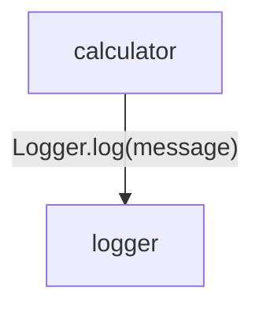
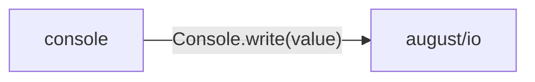

# logging data flow

[A small tested application](../../../index.md)

[Project overview](../../index.md)

This view opens the logging folder one level deeper. Each arrow shows the called operation and the data it returns to its caller. Calls inside a file stay in that file’s sequence view.

### Package boundaries

::: details console package calls

:::

::: details Data crossing these boundaries (2 contracts)

| From | To | Operation and inputs | Result |
| --- | --- | --- | --- |
| calculator | logger | [Logger.log](../../../logging/logger.md#symbol-Logger.log) · message: string · interface dispatch | void |
| console | august/io | [Console.write](../../../dependencies/august/1.0.0/io/contracts.md#symbol-Console.write) · value: string · interface dispatch | void |

:::

## Files in this folder

| Module | Read |
| --- | --- |
| logging/console.aug | [Flow and sequences](../../../logging/console-diagrams.md) · [Explanation](../../../logging/console.md) |
| logging/export.aug | [Flow and sequences](../../../logging/export-diagrams.md) · [Explanation](../../../logging/export.md) |
| logging/logger.aug | [Flow and sequences](../../../logging/logger-diagrams.md) · [Explanation](../../../logging/logger.md) |
