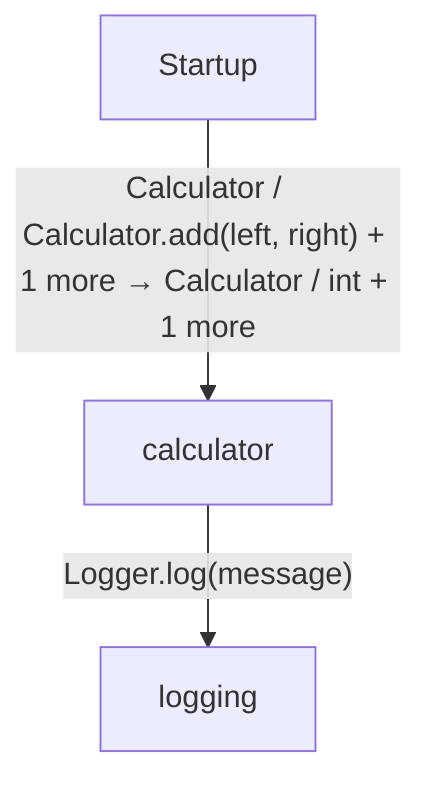
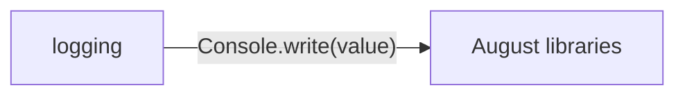

# A small tested application diagrams

[A small tested application](../index.md)

Start here to see what moves between the application’s folders. Each arrow names an operation’s inputs and the result it returns to its caller. Open a folder for the next level of detail. Expand the contract list for complete types and dependency links.

## Data flow

### Package boundaries

::: details logging package calls

:::

::: details Data crossing these boundaries (5 contracts)

| From | To | Operation and inputs | Result |
| --- | --- | --- | --- |
| calculator | logging | [Logger.log](../logging/logger.md) · message: string · interface dispatch | void |
| logging | August libraries | [Console.write](../dependencies/august/0.23.0/io/contracts.md) · value: string · interface dispatch | void |
| Startup | calculator | [Calculator](../calculator.md) | Calculator |
| Startup | calculator | [Calculator.add](../calculator.md) · left: int, right: int | int |
| Startup | calculator | [load](../calculator.md) · fail: bool | string |

:::

## Open a folder

| Folder | Read |
| --- | --- |
| logging | [Folder data flow](folders/logging/index.md) |

## Open a module

| Module | Read |
| --- | --- |
| calculator.aug | [Flow and sequences](../calculator-diagrams.md) · [Explanation](../calculator.md) |
| logging/console.aug | [Flow and sequences](../logging/console-diagrams.md) · [Explanation](../logging/console.md) |
| logging/export.aug | [Flow and sequences](../logging/export-diagrams.md) · [Explanation](../logging/export.md) |
| logging/logger.aug | [Flow and sequences](../logging/logger-diagrams.md) · [Explanation](../logging/logger.md) |
| main.aug | [Flow and sequences](../main-diagrams.md) · [Explanation](../main.md) |

These are static call boundaries, not a request trace. Interface implementations and foreign internals stop at their checked contracts. Dotted arrows defer a callback or browser action. Imports alone do not imply a call.
