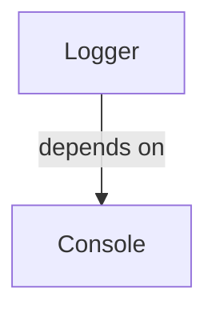

# logging/logger.aug diagrams

[A small tested application](../index.md)

[Project overview](../diagrams/index.md) · [Compiled explanation](logger.md)

## Class interactions

## Sequences

Call arrows identify checked targets; loop and branch frames determine when they run. Open that target’s module to follow its implementation. Branches describe alternatives; loops describe repeated work. Native calls and interface dispatch stop at their declared contracts. Exit notes end that path; enclosing recovery and cleanup remain visible.

### Logger.log {#sequence-Logger.log}

::: spec-paragraph specification-paragraph-1
[Source](logger.md#source-L6)
:::

Interface contract; implementation selected at runtime. [Explanation](logger.md).

## Called contracts

- [Console](../dependencies/august/0.23.0/io/contracts-diagrams.md) — august/io/contracts.aug
