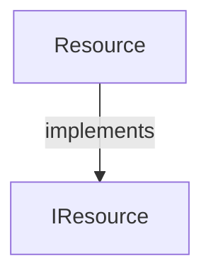

# resource.aug diagrams

[Resource cleanup](index.md)

[Project overview](diagrams/index.md) · [Compiled explanation](resource.md)

## Class interactions

## Sequences

Call arrows identify checked targets; loop and branch frames determine when they run. Open that target’s module to follow its implementation. Branches describe alternatives; loops describe repeated work. Native calls and interface dispatch stop at their declared contracts. Exit notes end that path; enclosing recovery and cleanup remain visible.

### Resource constructor {#sequence-Resource-20-constructor}

::: spec-paragraph specification-paragraph-1
[Source](resource.md#source-L2)
:::

[Explanation](resource.md).

### Resource.drop {#sequence-Resource.drop}

::: spec-paragraph specification-paragraph-2
[Source](resource.md#source-L3)
:::

[Explanation](resource.md).

## Called contracts

- [IResource](resource-diagrams.md) — resource.aug
