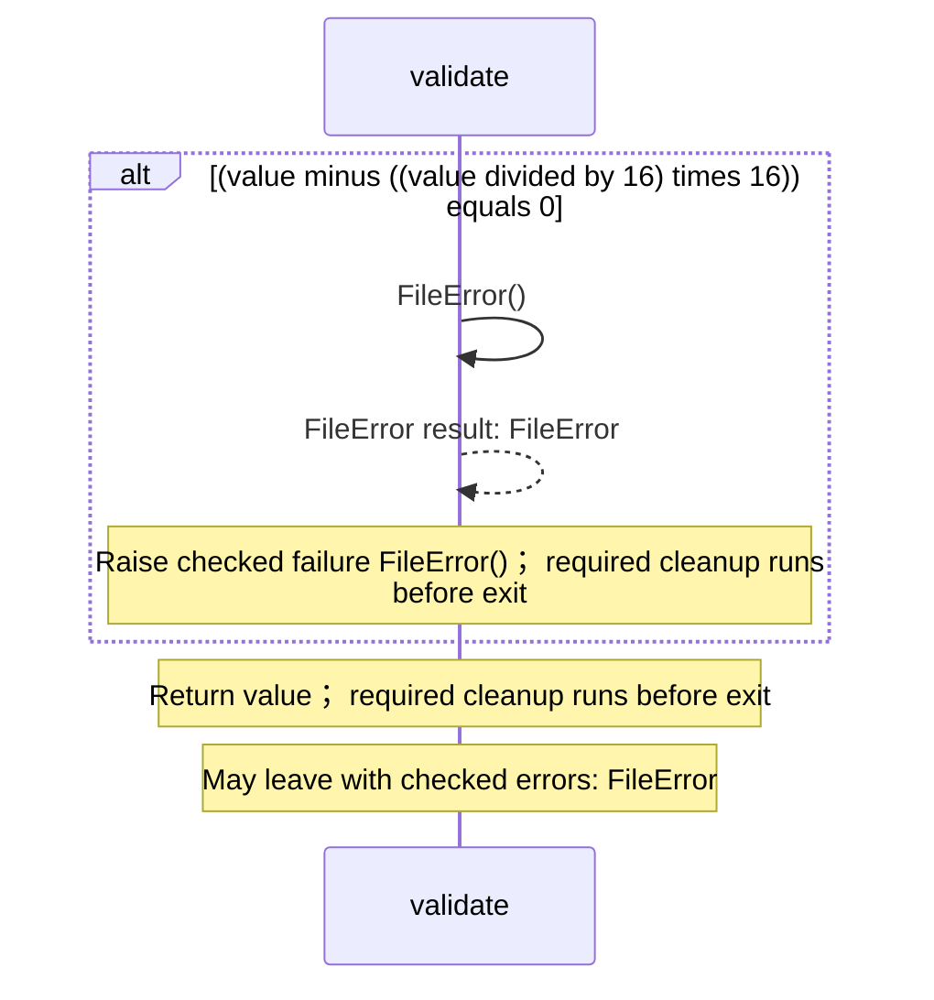

# operations.aug diagrams

[Checked-error benchmark](index.md)

[Project overview](diagrams/index.md) · [Compiled explanation](operations.md)

## Sequences

Call arrows identify checked targets; loop and branch frames determine when they run. Open that target’s module to follow its implementation. Branches describe alternatives; loops describe repeated work. Native calls and interface dispatch stop at their declared contracts. Exit notes end that path; enclosing recovery and cleanup remain visible.

### validate {#sequence-validate}

::: spec-paragraph specification-paragraph-1
[Source](operations.md#source-L2)
:::

It takes `value` as an integer.

Failures can raise `FileError`.

