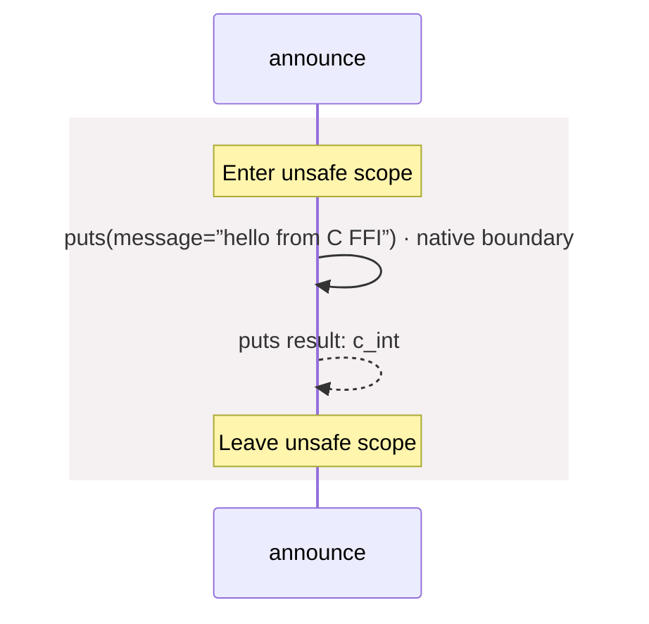

# native.aug diagrams

[A native C boundary](index.md)

[Project overview](diagrams/index.md) · [Compiled explanation](native.md)

## Sequences

Call arrows identify checked targets; loop and branch frames determine when they run. Open that target’s module to follow its implementation. Branches describe alternatives; loops describe repeated work. Native calls and interface dispatch stop at their declared contracts. Exit notes end that path; enclosing recovery and cleanup remain visible.

### puts {#sequence-puts}

::: spec-paragraph specification-paragraph-1
[Source](native.md#source-L2)
:::

It takes `message` as a string.

It returns `c_int`.

Native C implementation; only its declared contract is visible here.

Native implementation; only the declared contract is known. [Explanation](native.md).

### announce {#sequence-announce}

::: spec-paragraph specification-paragraph-2
[Source](native.md#source-L3)
:::

It can call `C.puts`.

## Called contracts

- [puts](native-diagrams.md#sequence-puts) — native.aug
