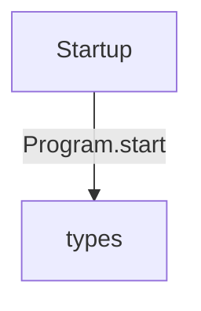
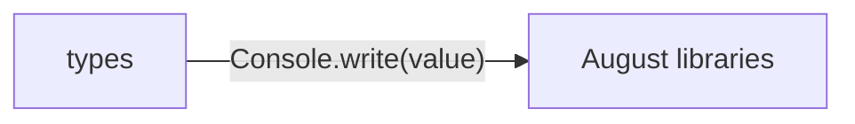

# Generic dependency injection diagrams

[Generic dependency injection](../index.md)

Start here to see what moves between the application’s folders. Each arrow names an operation’s inputs and the result it returns to its caller. Open a folder for the next level of detail. Expand the contract list for complete types and dependency links.

## Data flow

### Package boundaries

::: details types package calls

:::

::: details Data crossing these boundaries (2 contracts)

| From | To | Operation and inputs | Result |
| --- | --- | --- | --- |
| Startup | types | [Program.start](../types.md#symbol-Program.start) | void |
| types | August libraries | [Console.write](../dependencies/august/1.0.0/io/contracts.md#symbol-Console.write) · value: int · interface dispatch | void |

:::

## Open a module

| Module | Read |
| --- | --- |
| main.aug | [Flow and sequences](../main-diagrams.md) · [Explanation](../main.md) |
| types.aug | [Flow and sequences](../types-diagrams.md) · [Explanation](../types.md) |

These are static call boundaries, not a request trace. Interface implementations and foreign internals stop at their checked contracts. Dotted arrows defer a callback or browser action. Imports alone do not imply a call.
