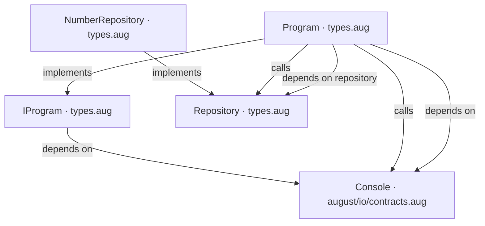
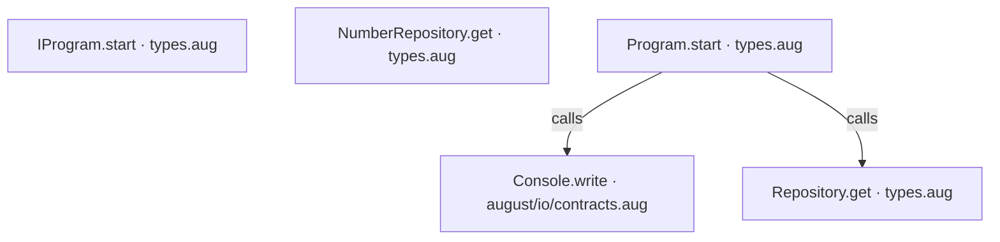
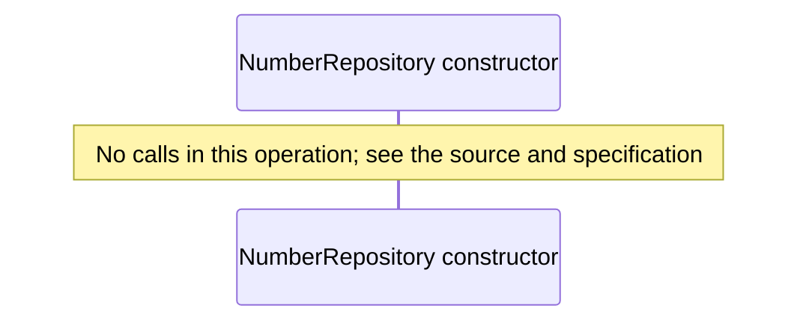
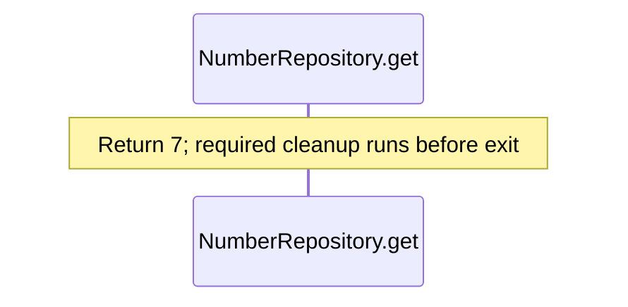
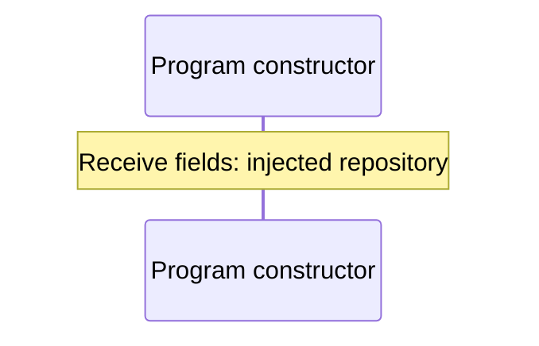
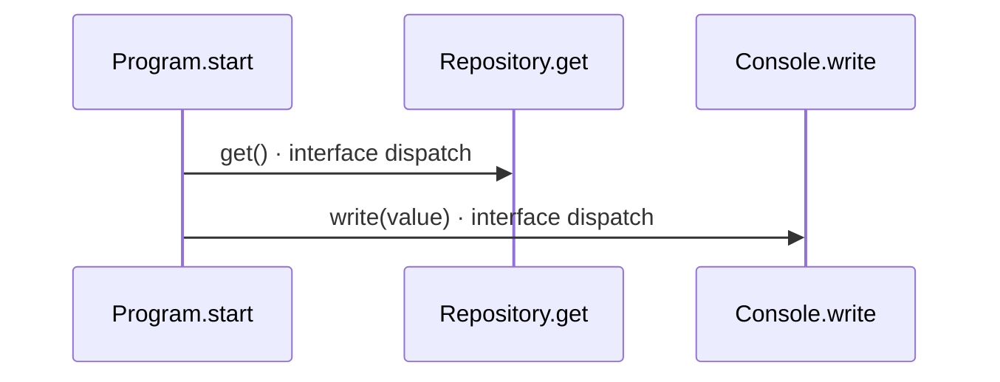
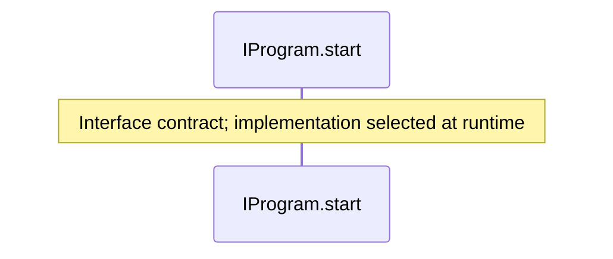

# types.aug diagrams

[Generic dependency injection](index.md)

[Project overview](diagrams/index.md) · [Compiled explanation](types.md)

## Class interactions

## API calls

## Sequences

Call arrows identify checked targets; loop and branch frames determine when they run. Open that target’s module to follow its implementation. Branches describe alternatives; loops describe repeated work. Native calls and interface dispatch stop at their declared contracts. Exit notes end that path; enclosing recovery and cleanup remain visible.

### Repository.get {#sequence-Repository.get}

::: spec-paragraph specification-paragraph-1
[Source](types.md#source-L4)
:::

### NumberRepository constructor {#sequence-NumberRepository-20-constructor}

::: spec-paragraph specification-paragraph-2
[Source](types.md#source-L6)
:::

### NumberRepository.get {#sequence-NumberRepository.get}

::: spec-paragraph specification-paragraph-3
[Source](types.md#source-L7)
:::

### Program constructor {#sequence-Program-20-constructor}

::: spec-paragraph specification-paragraph-4
[Source](types.md#source-L11)
:::

### Program.start {#sequence-Program.start}

::: spec-paragraph specification-paragraph-5
[Source](types.md#source-L12)
:::

### IProgram.start {#sequence-IProgram.start}

::: spec-paragraph specification-paragraph-6
[Source](types.md#source-L17)
:::

## Called contracts

- [Console](dependencies/august/0.23.0/io/contracts-diagrams.md) — august/io/contracts.aug
- [Console.write](dependencies/august/0.23.0/io/contracts-diagrams.md#sequence-Console.write) — august/io/contracts.aug
- [IProgram](types-diagrams.md) — types.aug
- [Repository](types-diagrams.md) — types.aug
- [Repository.get](types-diagrams.md#sequence-Repository.get) — types.aug
