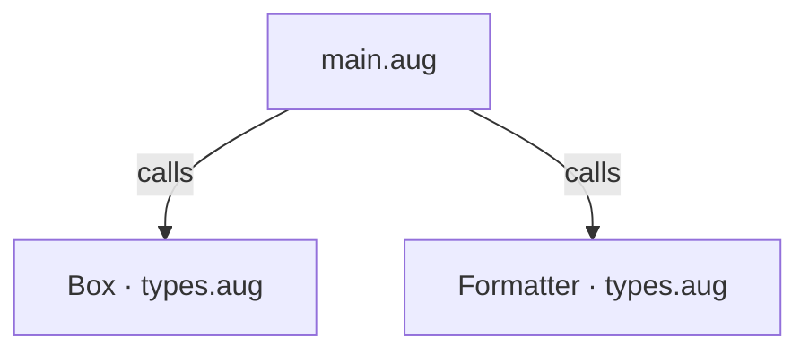
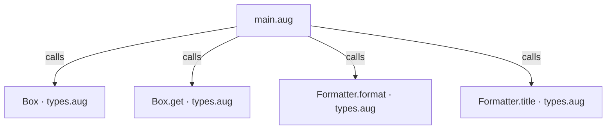
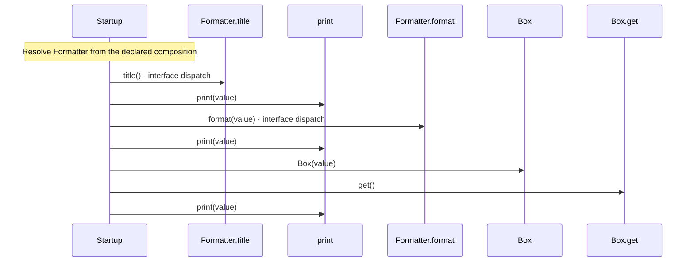

# Generic types and functions diagrams

[Generic types and functions](index.md)

[Project overview](diagrams/index.md) · [Compiled explanation](main.md)

### Class interactions

### API calls

### Sequences

Call arrows identify checked targets; loop and branch frames determine when they run. Open that target’s module to follow its implementation. Branches describe alternatives; loops describe repeated work. Native calls and interface dispatch stop at their declared contracts. Exit notes end that path; enclosing recovery and cleanup remain visible.

#### Startup {#sequence-Startup}

::: spec-paragraph specification-paragraph-1
[Source](main.md#source-L6)
:::

### Called contracts

- [Box](types-diagrams.md#sequence-Box-20-constructor) — types.aug
- [Box.get](types-diagrams.md#sequence-Box.get) — types.aug
- [Formatter.format](types-diagrams.md#sequence-Formatter.format) — types.aug
- [Formatter.title](types-diagrams.md#sequence-Formatter.title) — types.aug
