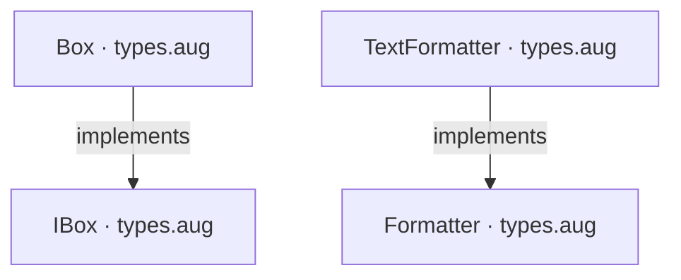
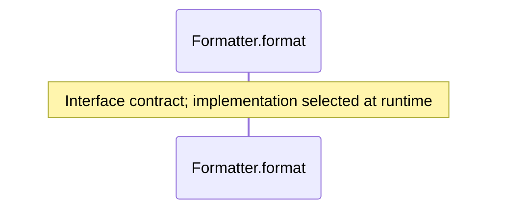
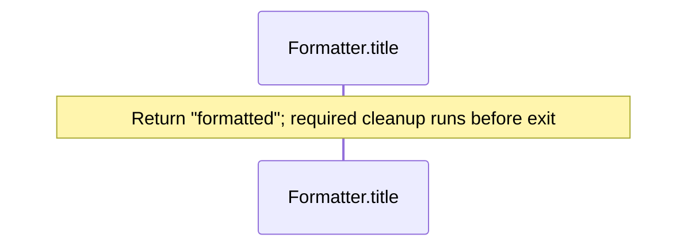
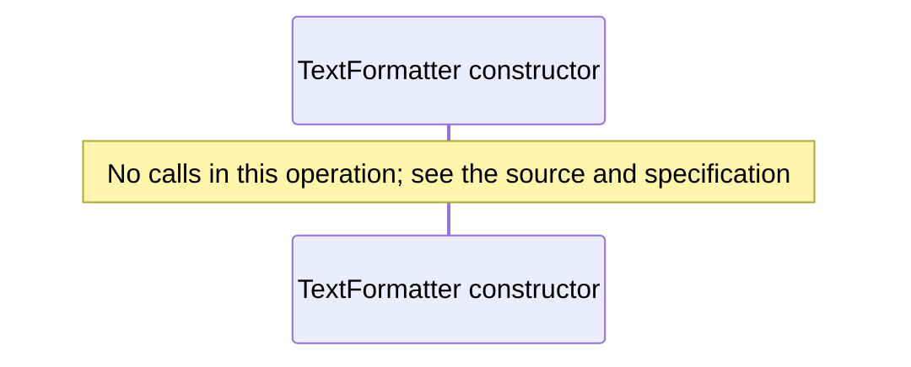
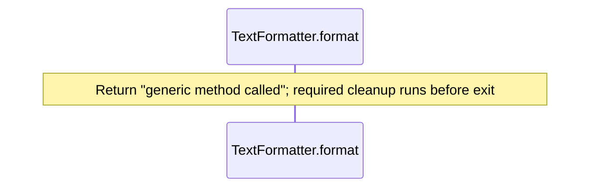
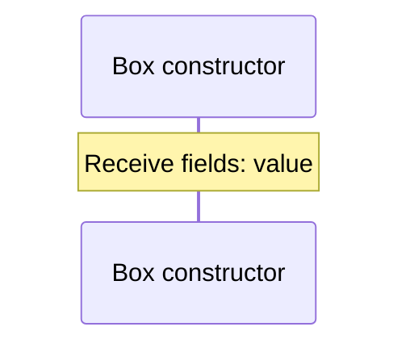
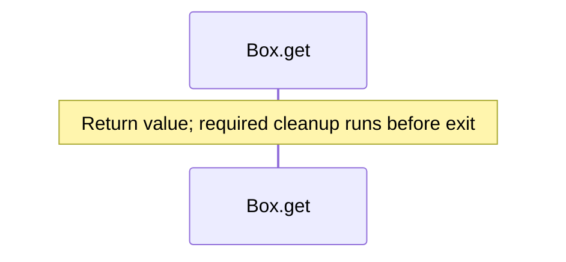
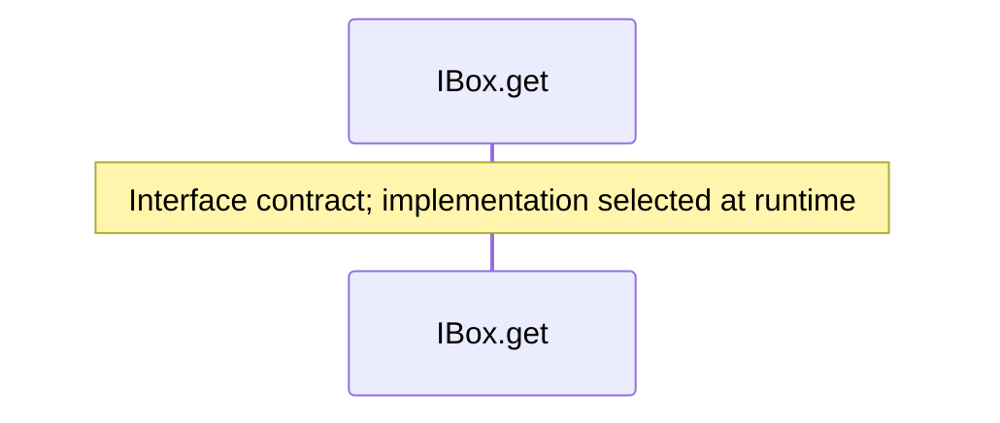

# types.aug diagrams

[Generic types and functions](index.md)

[Project overview](diagrams/index.md) · [Compiled explanation](types.md)

## Class interactions

## API calls

## Sequences

Call arrows identify checked targets; loop and branch frames determine when they run. Open that target’s module to follow its implementation. Branches describe alternatives; loops describe repeated work. Native calls and interface dispatch stop at their declared contracts. Exit notes end that path; enclosing recovery and cleanup remain visible.

### Formatter.format {#sequence-Formatter.format}

::: spec-paragraph specification-paragraph-1
[Source](types.md#source-L3)
:::

### Formatter.title {#sequence-Formatter.title}

::: spec-paragraph specification-paragraph-2
[Source](types.md#source-L4)
:::

### TextFormatter constructor {#sequence-TextFormatter-20-constructor}

::: spec-paragraph specification-paragraph-3
[Source](types.md#source-L8)
:::

### TextFormatter.format {#sequence-TextFormatter.format}

::: spec-paragraph specification-paragraph-4
[Source](types.md#source-L9)
:::

### Box constructor {#sequence-Box-20-constructor}

::: spec-paragraph specification-paragraph-5
[Source](types.md#source-L13)
:::

### Box.get {#sequence-Box.get}

::: spec-paragraph specification-paragraph-6
[Source](types.md#source-L14)
:::

### IBox.get {#sequence-IBox.get}

::: spec-paragraph specification-paragraph-7
[Source](types.md#source-L19)
:::

## Called contracts

- [Formatter](types-diagrams.md) — types.aug
- [IBox](types-diagrams.md) — types.aug
