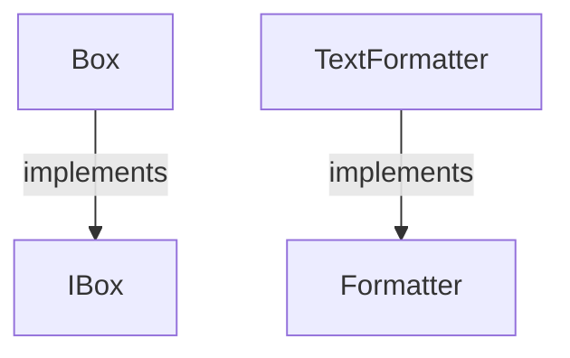

# types.aug diagrams

[Generic types and functions](index.md)

[Project overview](diagrams/index.md) · [Compiled explanation](types.md)

## Class interactions

## Sequences

Call arrows identify checked targets; loop and branch frames determine when they run. Open that target’s module to follow its implementation. Branches describe alternatives; loops describe repeated work. Native calls and interface dispatch stop at their declared contracts. Exit notes end that path; enclosing recovery and cleanup remain visible.

### Formatter.format {#sequence-Formatter.format}

::: spec-paragraph specification-paragraph-1
[Source](types.md#source-L3)
:::

The type parameters are `T`.

It takes `value` as `T`.

It returns `string`.

Interface contract; implementation selected at runtime. [Explanation](types.md).

### Formatter.title {#sequence-Formatter.title}

::: spec-paragraph specification-paragraph-2
[Source](types.md#source-L4)
:::

Return "formatted"; required cleanup runs before exit. [Explanation](types.md).

### TextFormatter constructor {#sequence-TextFormatter-20-constructor}

::: spec-paragraph specification-paragraph-3
[Source](types.md#source-L8)
:::

It implements [`Formatter`](types.md#symbol-Formatter).

It inherits the default implementations of [`Formatter.title`](types.md#symbol-Formatter.title).

[Explanation](types.md).

### TextFormatter.format {#sequence-TextFormatter.format}

::: spec-paragraph specification-paragraph-4
[Source](types.md#source-L9)
:::

It takes `value` as `T`.

Return "generic method called"; required cleanup runs before exit. [Explanation](types.md).

### Box constructor {#sequence-Box-20-constructor}

::: spec-paragraph specification-paragraph-5
[Source](types.md#source-L13)
:::

It implements [`IBox<T>`](types.md#symbol-IBox). The type parameters are `T`.

It takes `value` as `T`, kept read-only.

Receive fields: value. [Explanation](types.md).

### Box.get {#sequence-Box.get}

::: spec-paragraph specification-paragraph-6
[Source](types.md#source-L14)
:::

Return value; required cleanup runs before exit. [Explanation](types.md).

### IBox.get {#sequence-IBox.get}

::: spec-paragraph specification-paragraph-7
[Source](types.md#source-L19)
:::

It returns `T`.

Interface contract; implementation selected at runtime. [Explanation](types.md).

## Called contracts

- [Formatter](types-diagrams.md) — types.aug
- [IBox](types-diagrams.md) — types.aug
