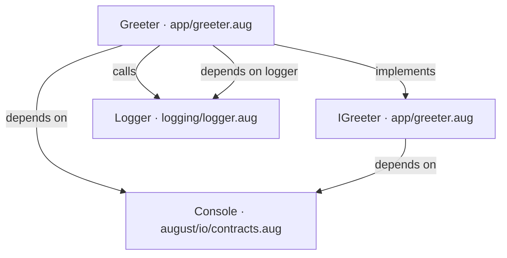
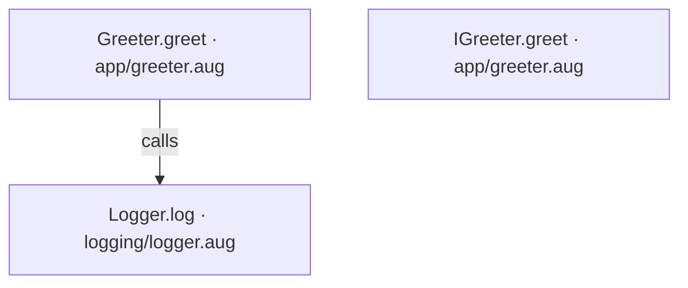
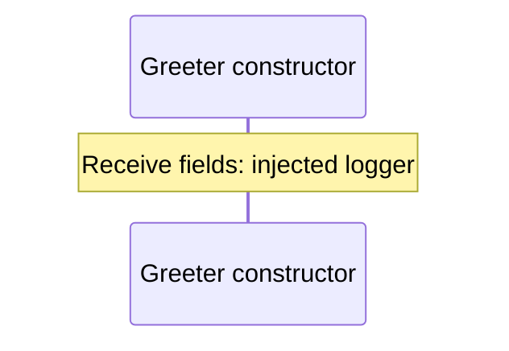
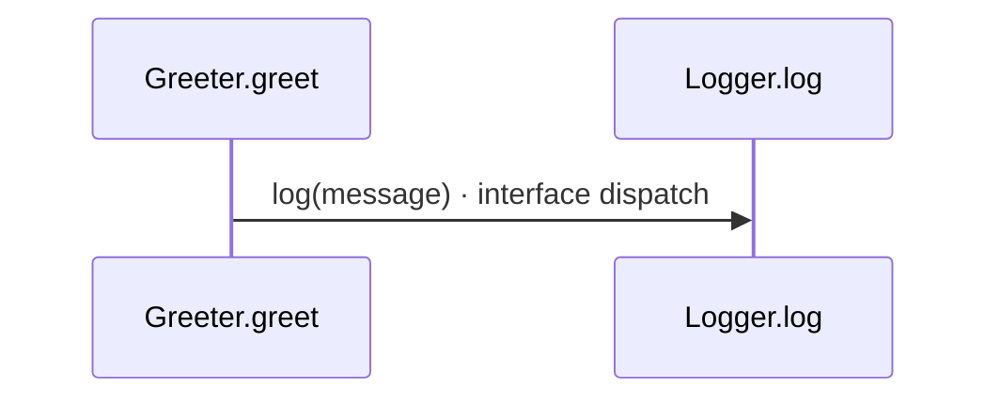
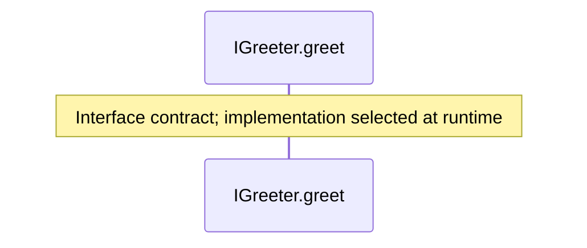

# app/greeter.aug diagrams

[Hello world with dependencies](../index.md)

[Project overview](../diagrams/index.md) · [Compiled explanation](greeter.md)

## Class interactions

## API calls

## Sequences

Call arrows identify checked targets; loop and branch frames determine when they run. Open that target’s module to follow its implementation. Branches describe alternatives; loops describe repeated work. Native calls and interface dispatch stop at their declared contracts. Exit notes end that path; enclosing recovery and cleanup remain visible.

### Greeter constructor {#sequence-Greeter-20-constructor}

::: spec-paragraph specification-paragraph-1
[Source](greeter.md#source-L8)
:::

### Greeter.greet {#sequence-Greeter.greet}

::: spec-paragraph specification-paragraph-2
[Source](greeter.md#source-L13)
:::

### IGreeter.greet {#sequence-IGreeter.greet}

::: spec-paragraph specification-paragraph-3
[Source](greeter.md#source-L22)
:::

## Called contracts

- [IGreeter](greeter-diagrams.md) — app/greeter.aug
- [Console](../dependencies/august/0.23.0/io/contracts-diagrams.md) — august/io/contracts.aug
- [Logger.log](../logging/logger-diagrams.md#sequence-Logger.log) — logging/logger.aug
