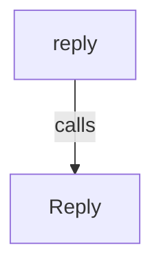
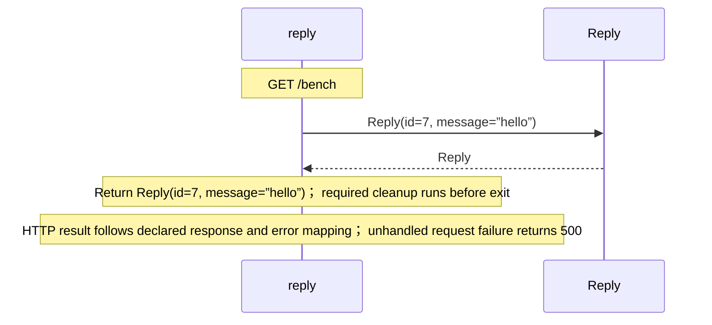

# routes.aug diagrams

[HTTP benchmark](index.md)

[Project overview](diagrams/index.md) · [Compiled explanation](routes.md)

::: details Call relationships

:::

## Sequences

Call arrows identify checked targets; loop and branch frames determine when they run. Open that target’s module to follow its implementation. Branches describe alternatives; loops describe repeated work. Native calls and interface dispatch stop at their declared contracts. Exit notes end that path; enclosing recovery and cleanup remain visible.

### Reply constructor {#sequence-Reply-20-constructor}

::: spec-paragraph specification-paragraph-1
[Source](routes.md#source-L2)
:::

Receive fields: id, message. [Explanation](routes.md).

### reply {#sequence-reply}

::: spec-paragraph specification-paragraph-2
[Source](routes.md#source-L3)
:::

## Called contracts

- [Reply](routes-diagrams.md#sequence-Reply-20-constructor) — routes.aug
