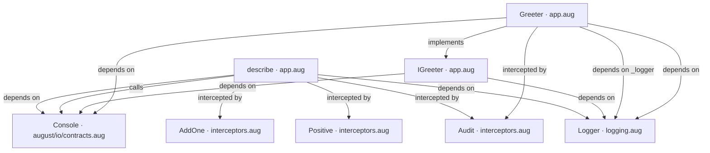
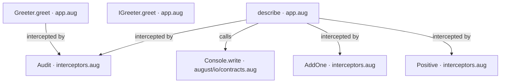
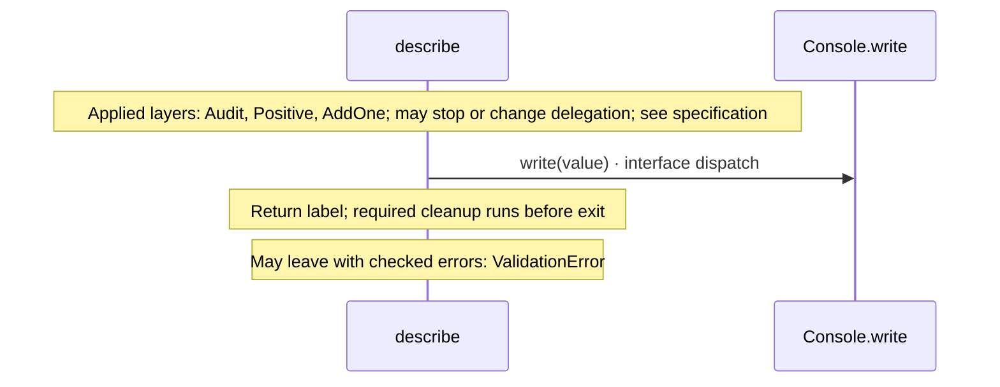
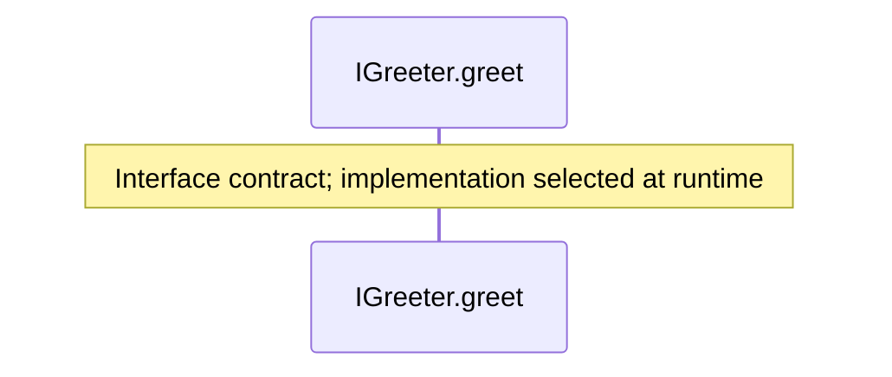
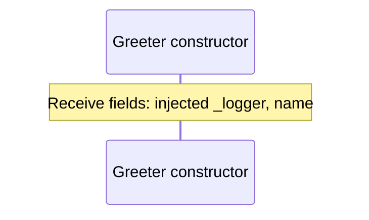
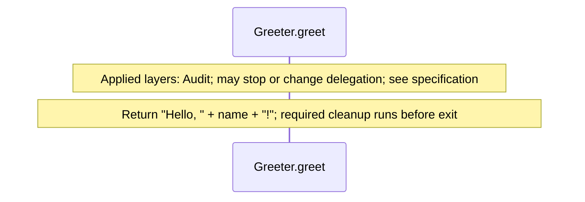

# app.aug diagrams

[Function and constructor middleware](index.md)

[Project overview](diagrams/index.md) · [Compiled explanation](app.md)

## Class interactions

## API calls

## Sequences

Call arrows identify checked targets; loop and branch frames determine when they run. Open that target’s module to follow its implementation. Branches describe alternatives; loops describe repeated work. Native calls and interface dispatch stop at their declared contracts. Exit notes end that path; enclosing recovery and cleanup remain visible.

### describe {#sequence-describe}

::: spec-paragraph specification-paragraph-1
[Source](app.md#source-L15)
:::

### IGreeter.greet {#sequence-IGreeter.greet}

::: spec-paragraph specification-paragraph-2
[Source](app.md#source-L20)
:::

### Greeter constructor {#sequence-Greeter-20-constructor}

::: spec-paragraph specification-paragraph-3
[Source](app.md#source-L23)
:::

### Greeter.greet {#sequence-Greeter.greet}

::: spec-paragraph specification-paragraph-4
[Source](app.md#source-L26)
:::

## Called contracts

- [IGreeter](app-diagrams.md) — app.aug
- [Console](dependencies/august/0.23.0/io/contracts-diagrams.md) — august/io/contracts.aug
- [Console.write](dependencies/august/0.23.0/io/contracts-diagrams.md#sequence-Console.write) — august/io/contracts.aug
- [AddOne](interceptors-diagrams.md) — interceptors.aug
- [Audit](interceptors-diagrams.md) — interceptors.aug
- [Positive](interceptors-diagrams.md) — interceptors.aug
- [Logger](logging-diagrams.md) — logging.aug
