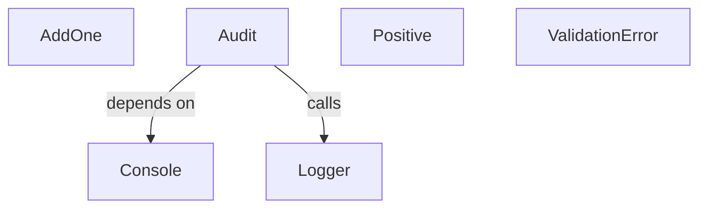
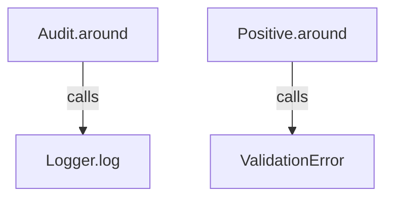
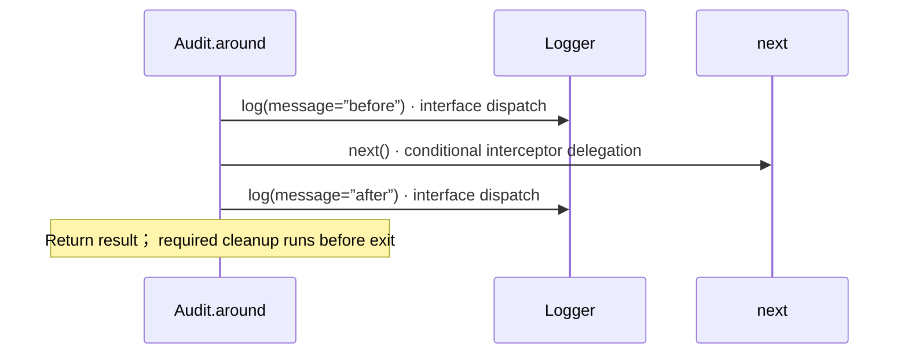
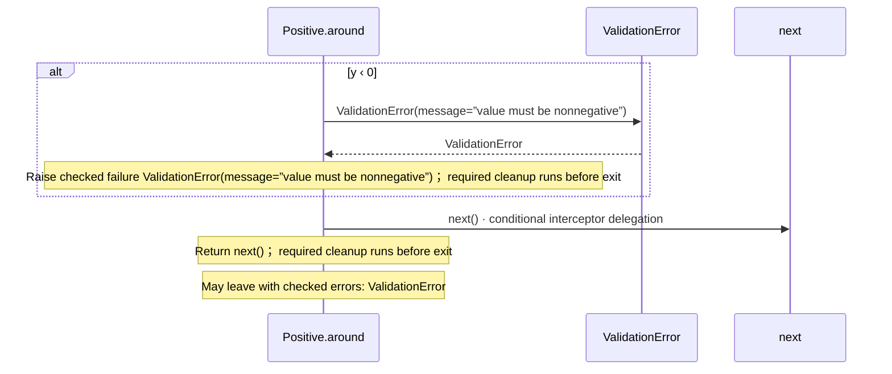
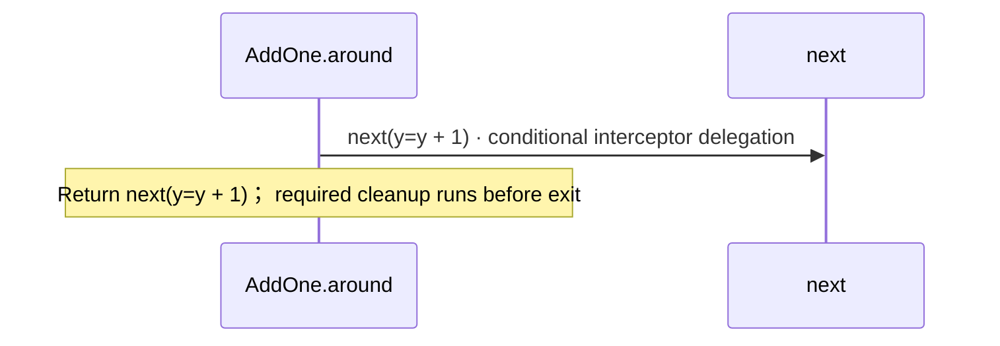

# interceptors.aug diagrams

[Function and constructor middleware](index.md)

[Project overview](diagrams/index.md) · [Compiled explanation](interceptors.md)

## Class interactions

::: details Call relationships

:::

## Sequences

Call arrows identify checked targets; loop and branch frames determine when they run. Open that target’s module to follow its implementation. Branches describe alternatives; loops describe repeated work. Native calls and interface dispatch stop at their declared contracts. Exit notes end that path; enclosing recovery and cleanup remain visible.

### ValidationError constructor {#sequence-ValidationError-20-constructor}

::: spec-paragraph specification-paragraph-1
[Source](interceptors.md#source-L5)
:::

Receive fields: message. [Explanation](interceptors.md).

### Audit.around {#sequence-Audit.around}

::: spec-paragraph specification-paragraph-2
[Source](interceptors.md#source-L15)
:::

### Positive.around {#sequence-Positive.around}

::: spec-paragraph specification-paragraph-3
[Source](interceptors.md#source-L28)
:::

### AddOne.around {#sequence-AddOne.around}

::: spec-paragraph specification-paragraph-4
[Source](interceptors.md#source-L38)
:::

## Called contracts

- [Console](dependencies/august/0.23.0/io/contracts-diagrams.md) — august/io/contracts.aug
- [ValidationError](interceptors-diagrams.md#sequence-ValidationError-20-constructor) — interceptors.aug
- [Logger.log](logging-diagrams.md#sequence-Logger.log) — logging.aug
