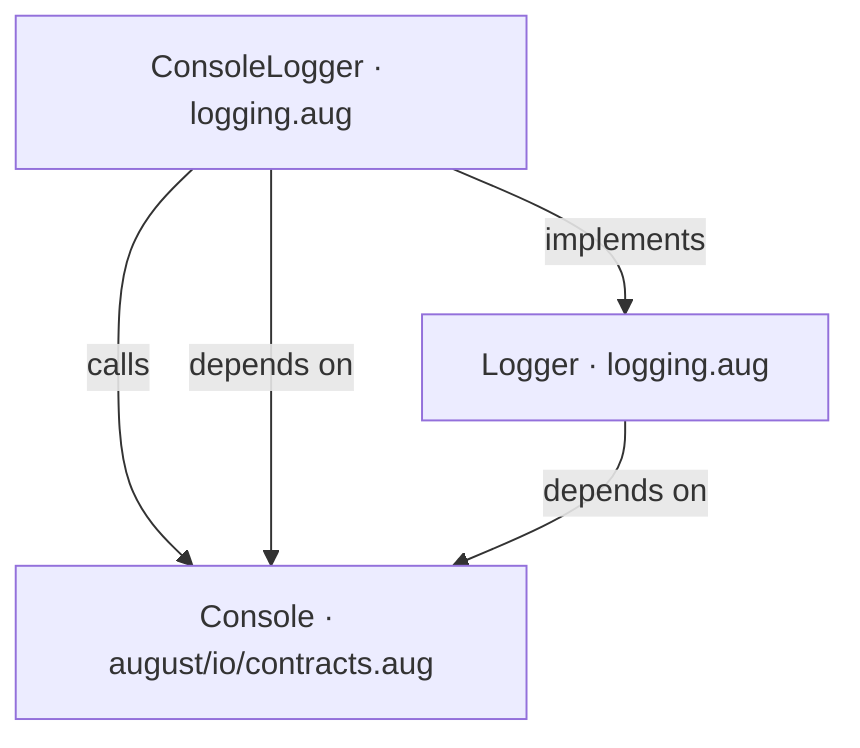
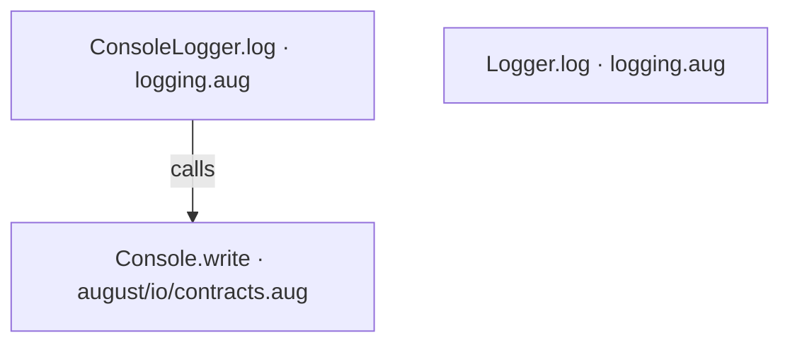
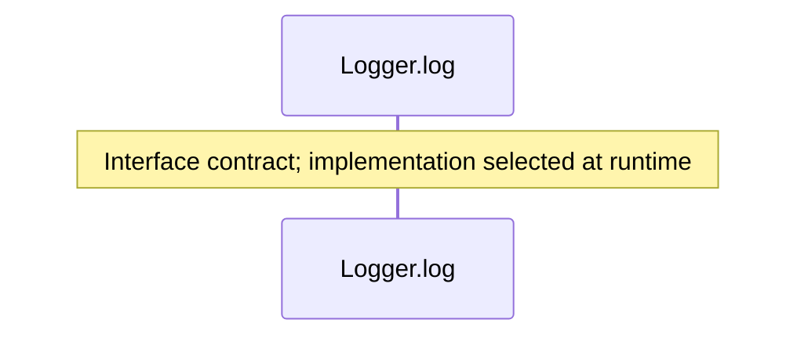
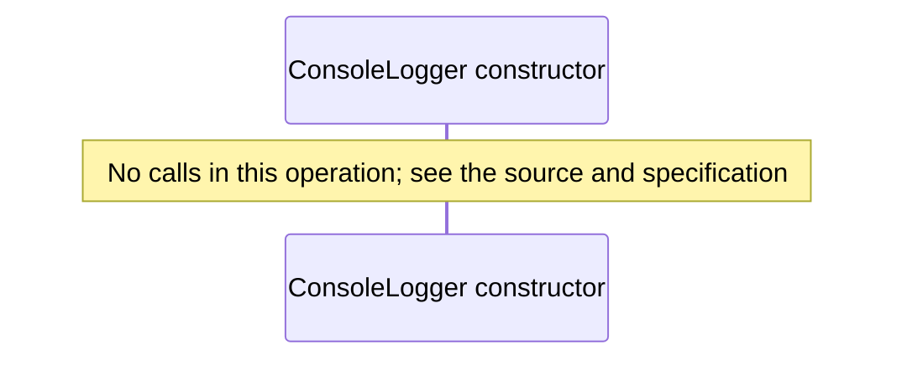
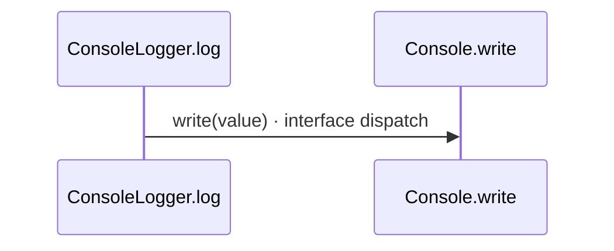

# Function and constructor middleware diagrams

[Function and constructor middleware](index.md)

[Project overview](diagrams/index.md) · [Compiled explanation](logging.md)

### Class interactions

### API calls

### Sequences

Call arrows identify checked targets; loop and branch frames determine when they run. Open that target’s module to follow its implementation. Branches describe alternatives; loops describe repeated work. Native calls and interface dispatch stop at their declared contracts. Exit notes end that path; enclosing recovery and cleanup remain visible.

#### Logger.log {#sequence-Logger.log}

::: spec-paragraph specification-paragraph-1
[Source](logging.md#source-L6)
:::

#### ConsoleLogger constructor {#sequence-ConsoleLogger-20-constructor}

::: spec-paragraph specification-paragraph-2
[Source](logging.md#source-L9)
:::

#### ConsoleLogger.log {#sequence-ConsoleLogger.log}

::: spec-paragraph specification-paragraph-3
[Source](logging.md#source-L10)
:::

### Called contracts

- [Console](dependencies/august/0.23.0/io/contracts-diagrams.md) — august/io/contracts.aug
- [Console.write](dependencies/august/0.23.0/io/contracts-diagrams.md#sequence-Console.write) — august/io/contracts.aug
- [Logger](logging-diagrams.md) — logging.aug
