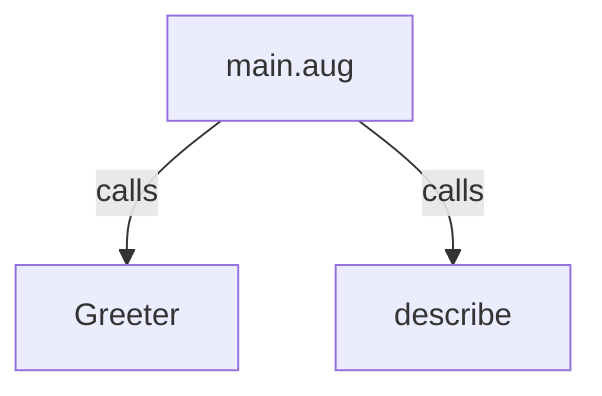
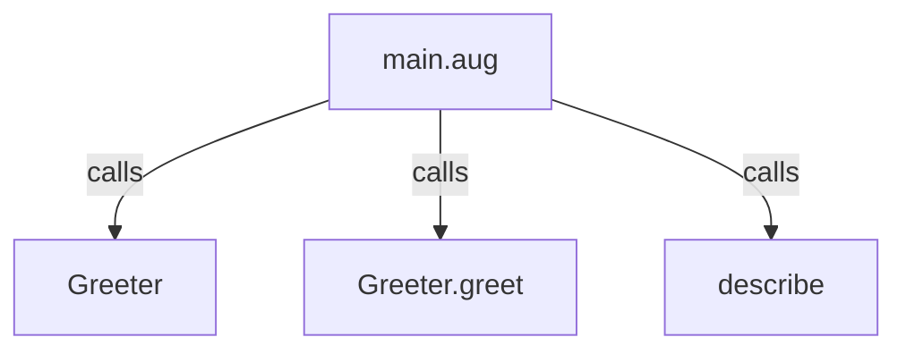
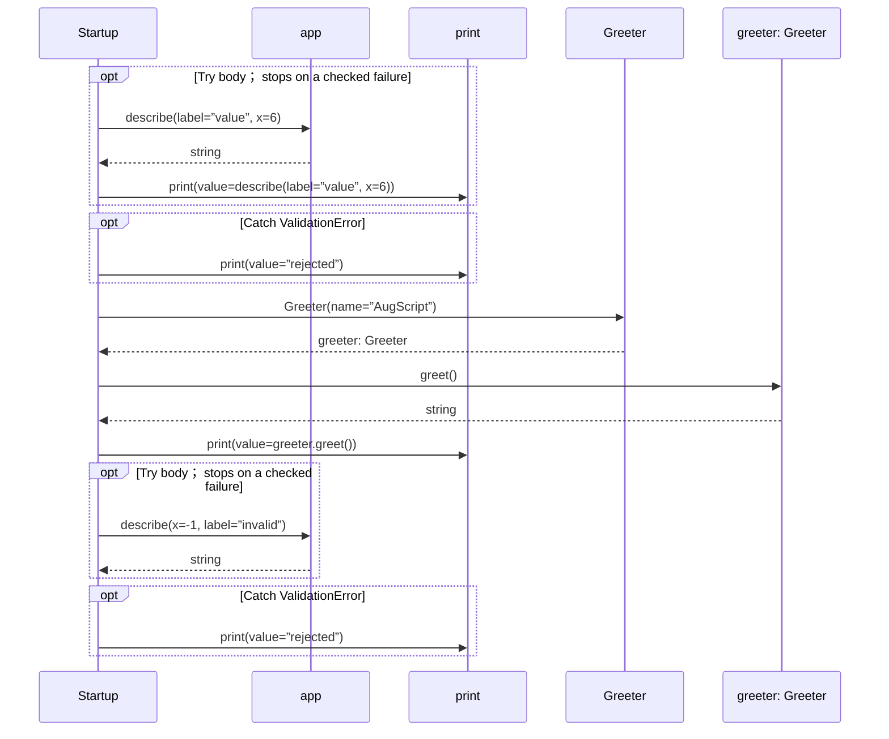

# main.aug diagrams

[Function and constructor middleware](index.md)

[Project overview](diagrams/index.md) · [Compiled explanation](main.md)

## Class interactions

::: details Call relationships

:::

## Sequences

Call arrows identify checked targets; loop and branch frames determine when they run. Open that target’s module to follow its implementation. Branches describe alternatives; loops describe repeated work. Native calls and interface dispatch stop at their declared contracts. Exit notes end that path; enclosing recovery and cleanup remain visible.

### Startup {#sequence-Startup}

::: spec-paragraph specification-paragraph-1
[Source](main.md#source-L10)
:::

## Called contracts

- [Greeter](app-diagrams.md#sequence-Greeter-20-constructor) — app.aug
- [Greeter.greet](app-diagrams.md#sequence-Greeter.greet) — app.aug
- [describe](app-diagrams.md#sequence-describe) — app.aug
