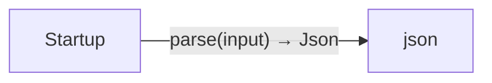

# JSON benchmark diagrams

[JSON benchmark](../index.md)

Start here to see what moves between the application’s folders. Each arrow names an operation’s inputs and the result it returns to its caller. Open a folder for the next level of detail. Expand the contract list for complete types and dependency links.

## Data flow

No calls cross the source files in this view. Follow local operations in the file sequences below.

### Package boundaries

::: details Data crossing these boundaries (1 contracts)

| From | To | Operation and inputs | Result |
| --- | --- | --- | --- |
| Startup | json | [parse](../dependencies/packages/%40git/url_2d3c37c690c0fa115be1/0.0.0-git.a39fc582565d4fca40be4f75fa304d71adc69301/contracts.md#symbol-parse) · input: string | Json |

:::

## Open a module

| Module | Read |
| --- | --- |
| data.aug | [Flow and sequences](../data-diagrams.md) · [Explanation](../data.md) |
| main.aug | [Flow and sequences](../main-diagrams.md) · [Explanation](../main.md) |

These are static call boundaries, not a request trace. Interface implementations and foreign internals stop at their checked contracts. Dotted arrows defer a callback or browser action. Imports alone do not imply a call.
