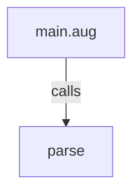
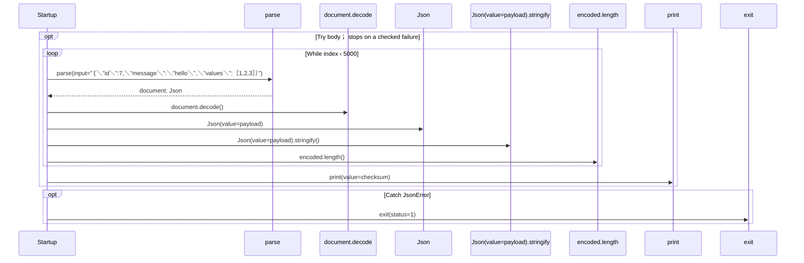

# main.aug diagrams

[JSON benchmark](index.md)

[Project overview](diagrams/index.md) · [Compiled explanation](main.md)

::: details Call relationships

:::

## Sequences

Call arrows identify checked targets; loop and branch frames determine when they run. Open that target’s module to follow its implementation. Branches describe alternatives; loops describe repeated work. Native calls and interface dispatch stop at their declared contracts. Exit notes end that path; enclosing recovery and cleanup remain visible.

### Startup {#sequence-Startup}

::: spec-paragraph specification-paragraph-1
[Source](main.md#source-L4)
:::

## Called contracts

- [parse](dependencies/packages/%40git/url_2d3c37c690c0fa115be1/0.0.0-git.a39fc582565d4fca40be4f75fa304d71adc69301/contracts-diagrams.md#sequence-parse) — package/@git/url\_2d3c37c690c0fa115be1@0.0.0-git.a39fc582565d4fca40be4f75fa304d71adc69301/contracts.aug
