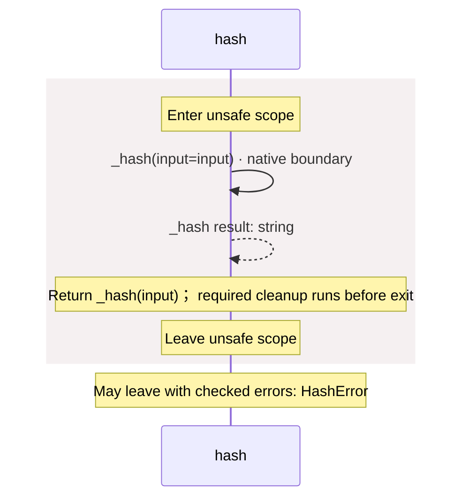

# package/@greenpandastudios/aug-blake3@0.1.5/api.aug diagrams

[Hashing with Rust BLAKE3](../../../../../index.md)

[Project overview](../../../../../diagrams/index.md) · [Compiled explanation](api.md)

## Sequences

Call arrows identify checked targets; loop and branch frames determine when they run. Open that target’s module to follow its implementation. Branches describe alternatives; loops describe repeated work. Native calls and interface dispatch stop at their declared contracts. Exit notes end that path; enclosing recovery and cleanup remain visible.

### \_hash {#sequence-_hash}

::: spec-paragraph specification-paragraph-1
[Source](api.md#source-L4)
:::

May leave with checked errors: HashError. Native implementation; only the declared contract is known. [Explanation](api.md).

### hash {#sequence-hash}

::: spec-paragraph specification-paragraph-2
[Source](api.md#source-L6)
:::

## Called contracts

- [\_hash](api-diagrams.md#sequence-_hash) — package/@greenpandastudios/aug-blake3@0.1.5/api.aug
