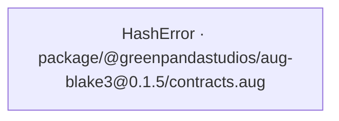
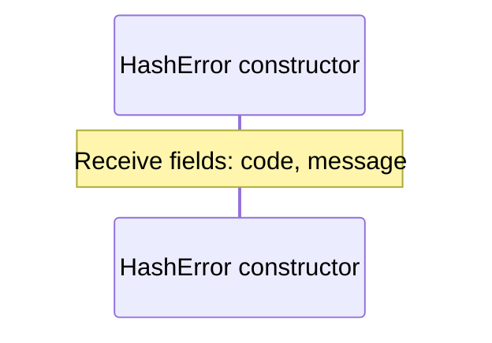

# package/@greenpandastudios/aug-blake3@0.1.5/contracts.aug diagrams

[Hashing with Rust BLAKE3](../../../../../index.md)

[Project overview](../../../../../diagrams/index.md) · [Compiled explanation](contracts.md)

## Class interactions

## API calls

No relationships at this level.

## Sequences

Call arrows identify checked targets; loop and branch frames determine when they run. Open that target’s module to follow its implementation. Branches describe alternatives; loops describe repeated work. Native calls and interface dispatch stop at their declared contracts. Exit notes end that path; enclosing recovery and cleanup remain visible.

### HashError constructor {#sequence-HashError-20-constructor}

::: spec-paragraph specification-paragraph-1
[Source](contracts.md#source-L3)
:::

