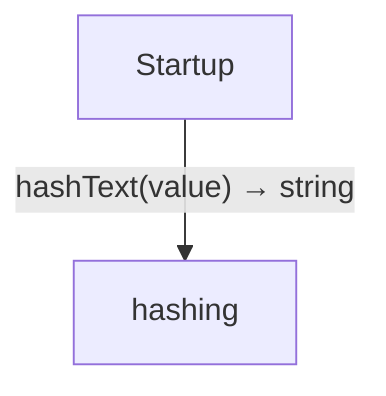
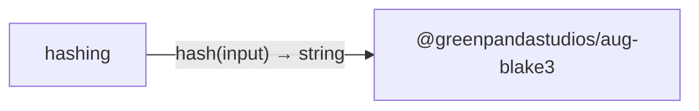

# Hashing with Rust BLAKE3 diagrams

[Hashing with Rust BLAKE3](../index.md)

Start here to see what moves between the application’s folders. Each arrow names an operation’s inputs and the result it returns to its caller. Open a folder for the next level of detail. Expand the contract list for complete types and dependency links.

## Data flow

### Package boundaries

::: details hashing package calls

:::

::: details Data crossing these boundaries (2 contracts)

| From | To | Operation and inputs | Result |
| --- | --- | --- | --- |
| hashing | @greenpandastudios/aug-blake3 | [hash](../dependencies/packages/%40greenpandastudios/aug-blake3/0.1.5/api.md#symbol-hash) · input: Bytes | string |
| Startup | hashing | [hashText](../hashing.md#symbol-hashText) · value: string | string |

:::

## Open a module

| Module | Read |
| --- | --- |
| hashing.aug | [Flow and sequences](../hashing-diagrams.md) · [Explanation](../hashing.md) |
| main.aug | [Flow and sequences](../main-diagrams.md) · [Explanation](../main.md) |

These are static call boundaries, not a request trace. Interface implementations and foreign internals stop at their checked contracts. Dotted arrows defer a callback or browser action. Imports alone do not imply a call.
