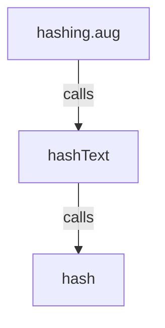
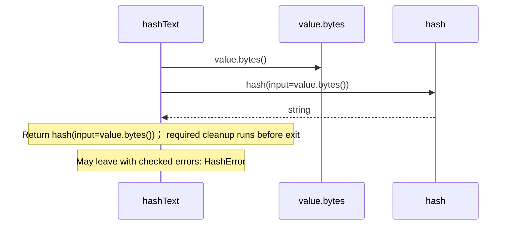

# hashing.aug diagrams

[Hashing with Rust BLAKE3](index.md)

[Project overview](diagrams/index.md) · [Compiled explanation](hashing.md)

::: details Call relationships

:::

## Sequences

Call arrows identify checked targets; loop and branch frames determine when they run. Open that target’s module to follow its implementation. Branches describe alternatives; loops describe repeated work. Native calls and interface dispatch stop at their declared contracts. Exit notes end that path; enclosing recovery and cleanup remain visible.

### hashText {#sequence-hashText}

::: spec-paragraph specification-paragraph-1
[Source](hashing.md#source-L5)
:::

## Called contracts

- [hashText](hashing-diagrams.md#sequence-hashText) — hashing.aug
- [hash](dependencies/packages/%40greenpandastudios/aug-blake3/0.1.5/api-diagrams.md#sequence-hash) — package/@greenpandastudios/aug-blake3@0.1.5/api.aug
