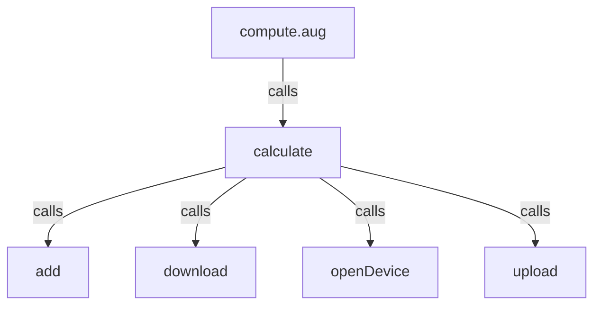
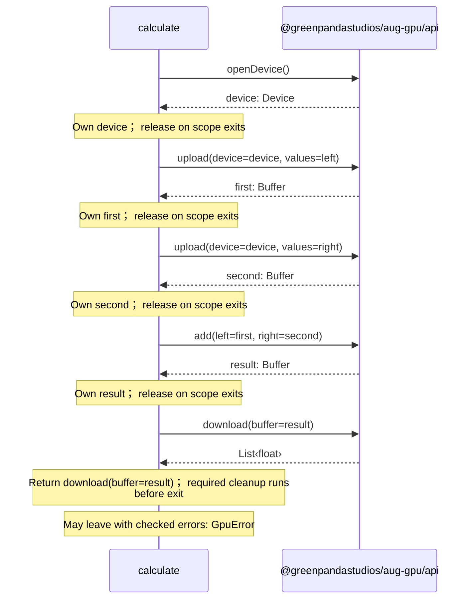

# compute.aug diagrams

[GPU workers](index.md)

[Project overview](diagrams/index.md) · [Compiled explanation](compute.md)

::: details Call relationships

:::

## Sequences

Call arrows identify checked targets; loop and branch frames determine when they run. Open that target’s module to follow its implementation. Branches describe alternatives; loops describe repeated work. Native calls and interface dispatch stop at their declared contracts. Exit notes end that path; enclosing recovery and cleanup remain visible.

### calculate {#sequence-calculate}

::: spec-paragraph specification-paragraph-1
[Source](compute.md#source-L5)
:::

## Called contracts

- [calculate](compute-diagrams.md#sequence-calculate) — compute.aug
- [add](dependencies/packages/%40greenpandastudios/aug-gpu/0.1.1/api-diagrams.md#sequence-add) — package/@greenpandastudios/aug-gpu@0.1.1/api.aug
- [download](dependencies/packages/%40greenpandastudios/aug-gpu/0.1.1/api-diagrams.md#sequence-download) — package/@greenpandastudios/aug-gpu@0.1.1/api.aug
- [openDevice](dependencies/packages/%40greenpandastudios/aug-gpu/0.1.1/api-diagrams.md#sequence-openDevice) — package/@greenpandastudios/aug-gpu@0.1.1/api.aug
- [upload](dependencies/packages/%40greenpandastudios/aug-gpu/0.1.1/api-diagrams.md#sequence-upload) — package/@greenpandastudios/aug-gpu@0.1.1/api.aug
