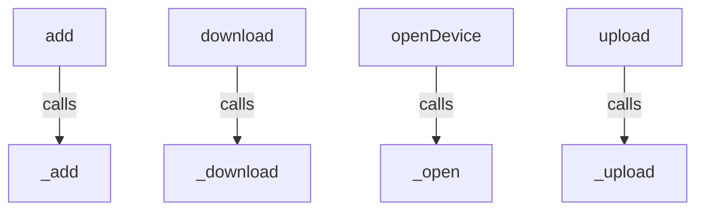
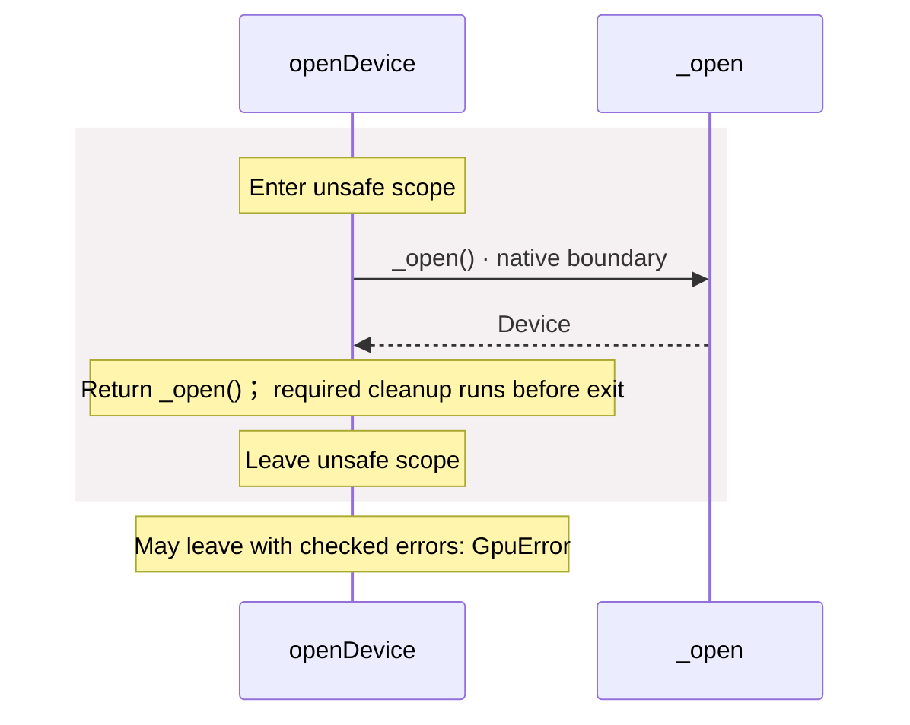
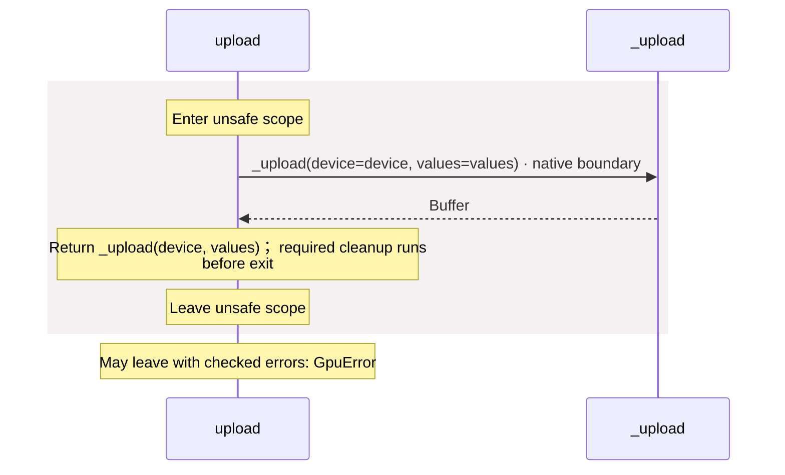
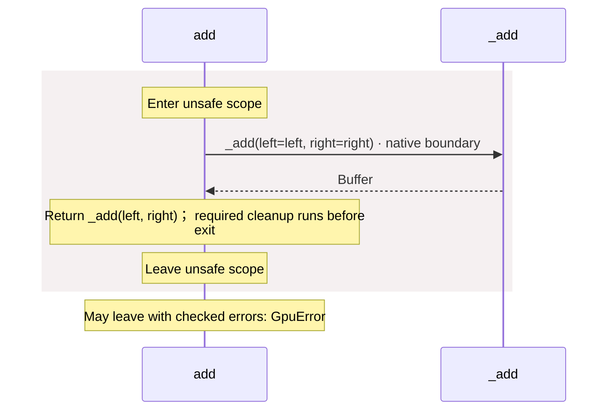
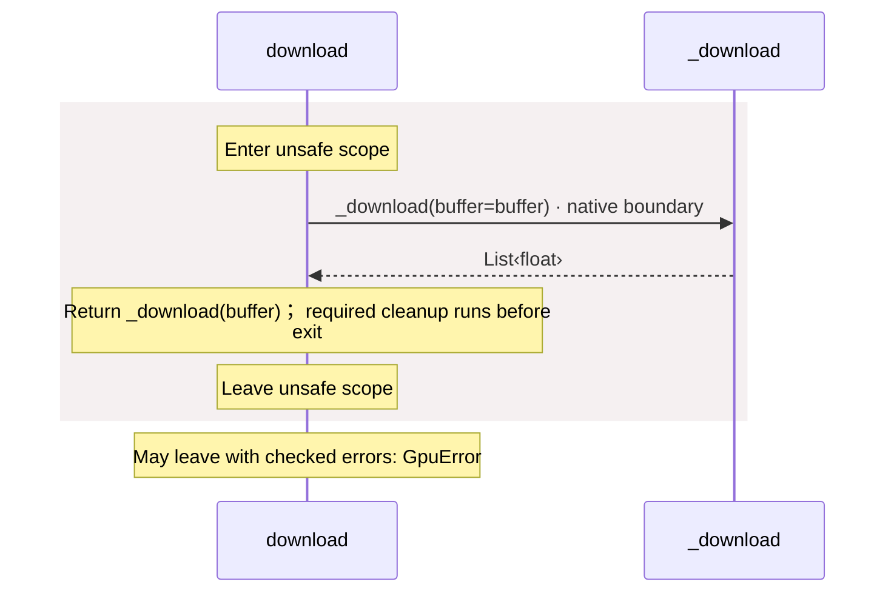

# package/@greenpandastudios/aug-gpu@0.1.1/api.aug diagrams

[GPU workers](../../../../../index.md)

[Project overview](../../../../../diagrams/index.md) · [Compiled explanation](api.md)

::: details Call relationships

:::

## Sequences

Call arrows identify checked targets; loop and branch frames determine when they run. Open that target’s module to follow its implementation. Branches describe alternatives; loops describe repeated work. Native calls and interface dispatch stop at their declared contracts. Exit notes end that path; enclosing recovery and cleanup remain visible.

### \_open {#sequence-_open}

::: spec-paragraph specification-paragraph-1
[Source](api.md#source-L5)
:::

May leave with checked errors: GpuError. Native implementation; only the declared contract is known. [Explanation](api.md).

### \_upload {#sequence-_upload}

::: spec-paragraph specification-paragraph-2
[Source](api.md#source-L6)
:::

May leave with checked errors: GpuError. Native implementation; only the declared contract is known. [Explanation](api.md).

### \_add {#sequence-_add}

::: spec-paragraph specification-paragraph-3
[Source](api.md#source-L7)
:::

May leave with checked errors: GpuError. Native implementation; only the declared contract is known. [Explanation](api.md).

### \_download {#sequence-_download}

::: spec-paragraph specification-paragraph-4
[Source](api.md#source-L8)
:::

May leave with checked errors: GpuError. Native implementation; only the declared contract is known. [Explanation](api.md).

### \_live {#sequence-_live}

::: spec-paragraph specification-paragraph-5
[Source](api.md#source-L9)
:::

Native implementation; only the declared contract is known. [Explanation](api.md).

### openDevice {#sequence-openDevice}

::: spec-paragraph specification-paragraph-6
[Source](api.md#source-L11)
:::

### upload {#sequence-upload}

::: spec-paragraph specification-paragraph-7
[Source](api.md#source-L15)
:::

### add {#sequence-add}

::: spec-paragraph specification-paragraph-8
[Source](api.md#source-L19)
:::

### download {#sequence-download}

::: spec-paragraph specification-paragraph-9
[Source](api.md#source-L23)
:::

## Called contracts

- [\_add](api-diagrams.md#sequence-_add) — package/@greenpandastudios/aug-gpu@0.1.1/api.aug
- [\_download](api-diagrams.md#sequence-_download) — package/@greenpandastudios/aug-gpu@0.1.1/api.aug
- [\_open](api-diagrams.md#sequence-_open) — package/@greenpandastudios/aug-gpu@0.1.1/api.aug
- [\_upload](api-diagrams.md#sequence-_upload) — package/@greenpandastudios/aug-gpu@0.1.1/api.aug
