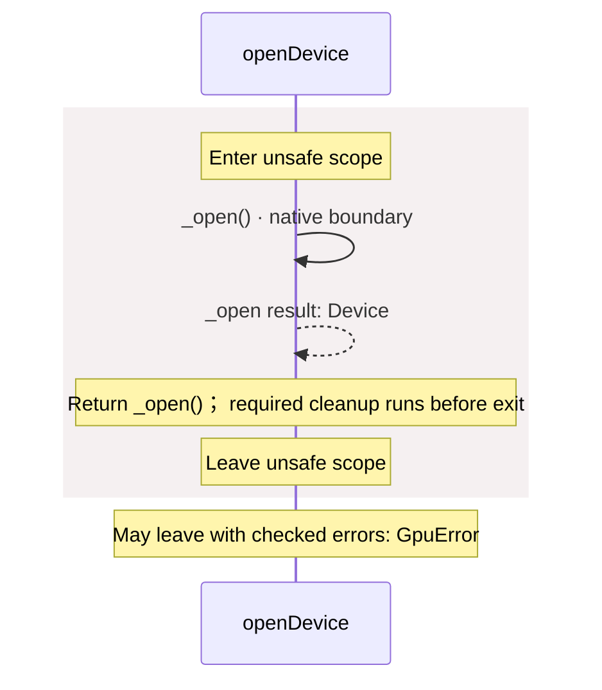
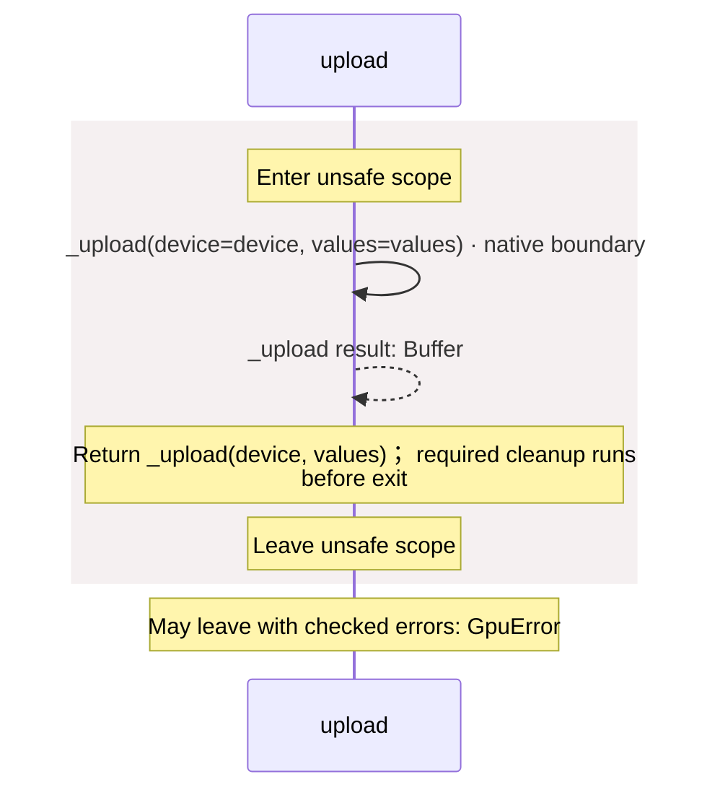
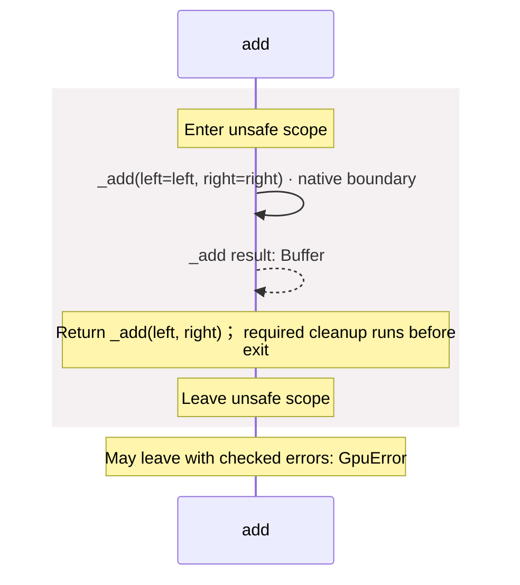
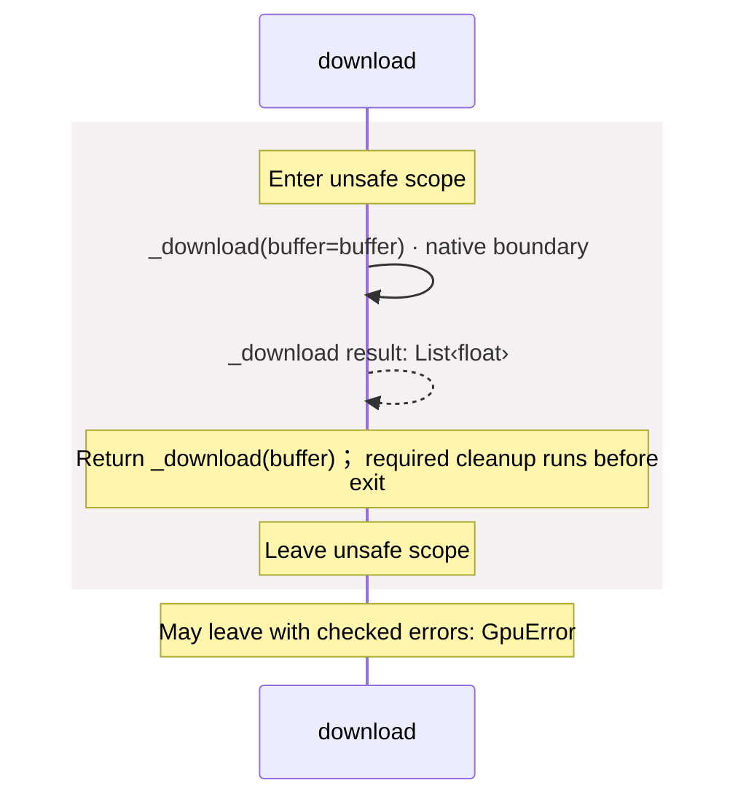

# package/@greenpandastudios/aug-gpu@0.2.0/api.aug diagrams

[GPU workers](../../../../../index.md)

[Project overview](../../../../../diagrams/index.md) · [Compiled explanation](api.md)

## Sequences

Call arrows identify checked targets; loop and branch frames determine when they run. Open that target’s module to follow its implementation. Branches describe alternatives; loops describe repeated work. Native calls and interface dispatch stop at their declared contracts. Exit notes end that path; enclosing recovery and cleanup remain visible.

### \_open {#sequence-_open}

::: spec-paragraph specification-paragraph-1
[Source](api.md#source-L5)
:::

It is private to its defining scope.

It returns ownership of [`Device`](bindings.md#symbol-Device). Failures can raise [`GpuError`](contracts.md#symbol-GpuError).

Native implementation: `@greenpandastudios/aug-gpu@0.2.0`, `0.1.0`. Supported targets: macos arm64 14.0+. Binding contract: [`native.abi.json`](native.abi-json.md) (SHA-256 `d95e237d8be07df8fd20132ca0f5a45a125fd65b7ba93669e69c0a38db63d60c`). It calls `aug_gpu_open_v1` through the C ABI on the caller thread; a blocking native call blocks that thread. The caller owns the returned handle. Its maintainer permits independent instances on worker threads. The compiler checks the provider, descriptor digest, signature and ownership at August call sites. The native author promises not to retain inputs, enter August from foreign threads, or unwind across the C boundary; internal native workers may run. The compiler does not prove those promises.

May leave with checked errors: GpuError. Native implementation; only the declared contract is known. [Explanation](api.md).

### \_upload {#sequence-_upload}

::: spec-paragraph specification-paragraph-2
[Source](api.md#source-L6)
:::

It is private to its defining scope.

It takes `device` as [`Device`](bindings.md#symbol-Device) and `values` as `List<float>`.

It returns ownership of [`Buffer`](bindings.md#symbol-Buffer). Failures can raise [`GpuError`](contracts.md#symbol-GpuError).

Native implementation: `@greenpandastudios/aug-gpu@0.2.0`, `0.1.0`. Supported targets: macos arm64 14.0+. Binding contract: [`native.abi.json`](native.abi-json.md) (SHA-256 `d95e237d8be07df8fd20132ca0f5a45a125fd65b7ba93669e69c0a38db63d60c`). It calls `aug_gpu_upload_v1` through the C ABI on the caller thread; a blocking native call blocks that thread. `device` lends read access for this call. The caller owns the returned handle. Its maintainer permits independent instances on worker threads. The compiler checks the provider, descriptor digest, signature and ownership at August call sites. The native author promises not to retain inputs, enter August from foreign threads, or unwind across the C boundary; internal native workers may run. The compiler does not prove those promises.

May leave with checked errors: GpuError. Native implementation; only the declared contract is known. [Explanation](api.md).

### \_add {#sequence-_add}

::: spec-paragraph specification-paragraph-3
[Source](api.md#source-L7)
:::

It is private to its defining scope.

It takes `left` and `right` as [`Buffer`](bindings.md#symbol-Buffer).

It returns ownership of [`Buffer`](bindings.md#symbol-Buffer). Failures can raise [`GpuError`](contracts.md#symbol-GpuError).

Native implementation: `@greenpandastudios/aug-gpu@0.2.0`, `0.1.0`. Supported targets: macos arm64 14.0+. Binding contract: [`native.abi.json`](native.abi-json.md) (SHA-256 `d95e237d8be07df8fd20132ca0f5a45a125fd65b7ba93669e69c0a38db63d60c`). It calls `aug_gpu_add_v1` through the C ABI on the caller thread; a blocking native call blocks that thread. `left` lends read access for this call; `right` lends read access for this call. The caller owns the returned handle. Its maintainer permits independent instances on worker threads. The compiler checks the provider, descriptor digest, signature and ownership at August call sites. The native author promises not to retain inputs, enter August from foreign threads, or unwind across the C boundary; internal native workers may run. The compiler does not prove those promises.

May leave with checked errors: GpuError. Native implementation; only the declared contract is known. [Explanation](api.md).

### \_download {#sequence-_download}

::: spec-paragraph specification-paragraph-4
[Source](api.md#source-L8)
:::

It is private to its defining scope.

It takes `buffer` as [`Buffer`](bindings.md#symbol-Buffer).

It returns `List<float>`. Failures can raise [`GpuError`](contracts.md#symbol-GpuError).

Native implementation: `@greenpandastudios/aug-gpu@0.2.0`, `0.1.0`. Supported targets: macos arm64 14.0+. Binding contract: [`native.abi.json`](native.abi-json.md) (SHA-256 `d95e237d8be07df8fd20132ca0f5a45a125fd65b7ba93669e69c0a38db63d60c`). It calls `aug_gpu_download_v1` through the C ABI on the caller thread; a blocking native call blocks that thread. `buffer` lends read access for this call. August copies the returned buffer, then calls `aug_gpu_values_release_v1` to release it. Its maintainer permits independent instances on worker threads. The compiler checks the provider, descriptor digest, signature and ownership at August call sites. The native author promises not to retain inputs, enter August from foreign threads, or unwind across the C boundary; internal native workers may run. The compiler does not prove those promises.

May leave with checked errors: GpuError. Native implementation; only the declared contract is known. [Explanation](api.md).

### \_live {#sequence-_live}

::: spec-paragraph specification-paragraph-5
[Source](api.md#source-L9)
:::

It is private to its defining scope.

It returns `int`.

Native implementation: `@greenpandastudios/aug-gpu@0.2.0`, `0.1.0`. Supported targets: macos arm64 14.0+. Binding contract: [`native.abi.json`](native.abi-json.md) (SHA-256 `d95e237d8be07df8fd20132ca0f5a45a125fd65b7ba93669e69c0a38db63d60c`). It calls `aug_gpu_live_resources_v1` through the C ABI on the caller thread; a blocking native call blocks that thread. Its maintainer permits independent instances on worker threads. The compiler checks the provider, descriptor digest, signature and ownership at August call sites. The native author promises not to retain inputs, enter August from foreign threads, or unwind across the C boundary; internal native workers may run. The compiler does not prove those promises.

Native implementation; only the declared contract is known. [Explanation](api.md).

### openDevice {#sequence-openDevice}

::: spec-paragraph specification-paragraph-6
[Source](api.md#source-L11)
:::

Open a Metal GPU on the current worker. No device means GpuError.

It returns ownership of [`Device`](bindings.md#symbol-Device). Failures can raise [`GpuError`](contracts.md#symbol-GpuError).

### upload {#sequence-upload}

::: spec-paragraph specification-paragraph-7
[Source](api.md#source-L15)
:::

Copy finite numbers to an owned float32 GPU buffer. Values round to float32.

It takes `device` as [`Device`](bindings.md#symbol-Device) and `values` as `List<float>`.

It returns ownership of [`Buffer`](bindings.md#symbol-Buffer). Failures can raise [`GpuError`](contracts.md#symbol-GpuError).

### add {#sequence-add}

::: spec-paragraph specification-paragraph-8
[Source](api.md#source-L19)
:::

Add equally sized buffers on the GPU. Wait for device completion before returning.

It takes `left` and `right` as [`Buffer`](bindings.md#symbol-Buffer).

It returns ownership of [`Buffer`](bindings.md#symbol-Buffer). Failures can raise [`GpuError`](contracts.md#symbol-GpuError).

### download {#sequence-download}

::: spec-paragraph specification-paragraph-9
[Source](api.md#source-L23)
:::

Copy float32 GPU values into an August list of floats.

It takes `buffer` as [`Buffer`](bindings.md#symbol-Buffer).

Failures can raise [`GpuError`](contracts.md#symbol-GpuError).

## Called contracts

- [\_add](api-diagrams.md#sequence-_add) — package/@greenpandastudios/aug-gpu@0.2.0/api.aug
- [\_download](api-diagrams.md#sequence-_download) — package/@greenpandastudios/aug-gpu@0.2.0/api.aug
- [\_open](api-diagrams.md#sequence-_open) — package/@greenpandastudios/aug-gpu@0.2.0/api.aug
- [\_upload](api-diagrams.md#sequence-_upload) — package/@greenpandastudios/aug-gpu@0.2.0/api.aug
