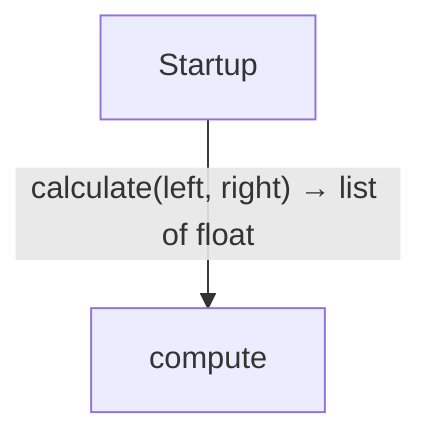
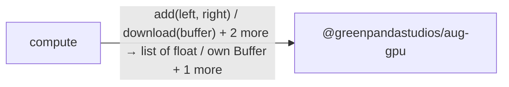
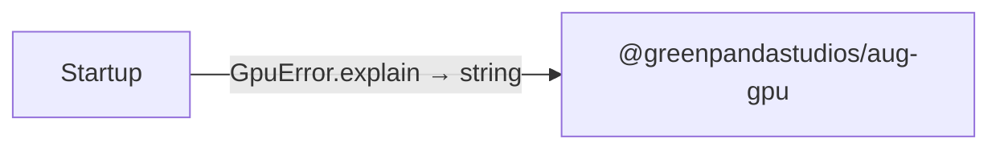

# GPU workers diagrams

[GPU workers](../index.md)

Start here to see what moves between the application’s folders. Each arrow names an operation’s inputs and the result it returns to its caller. Open a folder for the next level of detail. Expand the contract list for complete types and dependency links.

## Data flow

### Package boundaries

::: details compute package calls

:::

::: details Startup package calls

:::

::: details Data crossing these boundaries (6 contracts)

| From | To | Operation and inputs | Result |
| --- | --- | --- | --- |
| compute | @greenpandastudios/aug-gpu | [add](../dependencies/packages/%40greenpandastudios/aug-gpu/0.1.1/api.md#symbol-add) · left: Buffer, right: Buffer | own Buffer |
| compute | @greenpandastudios/aug-gpu | [download](../dependencies/packages/%40greenpandastudios/aug-gpu/0.1.1/api.md#symbol-download) · buffer: Buffer | List\<float\> |
| compute | @greenpandastudios/aug-gpu | [openDevice](../dependencies/packages/%40greenpandastudios/aug-gpu/0.1.1/api.md#symbol-openDevice) | own Device |
| compute | @greenpandastudios/aug-gpu | [upload](../dependencies/packages/%40greenpandastudios/aug-gpu/0.1.1/api.md#symbol-upload) · device: Device, values: List\<float\> | own Buffer |
| Startup | compute | [calculate](../compute.md#symbol-calculate) · left: List\<float\>, right: List\<float\> | List\<float\> |
| Startup | @greenpandastudios/aug-gpu | [GpuError.explain](../dependencies/packages/%40greenpandastudios/aug-gpu/0.1.1/contracts.md#symbol-GpuError.explain) | string |

:::

## Open a module

| Module | Read |
| --- | --- |
| compute.aug | [Flow and sequences](../compute-diagrams.md) · [Explanation](../compute.md) |
| main.aug | [Flow and sequences](../main-diagrams.md) · [Explanation](../main.md) |

These are static call boundaries, not a request trace. Interface implementations and foreign internals stop at their checked contracts. Dotted arrows defer a callback or browser action. Imports alone do not imply a call.
