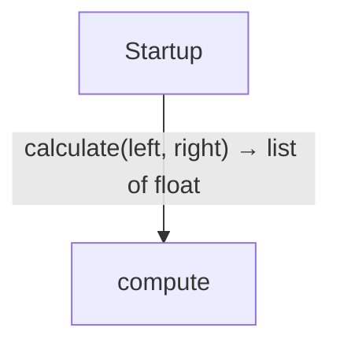
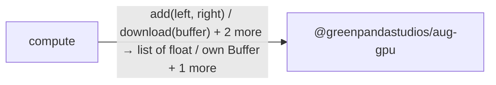
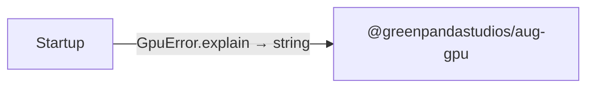

# GPU workers diagrams

[GPU workers](../index.md)

Start with how the application begins, then follow data between its folders. Open an operation to see its decisions, calls, failures and cleanup. Its explanation supplies the exact contract and linked dependencies.

This view includes 2 application source files. Package and interface boundaries show checked contracts; their runtime implementations are not expanded. The views describe the checked program, not desired requirements or a recorded execution.

## Where execution begins

### Startup {#startup}

::: spec-paragraph specification-paragraph-1
Within a task and ownership scope, it sets `first` to a worker task running [`calculate`](../compute.md#symbol-calculate) with `left` from a list containing `1.0`, `2.0`, `3.0` and `right` from a list containing `4.0`, `5.0`, `6.0` with copies of its inputs on a separate heap. It sets `second` to a worker task running [`calculate`](../compute.md#symbol-calculate) with `left` from a list containing `10.0`, `20.0` and `right` from a list containing `1.0`, `2.0` with copies of its inputs on a separate heap. It reads the result of waiting for `first` and `second` in input order; propagate failures once and binds `[0]` as `firstResult` and `[1]` as `secondResult`. [source](../main.md#source-L5-L18)
:::

::: spec-paragraph specification-paragraph-2
For each `value` in a snapshot of `firstResult`, it prints `value`. After the loop, for each `value` in a snapshot of `secondResult`, it prints `value`. On leaving this scope, join its child tasks and release its local values. If this work raises [`GpuError`](../dependencies/packages/%40greenpandastudios/aug-gpu/0.2.0/contracts.md#symbol-GpuError) as `error`, it prints [`error.explain`](../dependencies/packages/%40greenpandastudios/aug-gpu/0.2.0/contracts.md#symbol-GpuError.explain); then it calls `exit` with `status` `1`. [source](../main.md#source-L5-L18)
:::

::: spec-paragraph specification-paragraph-3
If this work raises `ConcurrencyError`, it prints `"Worker capacity is exhausted"`. [source](../main.md#source-L18)
:::

## Data flow

### Package boundaries

::: details compute package calls

:::

::: details Startup package calls

:::

### Follow the data

Each row opens the complete operations and call sites behind one pair of logical units. A grouped arrow records calls between those units; connected arrows need not belong to the same execution path.

| From | To | Operations | Read |
| --- | --- | --- | --- |
| compute | @greenpandastudios/aug-gpu | 4 | [Inputs, results and call sites](index.md#boundary-5693d34962ca) |
| Startup | compute | 1 | [Inputs, results and call sites](index.md#boundary-c2d7970ccd8f) |
| Startup | @greenpandastudios/aug-gpu | 1 | [Inputs, results and call sites](index.md#boundary-0ba4fcceaa8a) |

#### Data crossing these boundaries (6 contracts)

#### compute → @greenpandastudios/aug-gpu {#boundary-5693d34962ca}

::: details 4 operations, 5 sites

**[add](../dependencies/packages/%40greenpandastudios/aug-gpu/0.2.0/api.md#symbol-add)**

Inputs: left: Buffer, right: Buffer. Result: own Buffer.

| Caller or entry | Evidence |
| --- | --- |
| calculate | [Call site](../compute.md#source-L9) · [Caller explanation](../compute.md#symbol-calculate) |

**[download](../dependencies/packages/%40greenpandastudios/aug-gpu/0.2.0/api.md#symbol-download)**

Inputs: buffer: Buffer. Result: List\<float\>.

| Caller or entry | Evidence |
| --- | --- |
| calculate | [Call site](../compute.md#source-L10) · [Caller explanation](../compute.md#symbol-calculate) |

**[openDevice](../dependencies/packages/%40greenpandastudios/aug-gpu/0.2.0/api.md#symbol-openDevice)**

No caller-supplied inputs. Result: own Device.

| Caller or entry | Evidence |
| --- | --- |
| calculate | [Call site](../compute.md#source-L6) · [Caller explanation](../compute.md#symbol-calculate) |

**[upload](../dependencies/packages/%40greenpandastudios/aug-gpu/0.2.0/api.md#symbol-upload)**

Inputs: device: Device, values: List\<float\>. Result: own Buffer.

| Caller or entry | Evidence |
| --- | --- |
| calculate | [Call site](../compute.md#source-L7) · [Caller explanation](../compute.md#symbol-calculate) |
| calculate | [Call site](../compute.md#source-L8) · [Caller explanation](../compute.md#symbol-calculate) |

:::

#### Startup → compute {#boundary-c2d7970ccd8f}

::: details 1 operation, 2 sites

**[calculate](../compute.md#symbol-calculate)**

Inputs: left: List\<float\>, right: List\<float\>. Result: List\<float\>.

| Caller or entry | Evidence |
| --- | --- |
| Startup | [Call site](../main.md#source-L7) · [Caller explanation](../main.md#startup) |
| Startup | [Call site](../main.md#source-L8) · [Caller explanation](../main.md#startup) |

:::

#### Startup → @greenpandastudios/aug-gpu {#boundary-0ba4fcceaa8a}

::: details 1 operation, 1 site

**[GpuError.explain](../dependencies/packages/%40greenpandastudios/aug-gpu/0.2.0/contracts.md#symbol-GpuError.explain)**

No caller-supplied inputs. Result: string.

| Caller or entry | Evidence |
| --- | --- |
| Startup | [Call site](../main.md#source-L15) · [Caller explanation](../main.md#startup) |

:::

## Open a module

| Module | Read |
| --- | --- |
| compute.aug | [Flow and sequences](../compute-diagrams.md) · [Explanation](../compute.md) |
| main.aug | [Flow and sequences](../main-diagrams.md) · [Explanation](../main.md) |

These are static call boundaries, not a request trace. Interface implementations and foreign internals stop at their checked contracts. Dotted arrows defer a callback or browser action. Imports alone do not imply a call.
