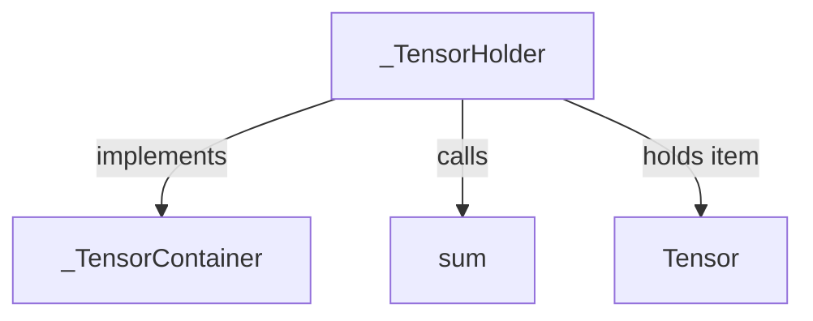
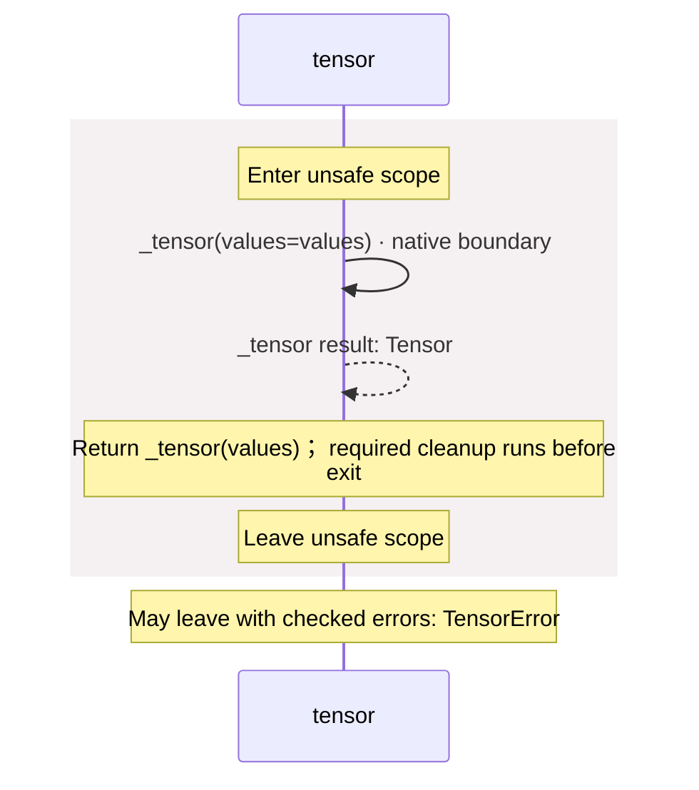
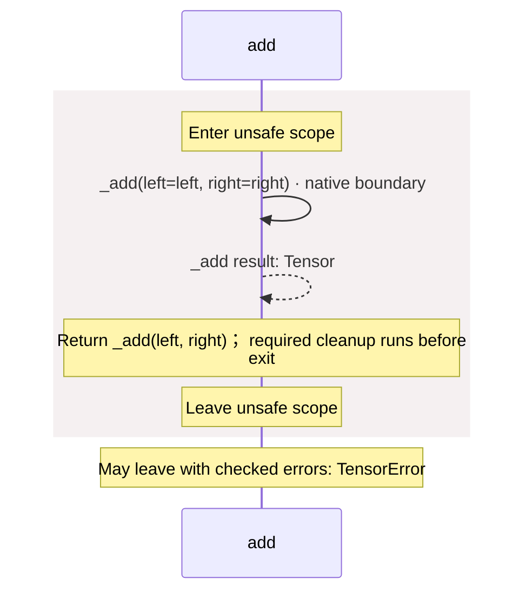
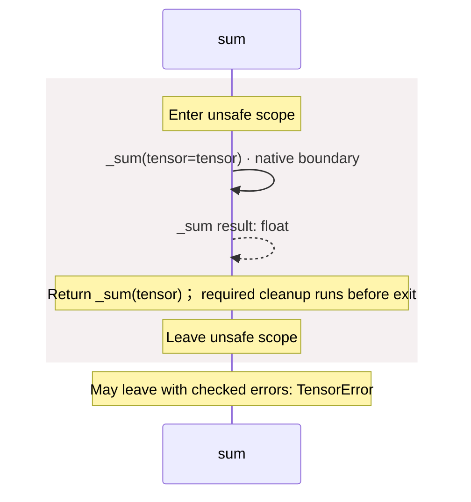
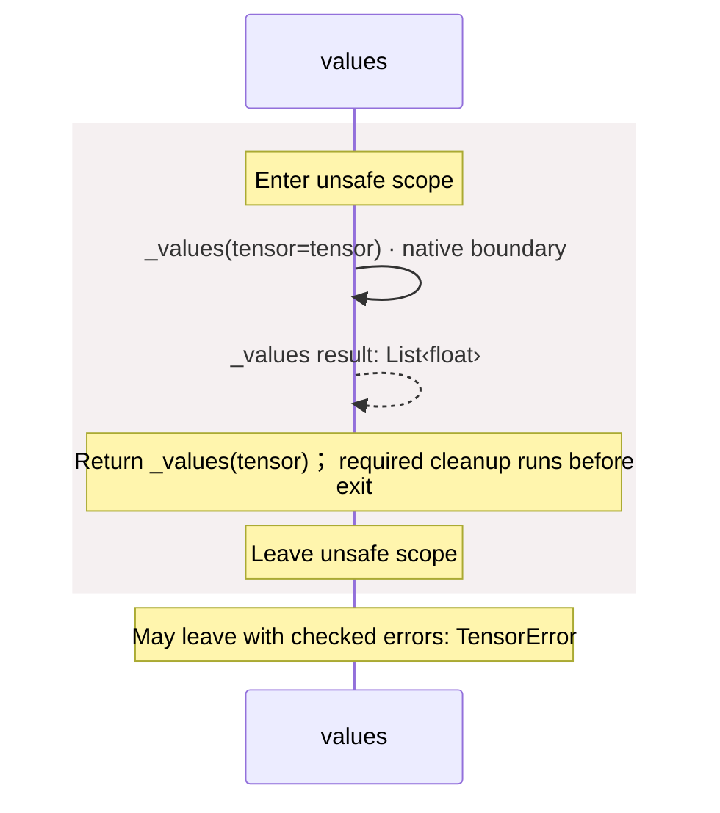
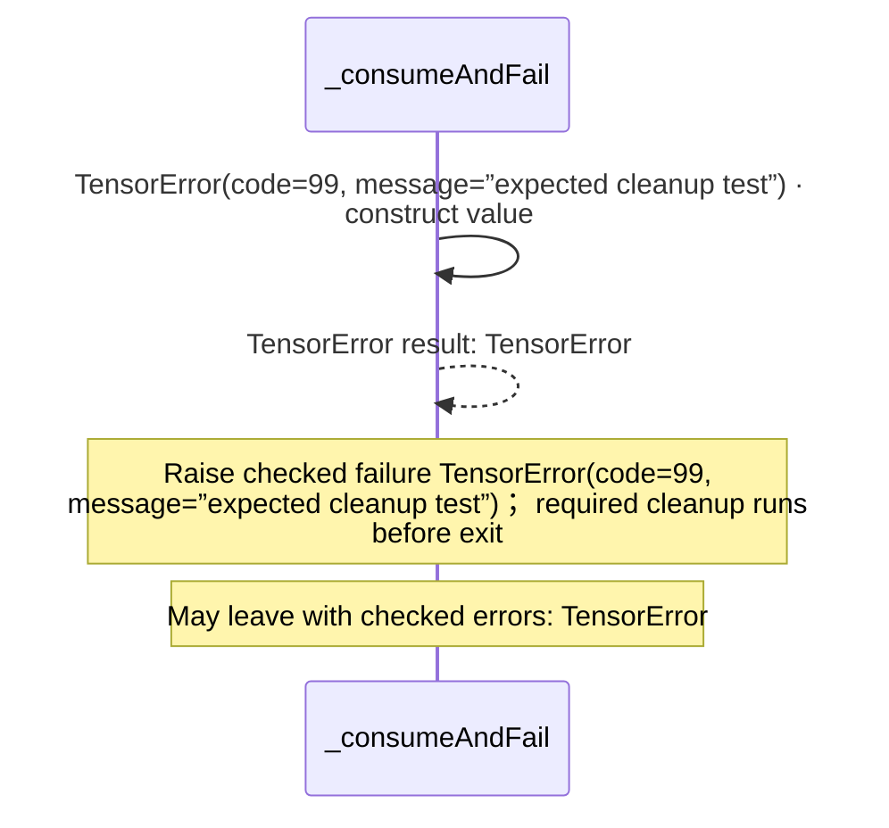
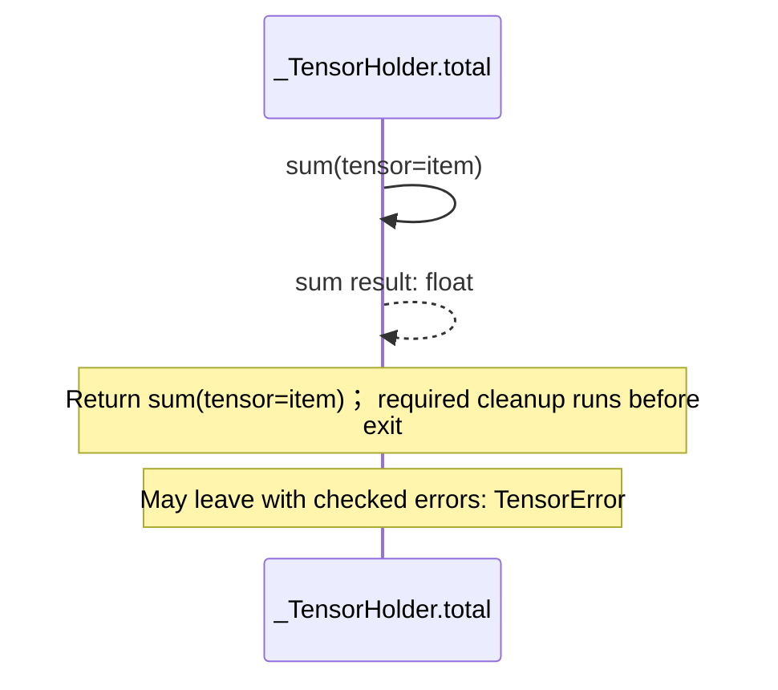

# package/@greenpandastudios/aug-pytorch@0.1.6/api.aug diagrams

[CPU tensors with PyTorch](../../../../../index.md)

[Project overview](../../../../../diagrams/index.md) · [Compiled explanation](api.md)

## Class interactions

## Sequences

Call arrows identify checked targets; loop and branch frames determine when they run. Open that target’s module to follow its implementation. Branches describe alternatives; loops describe repeated work. Native calls and interface dispatch stop at their declared contracts. Exit notes end that path; enclosing recovery and cleanup remain visible.

### \_tensor {#sequence-_tensor}

::: spec-paragraph specification-paragraph-1
[Source](api.md#source-L5)
:::

May leave with checked errors: TensorError. Native implementation; only the declared contract is known. [Explanation](api.md).

### \_add {#sequence-_add}

::: spec-paragraph specification-paragraph-2
[Source](api.md#source-L6)
:::

May leave with checked errors: TensorError. Native implementation; only the declared contract is known. [Explanation](api.md).

### \_sum {#sequence-_sum}

::: spec-paragraph specification-paragraph-3
[Source](api.md#source-L7)
:::

May leave with checked errors: TensorError. Native implementation; only the declared contract is known. [Explanation](api.md).

### \_values {#sequence-_values}

::: spec-paragraph specification-paragraph-4
[Source](api.md#source-L8)
:::

May leave with checked errors: TensorError. Native implementation; only the declared contract is known. [Explanation](api.md).

### tensor {#sequence-tensor}

::: spec-paragraph specification-paragraph-5
[Source](api.md#source-L10)
:::

### add {#sequence-add}

::: spec-paragraph specification-paragraph-6
[Source](api.md#source-L14)
:::

### sum {#sequence-sum}

::: spec-paragraph specification-paragraph-7
[Source](api.md#source-L18)
:::

### values {#sequence-values}

::: spec-paragraph specification-paragraph-8
[Source](api.md#source-L22)
:::

### \_liveTensors {#sequence-_liveTensors}

::: spec-paragraph specification-paragraph-9
[Source](api.md#source-L26)
:::

Native implementation; only the declared contract is known. [Explanation](api.md).

### \_liveBuffers {#sequence-_liveBuffers}

::: spec-paragraph specification-paragraph-10
[Source](api.md#source-L27)
:::

Native implementation; only the declared contract is known. [Explanation](api.md).

### \_consumeAndFail {#sequence-_consumeAndFail}

::: spec-paragraph specification-paragraph-11
[Source](api.md#source-L29)
:::

### \_TensorContainer.total {#sequence-_TensorContainer.total}

::: spec-paragraph specification-paragraph-12
[Source](api.md#source-L33)
:::

May leave with checked errors: TensorError. Interface contract; implementation selected at runtime. [Explanation](api.md).

### \_TensorHolder constructor {#sequence-_TensorHolder-20-constructor}

::: spec-paragraph specification-paragraph-13
[Source](api.md#source-L34)
:::

Receive fields: item. [Explanation](api.md).

### \_TensorHolder.total {#sequence-_TensorHolder.total}

::: spec-paragraph specification-paragraph-14
[Source](api.md#source-L35)
:::

### \_replace {#sequence-_replace}

::: spec-paragraph specification-paragraph-15
[Source](api.md#source-L37)
:::

Set holder.item to replacement. [Explanation](api.md).

## Called contracts

- [\_TensorContainer](api-diagrams.md) — package/@greenpandastudios/aug-pytorch@0.1.6/api.aug
- [\_add](api-diagrams.md#sequence-_add) — package/@greenpandastudios/aug-pytorch@0.1.6/api.aug
- [\_sum](api-diagrams.md#sequence-_sum) — package/@greenpandastudios/aug-pytorch@0.1.6/api.aug
- [\_tensor](api-diagrams.md#sequence-_tensor) — package/@greenpandastudios/aug-pytorch@0.1.6/api.aug
- [\_values](api-diagrams.md#sequence-_values) — package/@greenpandastudios/aug-pytorch@0.1.6/api.aug
- [sum](api-diagrams.md#sequence-sum) — package/@greenpandastudios/aug-pytorch@0.1.6/api.aug
- [TensorError](contracts-diagrams.md#sequence-TensorError-20-constructor) — package/@greenpandastudios/aug-pytorch@0.1.6/contracts.aug
