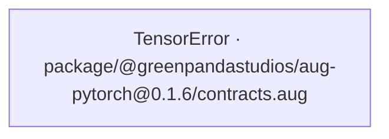
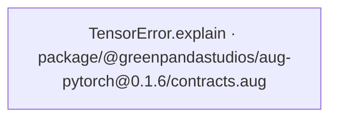
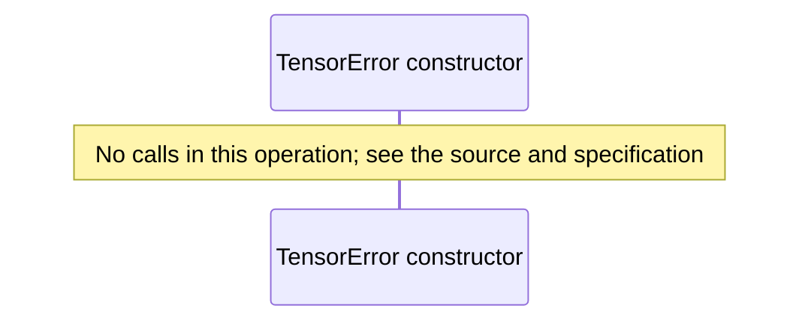
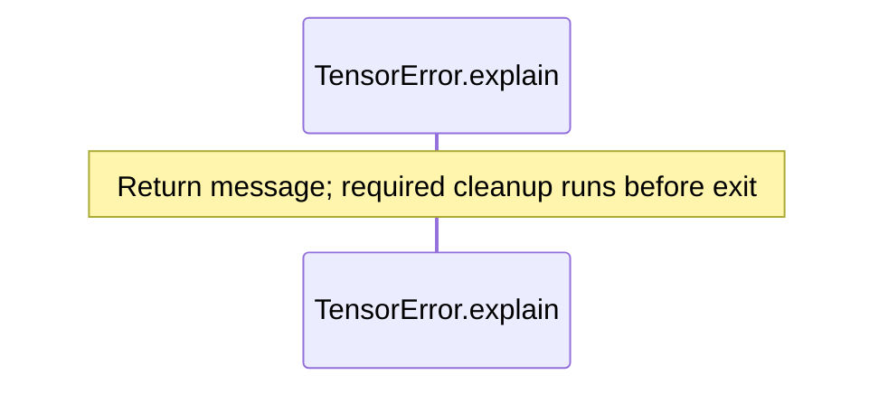

# CPU tensors with PyTorch diagrams

[CPU tensors with PyTorch](../../../../../index.md)

[Project overview](../../../../../diagrams/index.md) · [Compiled explanation](contracts.md)

### Class interactions

### API calls

### Sequences

Call arrows identify checked targets; loop and branch frames determine when they run. Open that target’s module to follow its implementation. Branches describe alternatives; loops describe repeated work. Native calls and interface dispatch stop at their declared contracts. Exit notes end that path; enclosing recovery and cleanup remain visible.

#### TensorError constructor {#sequence-TensorError-20-constructor}

::: spec-paragraph specification-paragraph-1
[Source](contracts.md#source-L3)
:::

#### TensorError.explain {#sequence-TensorError.explain}

::: spec-paragraph specification-paragraph-2
[Source](contracts.md#source-L5)
:::

