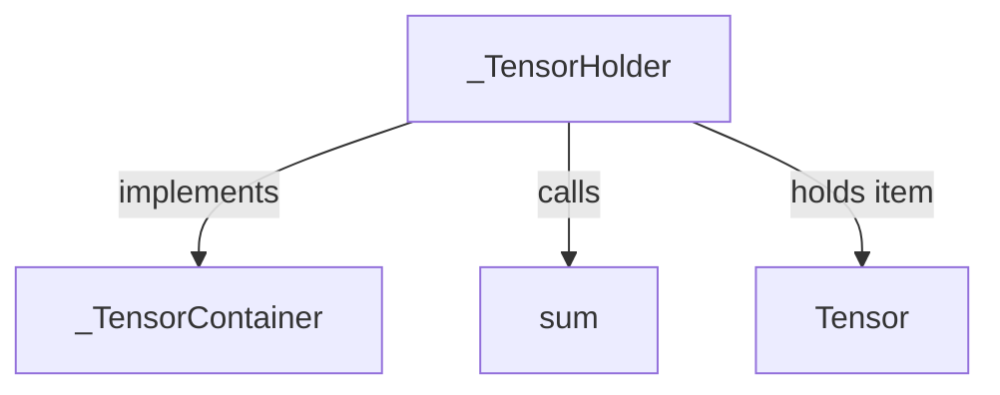
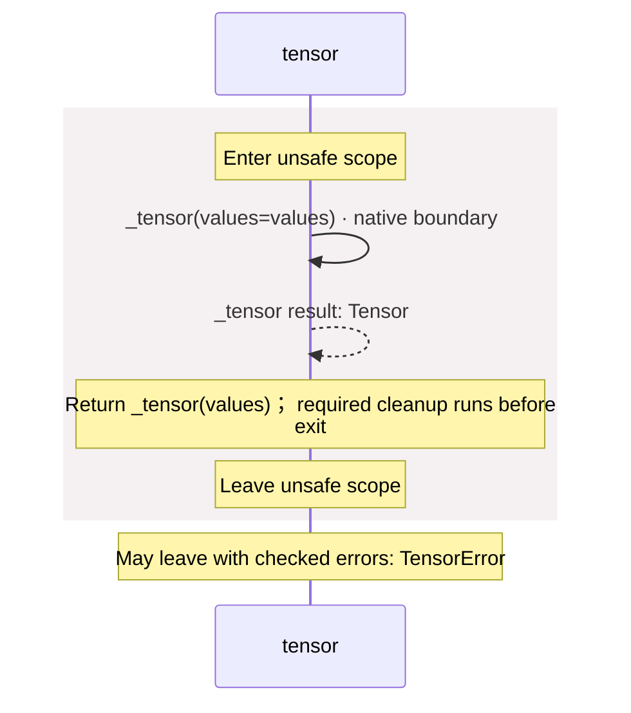
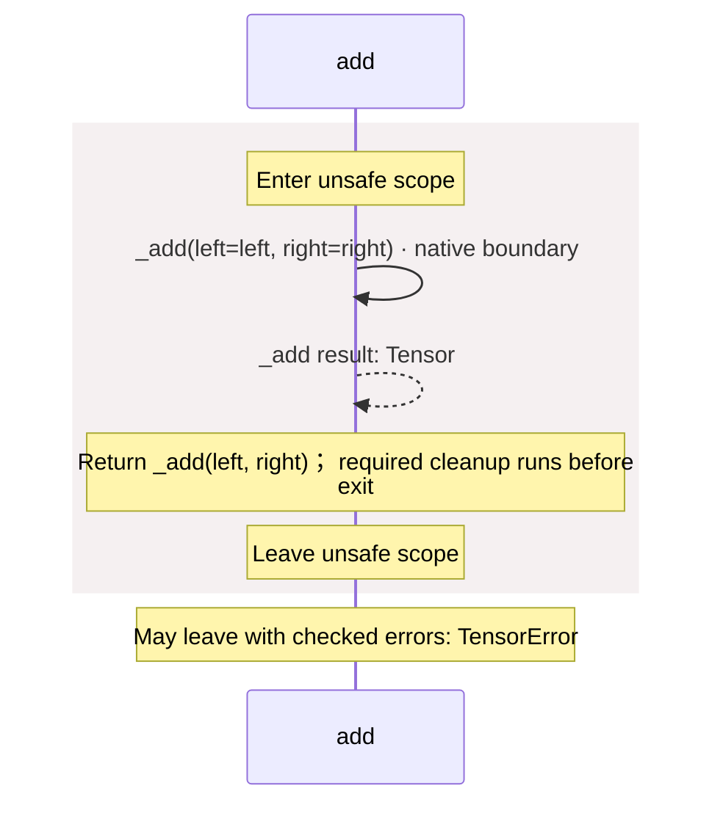
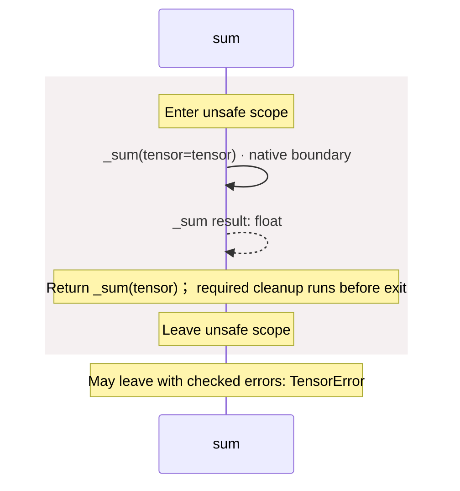
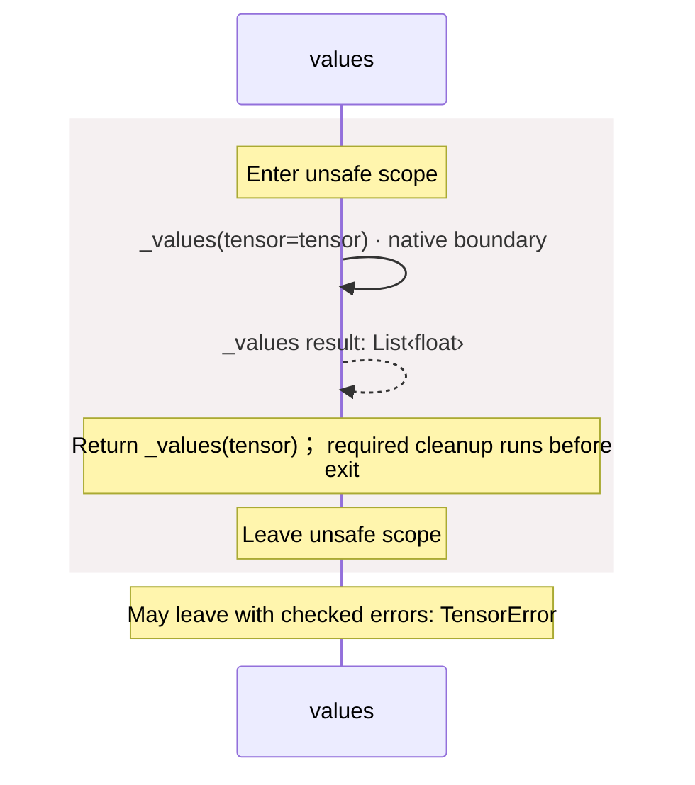
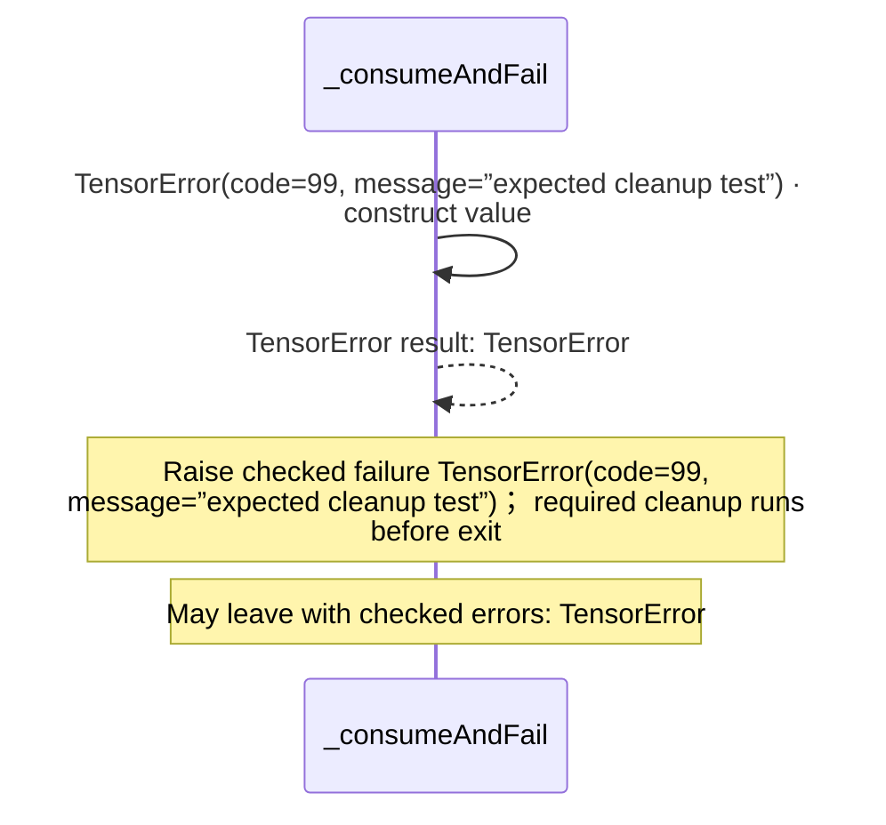
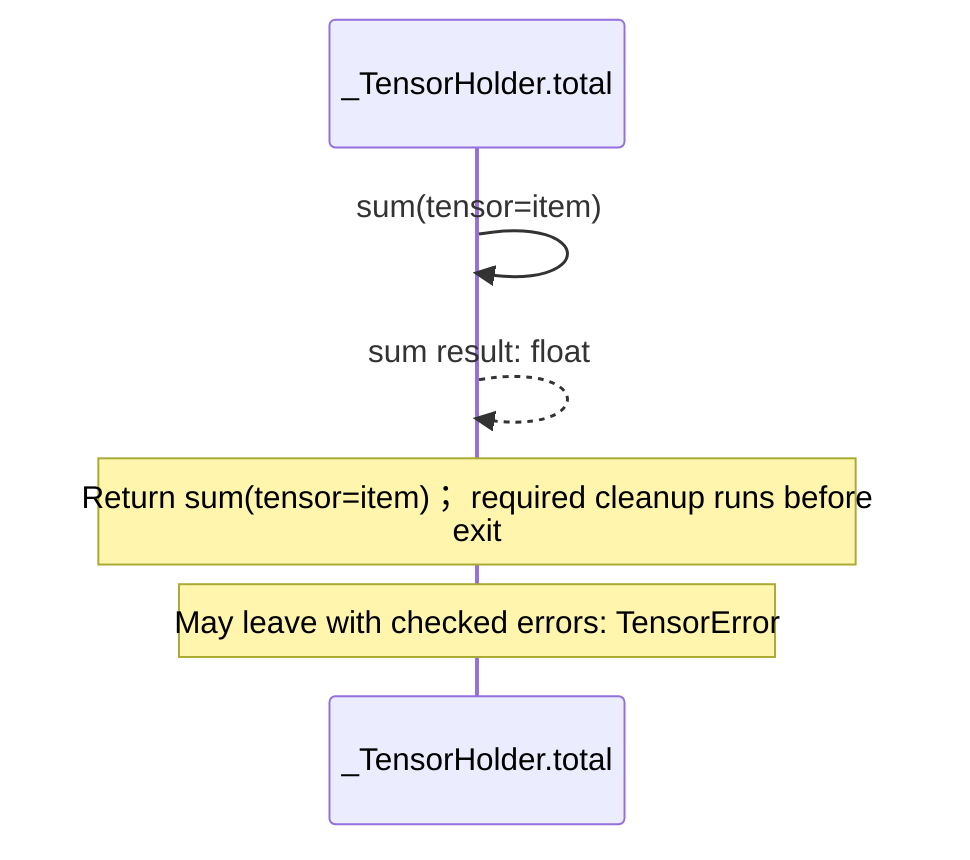

# package/@greenpandastudios/aug-pytorch@0.2.0/api.aug diagrams

[CPU tensors with PyTorch](../../../../../index.md)

[Project overview](../../../../../diagrams/index.md) · [Compiled explanation](api.md)

## Class interactions

## Sequences

Call arrows identify checked targets; loop and branch frames determine when they run. Open that target’s module to follow its implementation. Branches describe alternatives; loops describe repeated work. Native calls and interface dispatch stop at their declared contracts. Exit notes end that path; enclosing recovery and cleanup remain visible.

### \_tensor {#sequence-_tensor}

::: spec-paragraph specification-paragraph-1
[Source](api.md#source-L5)
:::

It is private to its defining scope.

It takes `values` as `List<float>`.

It returns ownership of [`Tensor`](bindings.md#symbol-Tensor). Failures can raise [`TensorError`](contracts.md#symbol-TensorError).

Native implementation: `@greenpandastudios/aug-pytorch@0.2.0`, `2.14.1`. Supported targets: linux arm64 glibc 2.36+ itanium-cxx11, linux x64 glibc 2.36+ itanium-cxx11, macos arm64 14.0+ apple-libc++. Binding contract: [`native.abi.json`](native.abi-json.md) (SHA-256 `f07b8cab89ad7cfe368edcd9daf87ecc810adb6a2eed1f446d7b71fb664e91f5`). It calls `aug_torch_tensor_from_f64_v1` through the C ABI on the caller thread; a blocking native call blocks that thread. The caller owns the returned handle. Its contract does not permit worker entry. The compiler checks the provider, descriptor digest, signature and ownership at August call sites. The native author promises not to retain inputs, enter August from foreign threads, or unwind across the C boundary; internal native workers may run. The compiler does not prove those promises.

May leave with checked errors: TensorError. Native implementation; only the declared contract is known. [Explanation](api.md).

### \_add {#sequence-_add}

::: spec-paragraph specification-paragraph-2
[Source](api.md#source-L6)
:::

It is private to its defining scope.

It takes `left` and `right` as [`Tensor`](bindings.md#symbol-Tensor).

It returns ownership of [`Tensor`](bindings.md#symbol-Tensor). Failures can raise [`TensorError`](contracts.md#symbol-TensorError).

Native implementation: `@greenpandastudios/aug-pytorch@0.2.0`, `2.14.1`. Supported targets: linux arm64 glibc 2.36+ itanium-cxx11, linux x64 glibc 2.36+ itanium-cxx11, macos arm64 14.0+ apple-libc++. Binding contract: [`native.abi.json`](native.abi-json.md) (SHA-256 `f07b8cab89ad7cfe368edcd9daf87ecc810adb6a2eed1f446d7b71fb664e91f5`). It calls `aug_torch_tensor_add_v1` through the C ABI on the caller thread; a blocking native call blocks that thread. `left` lends read access for this call; `right` lends read access for this call. The caller owns the returned handle. Its contract does not permit worker entry. The compiler checks the provider, descriptor digest, signature and ownership at August call sites. The native author promises not to retain inputs, enter August from foreign threads, or unwind across the C boundary; internal native workers may run. The compiler does not prove those promises.

May leave with checked errors: TensorError. Native implementation; only the declared contract is known. [Explanation](api.md).

### \_sum {#sequence-_sum}

::: spec-paragraph specification-paragraph-3
[Source](api.md#source-L7)
:::

It is private to its defining scope.

It takes `tensor` as [`Tensor`](bindings.md#symbol-Tensor).

It returns `float`. Failures can raise [`TensorError`](contracts.md#symbol-TensorError).

Native implementation: `@greenpandastudios/aug-pytorch@0.2.0`, `2.14.1`. Supported targets: linux arm64 glibc 2.36+ itanium-cxx11, linux x64 glibc 2.36+ itanium-cxx11, macos arm64 14.0+ apple-libc++. Binding contract: [`native.abi.json`](native.abi-json.md) (SHA-256 `f07b8cab89ad7cfe368edcd9daf87ecc810adb6a2eed1f446d7b71fb664e91f5`). It calls `aug_torch_tensor_sum_v1` through the C ABI on the caller thread; a blocking native call blocks that thread. `tensor` lends read access for this call. Its contract does not permit worker entry. The compiler checks the provider, descriptor digest, signature and ownership at August call sites. The native author promises not to retain inputs, enter August from foreign threads, or unwind across the C boundary; internal native workers may run. The compiler does not prove those promises.

May leave with checked errors: TensorError. Native implementation; only the declared contract is known. [Explanation](api.md).

### \_values {#sequence-_values}

::: spec-paragraph specification-paragraph-4
[Source](api.md#source-L8)
:::

It is private to its defining scope.

It takes `tensor` as [`Tensor`](bindings.md#symbol-Tensor).

It returns `List<float>`. Failures can raise [`TensorError`](contracts.md#symbol-TensorError).

Native implementation: `@greenpandastudios/aug-pytorch@0.2.0`, `2.14.1`. Supported targets: linux arm64 glibc 2.36+ itanium-cxx11, linux x64 glibc 2.36+ itanium-cxx11, macos arm64 14.0+ apple-libc++. Binding contract: [`native.abi.json`](native.abi-json.md) (SHA-256 `f07b8cab89ad7cfe368edcd9daf87ecc810adb6a2eed1f446d7b71fb664e91f5`). It calls `aug_torch_tensor_values_v1` through the C ABI on the caller thread; a blocking native call blocks that thread. `tensor` lends read access for this call. August copies the returned buffer, then calls `aug_torch_values_release_v1` to release it. Its contract does not permit worker entry. The compiler checks the provider, descriptor digest, signature and ownership at August call sites. The native author promises not to retain inputs, enter August from foreign threads, or unwind across the C boundary; internal native workers may run. The compiler does not prove those promises.

May leave with checked errors: TensorError. Native implementation; only the declared contract is known. [Explanation](api.md).

### tensor {#sequence-tensor}

::: spec-paragraph specification-paragraph-5
[Source](api.md#source-L10)
:::

Copy a list of float64 values into a CPU tensor.

It takes `values` as `List<float>`.

It returns ownership of [`Tensor`](bindings.md#symbol-Tensor). Failures can raise [`TensorError`](contracts.md#symbol-TensorError).

### add {#sequence-add}

::: spec-paragraph specification-paragraph-6
[Source](api.md#source-L14)
:::

Add tensors without changing either input.

It takes `left` and `right` as [`Tensor`](bindings.md#symbol-Tensor).

It returns ownership of [`Tensor`](bindings.md#symbol-Tensor). Failures can raise [`TensorError`](contracts.md#symbol-TensorError).

### sum {#sequence-sum}

::: spec-paragraph specification-paragraph-7
[Source](api.md#source-L18)
:::

Sum every element.

It takes `tensor` as [`Tensor`](bindings.md#symbol-Tensor).

Failures can raise [`TensorError`](contracts.md#symbol-TensorError).

### values {#sequence-values}

::: spec-paragraph specification-paragraph-8
[Source](api.md#source-L22)
:::

Copy tensor values into an August list.

It takes `tensor` as [`Tensor`](bindings.md#symbol-Tensor).

Failures can raise [`TensorError`](contracts.md#symbol-TensorError).

### \_liveTensors {#sequence-_liveTensors}

::: spec-paragraph specification-paragraph-9
[Source](api.md#source-L26)
:::

It is private to its defining scope.

It returns `int`.

Native implementation: `@greenpandastudios/aug-pytorch@0.2.0`, `2.14.1`. Supported targets: linux arm64 glibc 2.36+ itanium-cxx11, linux x64 glibc 2.36+ itanium-cxx11, macos arm64 14.0+ apple-libc++. Binding contract: [`native.abi.json`](native.abi-json.md) (SHA-256 `f07b8cab89ad7cfe368edcd9daf87ecc810adb6a2eed1f446d7b71fb664e91f5`). It calls `aug_probe_live_tensors_v1` through the C ABI on the caller thread; a blocking native call blocks that thread. Its contract does not permit worker entry. The compiler checks the provider, descriptor digest, signature and ownership at August call sites. The native author promises not to retain inputs, enter August from foreign threads, or unwind across the C boundary; internal native workers may run. The compiler does not prove those promises.

Native implementation; only the declared contract is known. [Explanation](api.md).

### \_liveBuffers {#sequence-_liveBuffers}

::: spec-paragraph specification-paragraph-10
[Source](api.md#source-L27)
:::

It is private to its defining scope.

It returns `int`.

Native implementation: `@greenpandastudios/aug-pytorch@0.2.0`, `2.14.1`. Supported targets: linux arm64 glibc 2.36+ itanium-cxx11, linux x64 glibc 2.36+ itanium-cxx11, macos arm64 14.0+ apple-libc++. Binding contract: [`native.abi.json`](native.abi-json.md) (SHA-256 `f07b8cab89ad7cfe368edcd9daf87ecc810adb6a2eed1f446d7b71fb664e91f5`). It calls `aug_probe_live_buffers_v1` through the C ABI on the caller thread; a blocking native call blocks that thread. Its contract does not permit worker entry. The compiler checks the provider, descriptor digest, signature and ownership at August call sites. The native author promises not to retain inputs, enter August from foreign threads, or unwind across the C boundary; internal native workers may run. The compiler does not prove those promises.

Native implementation; only the declared contract is known. [Explanation](api.md).

### \_consumeAndFail {#sequence-_consumeAndFail}

::: spec-paragraph specification-paragraph-11
[Source](api.md#source-L29)
:::

It is private to its defining scope.

It takes `value` as [`Tensor`](bindings.md#symbol-Tensor) with ownership transferred.

Failures can raise [`TensorError`](contracts.md#symbol-TensorError).

### \_TensorContainer.total {#sequence-_TensorContainer.total}

::: spec-paragraph specification-paragraph-12
[Source](api.md#source-L33)
:::

It returns `float`. Failures can raise [`TensorError`](contracts.md#symbol-TensorError).

May leave with checked errors: TensorError. Interface contract; implementation selected at runtime. [Explanation](api.md).

### \_TensorHolder constructor {#sequence-_TensorHolder-20-constructor}

::: spec-paragraph specification-paragraph-13
[Source](api.md#source-L34)
:::

It implements [`_TensorContainer`](api.md#symbol-_TensorContainer). It is private to this file.

It takes `item` as [`Tensor`](bindings.md#symbol-Tensor) with ownership transferred, kept mutable.

Receive fields: item. [Explanation](api.md).

### \_TensorHolder.total {#sequence-_TensorHolder.total}

::: spec-paragraph specification-paragraph-14
[Source](api.md#source-L35)
:::

Failures can raise [`TensorError`](contracts.md#symbol-TensorError).

### \_replace {#sequence-_replace}

::: spec-paragraph specification-paragraph-15
[Source](api.md#source-L37)
:::

It is private to its defining scope.

It takes `holder` as [`_TensorHolder`](api.md#symbol-_TensorHolder) with permission to mutate it during the call and `replacement` as [`Tensor`](bindings.md#symbol-Tensor) with ownership transferred.

It may change `holder`.

Set holder.item to replacement. [Explanation](api.md).

## Called contracts

- [\_TensorContainer](api-diagrams.md) — package/@greenpandastudios/aug-pytorch@0.2.0/api.aug
- [\_add](api-diagrams.md#sequence-_add) — package/@greenpandastudios/aug-pytorch@0.2.0/api.aug
- [\_sum](api-diagrams.md#sequence-_sum) — package/@greenpandastudios/aug-pytorch@0.2.0/api.aug
- [\_tensor](api-diagrams.md#sequence-_tensor) — package/@greenpandastudios/aug-pytorch@0.2.0/api.aug
- [\_values](api-diagrams.md#sequence-_values) — package/@greenpandastudios/aug-pytorch@0.2.0/api.aug
- [sum](api-diagrams.md#sequence-sum) — package/@greenpandastudios/aug-pytorch@0.2.0/api.aug
- [TensorError](contracts-diagrams.md#sequence-TensorError-20-constructor) — package/@greenpandastudios/aug-pytorch@0.2.0/contracts.aug
