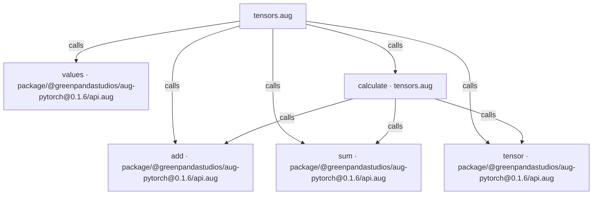
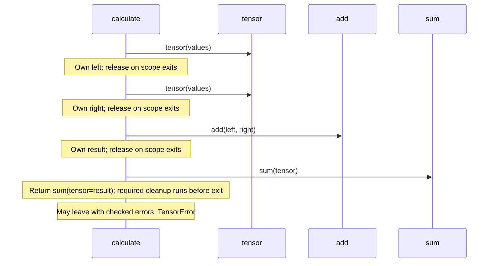

# CPU tensors with PyTorch diagrams

[CPU tensors with PyTorch](index.md)

[Project overview](diagrams/index.md) · [Compiled explanation](tensors.md)

### Class interactions

No relationships at this level.

### API calls

### Sequences

Call arrows identify checked targets; loop and branch frames determine when they run. Open that target’s module to follow its implementation. Branches describe alternatives; loops describe repeated work. Native calls and interface dispatch stop at their declared contracts. Exit notes end that path; enclosing recovery and cleanup remain visible.

#### calculate {#sequence-calculate}

::: spec-paragraph specification-paragraph-1
[Source](tensors.md#source-L5)
:::

### Called contracts

- [add](dependencies/packages/%40greenpandastudios/aug-pytorch/0.1.6/api-diagrams.md#sequence-add) — package/@greenpandastudios/aug-pytorch@0.1.6/api.aug
- [sum](dependencies/packages/%40greenpandastudios/aug-pytorch/0.1.6/api-diagrams.md#sequence-sum) — package/@greenpandastudios/aug-pytorch@0.1.6/api.aug
- [tensor](dependencies/packages/%40greenpandastudios/aug-pytorch/0.1.6/api-diagrams.md#sequence-tensor) — package/@greenpandastudios/aug-pytorch@0.1.6/api.aug
- [values](dependencies/packages/%40greenpandastudios/aug-pytorch/0.1.6/api-diagrams.md#sequence-values) — package/@greenpandastudios/aug-pytorch@0.1.6/api.aug
- [calculate](tensors-diagrams.md#sequence-calculate) — tensors.aug
